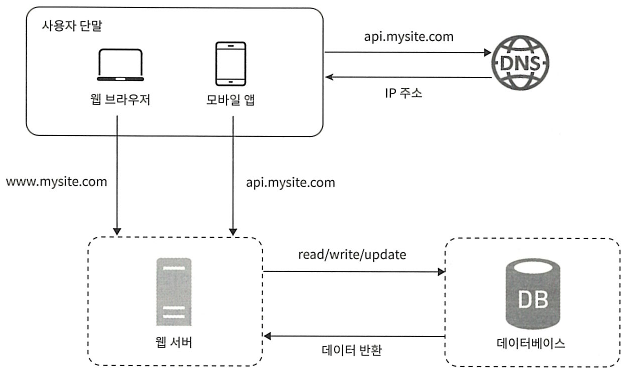
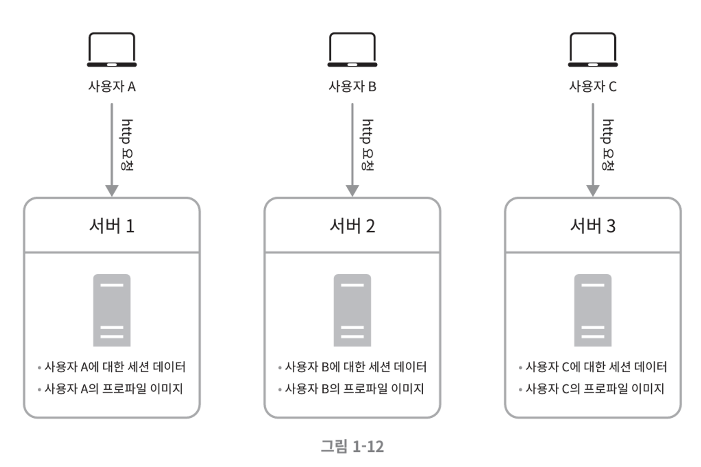
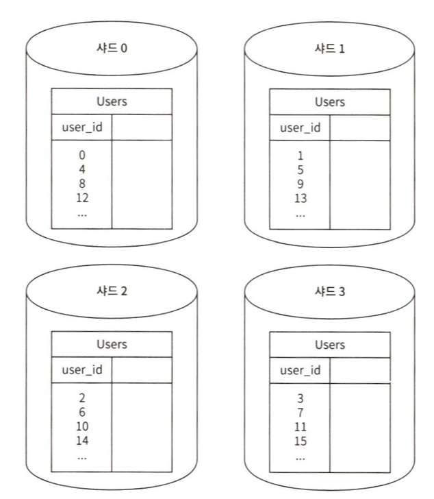

# 사용자 수에 따른 규모 확장성

---

## 단일 서버

- 모든 컴포넌트가 단 한 대의 서버에서 실행되는 간단한 시스템부터 설계해보자.

- 웹, 앱, 데이터베이스, 캐시 등이 전부 서버 한 대에서 실행된다!

### 사용자 요청 처리 흐름

- 사용자는 도메인 이름을 이용하여 웹사이트에 접속한다. 
- 이 접속을 위해 DNS (Domain Name Service)에 도메인 이름을 질의하여 IP 주소로 변환한다.
  - DNS는 보통 제 3 사업자가 제공하는 유료 서비스를 이용
  - DNS 조회 결과로 반환받은 IP 주소가 웹 서버의 주소이다.
- 해당 IP 주소로 HTTP(Hyper Text Transfer Protocol) 요청이 전달된다.
- 요청을 받은 웹 서버는 HTML 페이지나 JSON 형태의 응답을 반환한다.

### 실제 요청이 오는 곳?

- 웹 애플리케이션
  - 비즈니스 로직, 데이터 저장 등을 처리하기 서버 구현용 언어 (자바, 파이썬 등)를 사용하고,
  - 프레젠테이션용으로는 클라이언트 구현용 언어(HTML, 자바스크립트 등)를 사용한다.

- 모바일 앱
  - 모바일 앱과 웹 서버 간 통신을 위해서는 HTTP 프로토콜을 이용한다.
  - HTTP 프로토콜을 통해서 반환될 응답 데이터의 포맷으로는 보통 JSON(JavaScript Object Noation)이 널리 쓰인다.

---

## 데이터베이스

사용자가 늘면 서버 하나로는 충분하지 않아서 여러 서버를 두어야 합니다.

하나는 웹/모바일 트레픽 처리 용도, 다른 하나는 데이터베이스용 입니다.

웹/모바일 트레픽 처리 서버(웹 계층)와 데이터베이스 서버(데이터 계층)를 분리하면 그 각각을 독립적으로 확장해 나갈 수 있게 됩니다.

### 어떤 데이터베이스를 사용할 것인가?

- 관계형 데이터 베이스 관리 시스템 (relational database management system, RDBMS)

  - MySQL, 오라클 데이터베이스, PostgreSQL 등...
  - 자료를 테이블과 열, 칼럼으로 표현
  - SQL을 사용하면 여러 테이블에 있는 데이터를 관계에 따라 join하여 합칠 수 있다.

- 비-관계형 데이터베이스 (NoSQL)
  - CouchDB, Neo4j, Cassandra, HBase, Amazom DynamoDB 등...
  - 키-값 저장소 (key-value store), 그래프 저장소 (graph store), 칼럼 저장소 (column store), 문저 저장소 (document store)
  - 일반적으로 도인 연산은 지원하지 않는다.

- 비-관계형 데이터베이스가 바람직한 경우
  - 아주 낮은 응답 지연시간(latency)이 요구됨
  - 다루는 데이터가 비정형(unstructured)이라 관계형 데이터가 아님
  - 데이터(JOIN, YAML, XML 등)를 직렬화하거나 역직렬화 할 수 있기만 하면 됨
  - 아주 많은 양의 데이터를 저장할 필요가 있음

---

## 수직적 규모 확장 (scale up) vs 수평적 규모 확장 (scale out)

- 수직적 규모 확장 
  - 서버에 고사양 자원 (더 좋은 CPU, 더 많은 RAM 등)을 추가하는 행위
  - 서버로 유입되는 트래픽 양이 적을 때는 수직적 규모 확장이 좋은 선택이다.
  - 단, 한 대의 서버에 자원을 무한대로 증설할 방법이 없다는 한계 존재
  - 장애에 대한 자동복구(failover) 방안이나 다중화(redundancy) 방안을 제시하지 않는다.
  - 서버에 장애가 발생하면 웹사이트/앱은 완전히 중단된다.

- 수평적 규모 확장
  - 더 많은 서버를 추가하여 성능을 개선하는 행위
  - 대규모 애플리케이션을 지원하는 데 적절하다.
  - 부하 분산기 또는 로드밸런서를 도입해서 수평적 규모 확장을 진행한다.

### 로드밸런서 (load balancer)

부하 분산 집합 (loag balancing set)에 속한 웹 서버들에게 트래칙 부하를 고르게 분산하는 역할을 한다.

#### 로드 밸런서를 이용한 요청 처리 흐름

- 사용자는 로드밸런서의 공개 IP 주소로 접속한다. 
  - 웹 서버는 클라이언트의 접속을 직접 처리하지 않는다!
  - 서버 간 통신에는 사설 IP 주소가 이용된다.
- 로드밸런서는 웹 서버와 통신하기 위해 사설 IP 주소를 이용한다.
- 부하 분산 집합에 또 하나의 웹 서버를 추가하고 나면 장애를 자동복구하지 못하는 문제는 해소되고, 웹 계층의 가용성은 향상된다.
  - 서버 1이 다운되면 모든 트래픽은 서버 2로 전송
  - 웹 사이트 다운되는 경우 방지
  - 로드밸런서가 자동적으로 트래픽을 분산해주기 때문에 웹 사이트 트래픽이 가파르게 증가하면 더 많은 서버를 추가하기만 하면 된다.

### 데이터베이스 다중화

- 많은 데이터베이스 관리 시스템이 다중화를 지원한다.

- 서버 사이에 주(master)-부(slave) 관계를 설정하고 데이터 원본은 주 서버에, 사본은 부 서버에 저장하는 방식

- 쓰기 연산(write operation)은 마스터에서만 지원

- 부 데이터베이스는 주 데이터베이스로부터 사본을 전달받으며, 읽기 연산(read operation)만을 지원

- 대부분의 애플리케이션은 읽기 연산의 비중이 쓰기 연상보다 훨씬 높음

- 통상 부 데이터베이스가 주 데이터베이스 수보다 많다.

- 데이터베이스를 변경하는 명령어 (insert, delete, update) 등은 주 데이터베이스로만 전달되어야 함

#### 데이터베이스 다중화 이점

1. 더 나은 성능
   - 모든 데이터 변경 연산은 주 데이터에비스 서버로만 전달
   - 읽기 연산은 부 데이터베이스 서버들로 분산
   - 병렬로 처리될 수 있는 query 수가 늘어나므로, 성능이 좋아진다.
   
2. 안정성 (reliability)
   - 데이터를 지역적으로 떨어진 여러 장소에 다중화 시킬 수 있다.
   - 데이터베이스 서버 가운데 일부가 파괴되어도 데이터는 보존된다.

3. 가용성 (availability)
   - 데이터를 여러 지역에 복제해 둠
   - 하나의 데이터베이스 서버에 장애가 발생해도 다른 서버 데이터를 가져와 계속 서비스 가능

### 데이터베이스 서버 가운데 하나가 다운된다면??

#### 부 서버가 한 대 분인데 다운된 경우!
- 읽기 연산은 한시적으로 모두 주 데이터베이스로 전달된다.
- 즉시 새로운 부 데이터베이스 서버가 장애 서버를 대체한다.
- 부 서버가 여러 대인 경우 읽기 연산은 나머지 부 데이터베이스 서버들로 분산 된다.
- 새로운 부 데이터베이스가 장애 서버를 대체한다.

#### 주 데이터베이스 서버가 다운된 경우!
- 한 대의 부 데이터베이스만 있는 경우 해당 부 데이터베이스 서버가 새로운 주 서버가 되며, 모든 데이터베이스 연산은 일시적으로 새로운 주 서버상에서 수행된다.
- 새로운 부 서버가 추가된다.
- 프로덕션 환경
  - 부 서버에 보관된 데이터가 최신 상태가 아닐 수 있다.
  - 이런 경우 없는 데이터는 복구 스크립트를 돌려서 추가해야 한다.
  - 다중 마스터나 원형 다중화 방식을 도입하면 도움이 된다.

### 요청 처리 흐음

- 사용자는 DNS로부터 로드밸런서의 공개 IP주소를 받는다.
- 사용자는 해당 IP 주소를 사용해 로드밸런서에 접속한다.
- HTTP 요청은 서버 1이나 서버 2 로 전달된다.
- 웹 서버는 사용자의 데이터를 부 데이터베이스 서버에서 읽는다.
- 웹 서버는 데이터 변경 연산은 주 데이터베이스로 전달한다.

---

## 캐시 (cache)

- 값 비깐 연산 결과 또는 자주 참조되는 데이터를 메모리 안에 두고, 뒤이은 요청이 보다 빨리 처리될 수 있도록 하는 저장소다.

- 애플리케이션 성능은 데이터베이스를 얼마나 자주 호출하느냐에 크게 좌우 되며, 캐시는 그런 문제를 완화할 수 있다!

### 캐시 계층 (cache tier)

- 캐시 계층은 데이터가 잠시 보관되는 곳으로 데이터베이스보다 훨씬 빠르다.

- 별도의 캐시 계층을 두면 성을이 개선될 뿐 아니아 데이터베이스 부하를 줄일 수 있고, 캐시 계층의 규모를 독립적으로 확장시키는 것도 가능해진다.

#### 요청 흐름

캐시 우선 읽기 전략 (read-through caching strategy)

1. 요청을 받은 웹 서버는 캐시에 응답이 저장되어 있는지 확인
2. 만일 저장되어 있다면 해당 데이터를 클라이언트에 반환
3. 없는 경우 데이터베이스 query 를 통해 데이터를 찾아 캐시에 저장한 뒤 클라이언트에 반환

이외에도 캐시할 데이터 종류, 크기, 액세스 패턴에 맞는 다양한 전략이 존재하며 선택해서 사용하면 된다.

#### 캐시 사용 시 유의할 점

- 캐시는 어떤 상황에서 바람직한가?
  - 데이터 갱신은 자주 일어나지 않지만 참조는 빈번하게 일어나는 경우

- 어떤 데이터를 캐시에 두어야 하는가?
  - 캐시는 데이터를 휘발성 메모리에 둔다.
  - 영속적으로 보관할 데이터를 캐시에 저장 X, 중요 데이터는 지속적 저장소 (persistent data store)에 두어야 한다.

- 캐시에 보관된 데이터는 어떻게 만료(expire)되는가?
  - 만료 정책을 마련해 두어야 한다.
  - 만료된 데이터는 캐시에서 삭제 되어야 한다.
  - 만료 기한은 너무 짧으면 데이터베이스를 너무 자주 읽게 되고, 너무 길면 원본과 차이가 날 가능성이 높아진다.

- 일관성은 어떻게 유지되는가?
  - 일관성 : 데이터 저장소의 원본과 캐시 내의 사본이 같은지 여부
  - 저장소의 원본을 갱신하는 연산과 캐시를 생산하는 연산이 단일 트랜잭션으로 처리되지 않는 경우 일관성이 깨질 수 있다.
  

- 장애에는 어떻게 대처할 것인가?
  - 캐시 서버를 한 대만 두는 경우 해당 서버는 단일 장애 지점 (single point of failure, SPOF)이 되어버릴 가능성이 있다.
  - SPOF => 어떤 특정 지점에서의 장애가 전체 시스템의 동작을 중단시켜버릴 수 있는 경우
  
- 캐시 메모리는 얼마나 크게 잡을 것인가?
  - 캐시 메모리가 너무 작으면 액세스 패턴에 따라서는 데이터가 너무 자주 캐시에서 밀려나버려 캐시 성능이 떨어지게 된다.
  - 이를 막기 위해 캐시 메모리를 과할당 하면, 보관될 데이터가 갑자기 늘어났을 때 생길 문제도 방지할 수 있다.

- 데이터 방출(eviction) 정책은 무엇인가?
  - LRU(Least Recently Used) - 마지막으로 사용된 시점이 가장 오래된 데이터 방출 (가장 널리 쓰인다)
  - LFU(Least Frequently Used) - 사용된 빈도가 가장 낮은 데이터를 내보내는 정책
  - FIFO(First In First Out) - 가장 먼저 캐시에 들어온 데이터를 가장 먼저 내보내는 정책

---

## 콘텐츠 전송 네트워크(CDN)

- 정적 콘텐츠를 전송하는 데 쓰이는, 지리적으로 분산된 서버의 네트워크이다.
- 이미지, 비디오, JavaScript 파일 등을 캐시할 수 있다.

### CDN 동작 흐름

- 어떤 사용자 웹사이트를 방문하면, 그 사용자에게 가장 가까운 CDN 서버가 정적 콘텐츠를 전달하게 된다.

- 사용자가 CDN 서버로부터 멀면 멀수록 웹사이트는 천천히 로드된다.

1. 사용자 A가 이미지 URL을 이용해 image.pngdp 접근한다.
   - URL의 도메인은 CDN 서비스 사업자가 제공한 것이다.

2. CDN 서버의 캐시에 해당 이미지가 없는 경우, 서버는 원본 서버에 요청하여 파일을 가져온다
   - 원본 서버는 웹 서버 또는 아마존 S3와 같은 온라인 저장소일 수도 있다.

3. 원본 서버가 파일은 CDN 서버에 반환한다.
   - 응답의 HTTP 헤더에는 해당 파일이 얼마나 오래 캐시될 수 있는지를 설명하는 TTL(Time-To-Live) 값이 들어있다.

4. CDN 서버는 파일을 캐시하고 사용자 A에게 반환한다.
   - 이미지는 TTL에 명시된 시간이 끝날 때까지 캐시된다.

5. 사용자 B가 같은 이미지에 대한 요청을 CDN 서버에 전송한다.

6. 만료되지 않은 이미지에 대한 요청은 캐시를 통해 처리된다.

### CDN 사용 시 고려 사항

- 비용
  - 보통 제 3사업자에 의해 운영되며 데이터 전송 양에 따라 요금 발생
  - 자주 사용되지 않는 콘텐츠를 캐싱하는 것은 과금이 크니, CDN에서 빼는 것을 고려
  
- 적절한 만료 시한 설정
  - 시의성이 중요한 콘텐츠의 경우 적절한 만료 시한 설정 필요

- CDN 장애에 대한 대처 방안
  - CDN 자체가 죽었을 경우 대처 방안 고려
  - ex) 일시적으로 CDN이 응답하지 않을 경우, 해당 문제를 감지하고 원본 서버로부터 직접 콘텐츠를 가져오도록 클라이언트 구성

- 콘텐츠 무효화(invalidation) 방법
  - 아직 만료되지 않은 콘텐츠라도 아래 방법 중 하나를 사용해 CDN에서 제거 가능
    - CDN 서비스 사업자가 제공하는 API를 이용하여 콘텐츠 무효화
    - 콘텐츠의 다른 버전을 서비스하도록 오브젝트 버저닝 (object versioning) 이용
      - 콘텐츠의 개로운 버전을 지정하기 위해서는 URL 마지막에 버전 번호를 인자로 주면 된다. ex) image.png?v=2

#### 이전 설계보다 변화된 부분

1. 정적 콘텐츠 (JS,CSS,이미지 등)는 더 이상 웹 서버를 통해 서비스하지 않으며, CDN을 통해 제공하여 더 나은 성능을 보장한다.
2. 캐시가 데이터베이스 부하를 줄여준다.

---

## 무상태(stateless) 웹 계층

- 웹 계층을 수평적으로 확장하기 위해서는 상태 정보 (사용자 세션 데이터와 같은)를 웹 계층에서 제거하여야 한다.

- 바람직한 전략은 상태 정보를 관계형 데이터베이스나 NoSQL 같은 지속성 저장소에 보관하고, 필요할 때 가져오도록 하는 것이다.

- 이렇게 구성된 웹 계층을 무상태 웹 계층이라 부른다.

### 상태 정보 의존적인 아키텍처

상태 정보를 보관하는 서버는 클라이언트 정보, 즉 상태를 유지하여 요청들 사이에 공유되도록 한다.

상태 정보 의존적인 아키텍처를 가지면 요청은 항상 같은 서버로 전송 되어야 하는 문제가 발생한다.

### 무상태 아키텍처

- 무상태 아키텍처에서는 사용자로부터의 HTTP 요청은 어떤 웹 서버로도 전달될 수 있다.

- 웹 서버는 상태 정보가 필요할 경우 공유 저장소(shared storage)로부터 데이터를 가져온다.

- 상태 정보는 웹 서버로부터 물리적으로 분리되어 있으며, 이런 구조는 단순하고 안정적이며, 규모 확장이 쉽다.

- 세션 데이터를 웹 계층에서 분리하고 지속성 데이터 보관소에 저장한다.

- 분리된 공유 저장소는 관계형 DB, NoSQL, 캐시 시스템 중 하나일 수 있다.

- **상태 정보가 웹 서버들로분터 제거되었으므로, 트래픽 양에 따라 웹 서버를 넣거나 빼기만 하면 자동으로 규모를 확장할 수 있게 된다.**

---

## 데이터 센터

- 지리적 라우팅(geoDNS-roting 또는 geo-routing) -> 장애가 없는 상황에서 사용자는 가장 가까운 데이터 센터로 안내된다.
  - geoDNS : 사용자의 위치에 따라 도메인 이름을 어떤 IP 주소로 변환하지 결정할 수 있도록 해 주는 DNS 서비스

- 데이터 센터 중 하나에 심각한 장애가 발생하면 모든 트래픽은 장애가 없는 데이터 센터로 전송

### 다중 데이터센터 아키텍처를 만들기 위해 해결해야 하는 기술적 난제

1. 트래픽 우회
  - 올바은 데이터 센터로 트래픽을 보내는 효과적인 방법을 찾아야 한다.
    - GeoDNS

2. 데이터 동기화(synchronization)
  - 여러 데이터 센터에 걸쳐 데이터를 다중화 해놓아야 한다.

3. 테스트와 배포(deployment)
  - 여러 데이터 센터를 사용하도록 시스템이 구성된 상황일 때에는, 여러 위치에서 테스트해보는 것이 중요.

---

## 메시지 큐

- 메시지의 무손실을 보장하는, 비동기 통신을 지원하는 컴포넌트
  - 무손실(durability, 메시지 큐에 보관된 메시지는 소비될 때가지 안전하다)

### 메시지 큐 기본 아키텍처

- 생산자 또는 발행자(producer/publish)라고 불리는 입력 서비스가 메시지를 만들어 메시지 큐에 발행(publish)한다.

- 큐에는 보통 소비자 혹은 구독자(consumer/subscriber)라 불리는 서비스 혹은 서버가 연결되어 있으며, 메시지를 받아 그에 맞는 동작을 수행한다.

### 메시지 큐 이점

1. 서비스 또는 서버 간 결합이 느슨해져, 규모 확장성이 보장되어야 하는 안정적 애플리케이션을 구성하기 좋다.

2. 생산자는 소비자 프로세스가 다운되어 있어도 메시지를 발행할 수 있고, 소비자는 생산자 서비스가 가용한 상태가 아니더라도 메시지를 수신할 수 있다.

---

## 로그, 메트릭 그리고 자동화

### 로그

- 에러 로그를 모니터링하는 것은 중요하가.

- 서버 단위로 모니터링 할 수도 있지만, 단일 서비스로 모아주는 도구를 활용하면 편리하다

### 메트릭

- 사업 현황에 관한 유용한 정보를 얻을 수도 있고, 시스템의 현재 상태를 손쉽게 파악할 수 있다.

- 유용한 것
  - 호스트 단위 메드릭
    - CPU, 메모리, 디스크 I/O 등 .. 
  - 종합 메트릭(aggregated)
    - 데이터베이스 계층 성능, 캐시 계층 성능 등 ..
  - 핵심 비즈니스 메트릭
    - 일별 능동 사용자, 수익, 재방문 등 ..

### 자동화

- 생산성을 높이기 위한 자동화 도구

- 지속적 통합, 빌드, 테스트, 배포 등...

### 메시키 큐, 로그, 메트릭, 자동화 등을 반영하여 수정한 설계안

1. 메시지 큐는 각 컴포넌트가 보다 느슨히 결합될 수 있도록 하고, 결함에 대한 내성을 높인다.
2. 로그, 모니터링, 메트릭, 자동화 등을 지원하기 위한 장치를 추가함

---

## 데이터베이스 규모 확장

### 수직적 확장

- 데이터베이스 서버 하드웨어에는 한계가 있으므로 자원을 무한 증설할 수 없다.
- 사용자가 계속 늘어나면 서버 한 대로 감당하기 어렵다.

### 수평적 확장

- 데이터베이스의 수평적 확장은 샤딩(sharding)이라고 부른다.
  - 샤딩은 대규모 데이터베이스를 샤드(shard)라고 부르는 작은 단위로 분할하는 기술을 말한다.
  - 모든 샤드는 같은 스키마를 쓰지만 샤드에 보관되는 데이터 사이에는 중복이 없다.

    
  
#### 샤딩 전략을 구현할 때 고려해야 할 사항

- 샤딩 전략을 구현할 때 고려해야 할 가장 중요한 것은 샤딩 키(sharding key, = 파티션 키)를 어떻게 정하느냐 하는 것이다.

- 샤딩 키는 데이터가 어떻게 분산될지 정하는 하나 이상의 칼럼으로 구성된다.
  
- 샤딩 키를 정할 때는 데이터를 고르게 분할 할 수 있도록 하는 게 가장 중요

#### 샤딩 도입 시 풀어야 할 문제

1. 데이터의 재 샤딩 (resharding)
   - 재 샤딩이 필요한 경우
     1. 데이터가 너무 많아져서 하나의 샤드로는 감당하기 힘들 때
     2. 샤드 소진(shard exhaustion) 현상이 발생할 때
   
   - 이런 현상이 발생하면 샤드 키를 계산하는 함수를 변경하고 데이터를 재배치한다.

2. 유명인사 문제 (celebrity)
   - 핫스팟 키(hotspot key)라고도 부른다.
   - 특정 샤트에 질의가 집중되어 서버에 과부화가 걸리는 것

3. 조인과 비정규화 (join and de-normalization)
   - 데이터베이스를 샤드 서버로 쪼개고 나면, 조인하기가 힘들어진다.
   - 데이터베이스를 비정규화하여 하나의 테이블에서 질의가 수행될 수 있도록 한다.

---

## 정리

- 웹 계층은 무상태 계층으로
- 모든 계층에 다중화 도입
- 가능한 한 많은 데이터를 캐시할 것
- 여러 데이터 센터를 지원할 것
- 정적 콘텐츠는 CDN을 통해 서비스할 것
- 데이터 계층은 샤딩을 통해 그 규모를 확장할 것
- 각 계층은 독립적 서비스로 분할할 것
- 시스템을 지속적으로 모니터링하고, 자동화 도구들을 활용할 것

