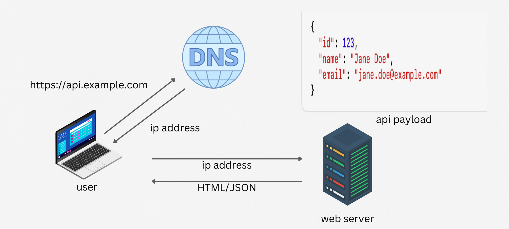
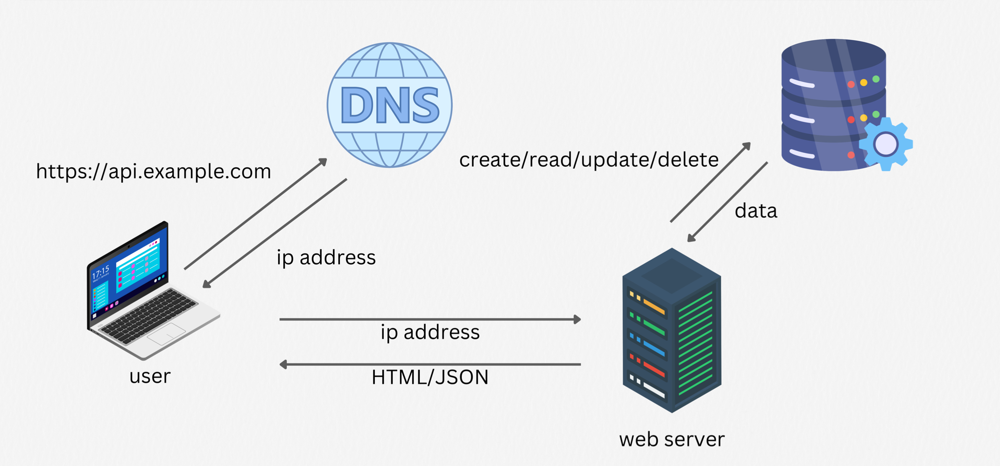
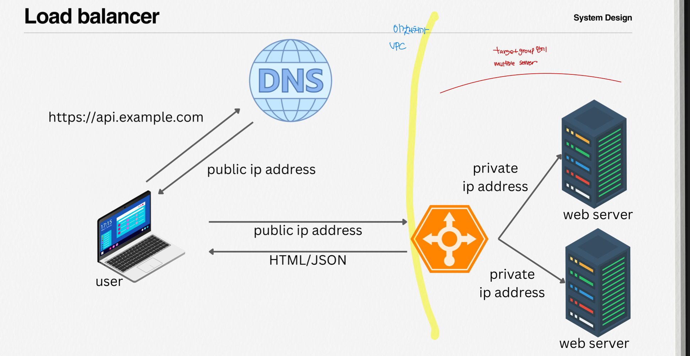
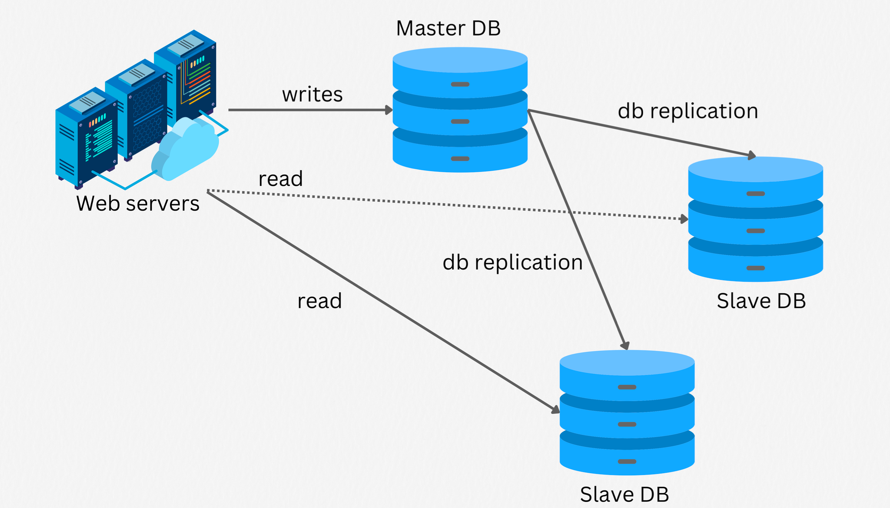

`1장: 사용자 수에 따른 규모 확장성`
---
## Single server setup

1. 사용자는 도메인 이름을 이용하여 웹사이트에 접속합니다. 이 접속을 위해서는 도메인 이름을 도메인 이름 서비스에 질의하여 IP 주소로 변환하는 과정이 필요하빈다.
2. DNS 조회로 웹 서버의 IP 주소가 반환됩니다.
3. 해당 IP 주소로 HTTP 요청이 전달 됩니다.
4. 요청을 받은 웹 서버는 HTML 페이지나 JSON 형태의 응답을 반환합니다. 
-> 이러한 과정을 통해서 우리의 브라우저 안에서 렌더링이 되거나 데이터를 받을 수 있습니다. 

@ 단일 서버 구성
웹 클라이언트 => 연결 <=  웹서버 WAS + 데이터베이스 서버

## Database

@ WAS와 데이터베이스 서버를 분리 구성
웹 클라이언트 => 연결 <= 웹서버 WAS => 연결 <= 데이터베이스 서버

사용자가 늘면 서버 하나로는 충분하지 않아서 여러 서버를 두어야 합니다.
하나는 웹/모바일 트래픽 처리 용도로, 또 다른 하나는 데이터베이스용으로 분리해보겠습니다.

##  Relational Database Management System(RDBMS)?? Non-Relational database(NoSQL)??
우선 관계형 데이터베이스 별칭 SQL 데이터베이스로는 대표적으로

• MySQL

• Oracle database

• PostgreSQL(Support JSON)

비관계형 데이터베이스로는 대표적으로

• CouchDB

• Neo4j

• Cassandra

• HBase

• Amazon DynamoDB

들이 있습니다. 

## When do we need NoSQL?
- "Requires super-low latency"

  •	응답 속도가 매우 중요할 때, 데이터 모델을 비정규화(Denormalize)하거나 병렬 처리(Parallel processing), 내부 캐시(Internal Cache) 등을 통해 데이터를 빠르게 조회할 수 있어야 합니다.  

  •	전통적인 RDBMS 구조에서 JOIN 연산이 잦으면 속도가 느려질 수 있는데, NoSQL은 스키마 제약이 적어 구조를 단순화(또는 비정규화)해서 빠른 읽기/쓰기 성능을 얻을 수 있습니다.  

- "Unstructured data"

  •	텍스트, 이미지, 로그, 센서 데이터 등 구조가 일정하지 않은 데이터를 저장해야 하는 상황에서 스키마가 고정되지 않은 NoSQL이 유리합니다.
  •	RDBMS는 테이블 스키마가 엄격해서, 계속해서 바뀌는 데이터 구조에 유연하게 대응하기 어렵습니다.
- "Only need Serialize / Deserialize(JSON, XML, YAML)"

  •	데이터 전송 또는 저장 시, 단순히 직렬화 포맷으로 넣고 빼기만 하면 된다면, Key-Value 또는 Document 지향 형태의 NoSQL DB가 사용하기 편리합니다.
  •	구조를 미리 정의할 필요가 없고, 애플리케이션 측에서 JSON, XML, YAML 등 다양한 형식으로 데이터를 가공하기 쉽습니다.
- "Store massive amount of data"

  •	데이터 규모가 급격히 커지고, 수평 확장(Scale-out)이 필요한 시점이라면, NoSQL이 더 적합할 수 있습니다.
  •	RDBMS에서도 수평 확장은 가능하지만, 일반적으로 Sharding과 같은 복잡한 설정이 필요합니다. 반면 NoSQL은 기본적으로 클러스터링과 분산 아키텍처가 잘 되어 있어, 대규모 데이터를 효율적으로 처리할 수 있습니다.

-> 1.데이터 구조가 유연해야 하거나 2. 아주 빠른 읽기/쓰기 성능이 필요하고 3. 대규모 확장성(Scalability)이 중요한 경우
NoSQL을 고려하면 좋습니다.

## Vertical scaling vs. Horizontal scaling
1. 수직 확장 (Vertical scaling)

   •	Scale up/down: CPU, RAM 등 하드웨어 자원을 업그레이드하거나 다운그레이드하여 서버 용량을 확장/축소하는 방식

   •	장점: 트래픽이 낮을 때 적합

   •	단점:
   •	물리적인 한계가 존재 (더 이상 확장할 수 없는 시점이 올 수 있습니다. )

   •	장애 발생 시 대체할 서버가 없어, 장애 복구나 이중화(failover/redundancy)에 취약

2. 수평 확장 (Horizontal scaling)

   •	Scale in/out: 클러스터에 더 많은 서버를 추가하여 용량을 확장하거나, 서버를 제거하여 축소하는 방식

   •	주로 선호되는 방식: 무중단 확장이나 트래픽 분산 등 여러 측면에서 이점이 많음

-> 고려 사항

1.	샤딩(Sharding) 방법 

•   샤딩은 데이터를 여러 DB에 나누는 것 입니다. 

•	데이터를 어떤 기준으로 나눌 것인지 결정해야 합니다

2.	리샤딩(Resharding) 데이터

•	샤딩한 데이터를 재분배(Resharding)해야 할 경우, 어떻게 처리할지 고려해야합니다.

3.	Celebrity problem(Hotspot key problem)
•	특정 키(또는 파티션)에 지나치게 많은 트래픽이 몰리는 문제

4.	여러 서버에 걸친 Join 쿼리
•	분산된 데이터에 대해 Join을 수행해야 할 때 복잡성이 증가

하나의 해결책
•	**비정규화(De-normalization)**를 통해 데이터를 한 서버에 모은 뒤, 해당 서버에서 쿼리를 실행하면 여러 서버를 오가며 조인하지 않아도 됩니다. 

## Load balancer

loag balancing set에 속한 웹 서버들에게 트래픽 부하를 고르게 분산하는 역할을 합니다.

만약 로드밸런서에 또 하나의 웹서버를 추가한다면 장애를 자동으로 복구하지 못하는 문제를 해결할 수 있으며, 웹 계층의 가용성이 향상됩니다. 구체적으로는 아래와 같습니다.

1.	서버 1이 다운되면, 로드밸런서는 자동으로 모든 트래픽을 서버 2로 전송하여 서비스가 중단되지 않습니다.

2.	만약 트래픽이 급격히 증가하여 서버 2대만으로 처리할 수 없게 된다면, 로드밸런서에 서버를 하나 더 추가하여 문제를 해결할 수 있습니다.

- 오토 스케일링 -> 웹 서버 계층에 필요한 시스템의 부하를 자동으로 조절 할 수 있습니다.
- ex) cpu 90% 이상 되면,  90 90 -> 60 60 60 -> cpu 증가량이 높아지면 점점 늘어나는 auto scaling

## Database replication

데이터베이스를 Master-Slave로 나누는데 쓰기 연산은 Master에서만 지원하고, 읽기 연산은 Slave에서만 지원합니다.
대부분의 애플리케이션에서는 쓰기 작업 보다는 읽기 작업이 훨씬 많기 때문에 Slave 데이터베이스가 훨씬 많습니다.

조회 기능은 slave DB
생성, 업데이트, 삭제 기능은 master DB

### 데이터베이스 다중화의 장점

더 나은 성능 : 모든 데이터 변경 연산은 Master 서버로만 전달되는 반면 읽기 연산은 Slave 데이터베이스 서버들로 분산됩니다. 병렬로 처리될 수 있는 쿼리의 수가 늘어나므로 성능이 좋아집니다.

안전성: 데이터베이스 서버 가운데 일부가 파괴되어도 데이터는 보존될 것입니다. 데이터를 지역적으로 떨어진 여러 장소에 다중화 시켜놓을 수 있기 때문입다.

가용성: 데이터를 여러 지역에 복제해 둠으로써, 하나의 데이터베이스 서버에 장애가 발생하더라도 다른 서버에 있는 데이터를 가져와 계속 서비스할 수 있게 됩니다.

