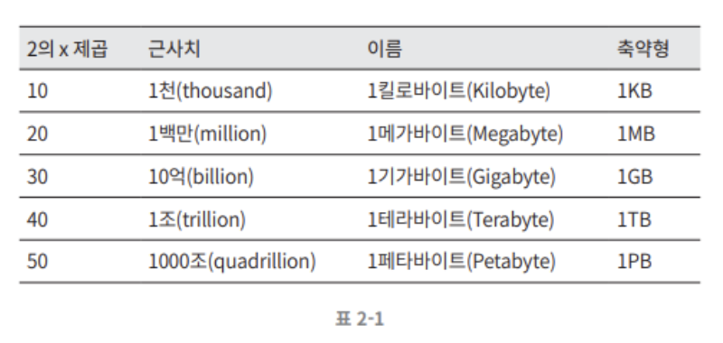

# Chapter 2. 개략적인 규모 추정

- 개략적인 규모 추정은 보편적으로 통용되는 성능 수치상에서 사고 실험을 행하여 추정치를 계산하는 행위로서, 
- 어떤 설계가 요구사항에 부합할 것인지 보기 위한 것이다!

---

## 2의 제곱수

- 분산 시스템에서 다루는 데이터 양을 계산하기 위해서는 데이터 볼륨의 단위를 2의 제곱수로 표현하면 어떻게 되는지 우선 알아야 한다.

- 최소 단위는 1바이트이고, 8비트로 구성된다.

- ASCII 문자 하나가 차지하는 메모리 크기가 1바이트이다.

---

## 모든 프로그래머가 알아야 하는 응답지연 값

- 해당 수치들은 컴퓨터 연산들의 처리 속도가 어느 정도인지 짐작할 수 있도록 해준다.

- 위 그림은 해당 수치들을 시각화한 수치이다.

### 결론

- 메모리는 빠르지만 디스크는 아직도 느리다.
- 디스크 탐색(seek)은 가능한 한 피하라.
- 단순한 압축 알고리즘은 빠르다.
- 데이터를 인터넷으로 전송하기 전에 가능하면 압축하라.
- 데이터 센터는 보통 여러 지역(region)에 분산되어 있고, 센터들 간에 데이터를 주고받는 데는 시간이 걸린다.

---

## 가용성에 관계된 수치들

### 고가용성 (high availability)
- 시스템이 오랜 시간 동안 지속적으로 중간 없이 운영될 수 있는 능력을 지칭하는 용어
- 퍼센트로 표현
- 100% 는 시스템이 단 한 번도 중단된 적이 없었음을 의미
- 대부분 서비스는 99%~100% 사이의 값을 갖는다.

### SLA (Service Level Agreement)
- 서비스 사업자와 고객 사이에 맺어진 합의
- 이 합의에는 서비스 사업자가 제공하는 서비스의 가용시간이 공식적으로 기술되어 있다.
- 가용시간은 관습적으로 숫자 9를 사용해 표시한다.
- 9가 많으면 많을수록 좋다.

---

## 예제 : 트위터 QPS와 저장소 요구량 추정

### 가정
- 월간 능동 사용자는 3억 명이다.
- 50%의 사용자가 트위터를 매일 사용한다.
- 평균적으로 각 사용자는 매일 2건의 트윗을 올린다.
- 미디어를 포함하는 트윗은 10% 정도다.
- 데이터는 5년간 보관된다.

### 추정

#### QPS(Query Per Second) 추정치
- 일단 능동 상용자(Daily Active User, DAU) = 3억 * 50% = 1.5억
- 1.5억 * 2 트윗 / 24시간 / 3600초 = 약 3500
- 최대 QPS(Peek QPS) = 2 * QPS = 약 7000

#### 미디어 저장을 위한 저장소 요구량
- 평균 트윗 크기
  - tweet_id에 64바이트
  - 텍스트에 140바이트
  - 미디어에 1MB
- 미디어 저장소 요구량: 1.5억 * 2 * 10% * 1MB = 30TB/일
- 5년간 미디어를 보관하기 위한 저장소 요구량: 30TB * 365 * 5 = 약 55PB

---

## Tip

가장 중요한 것은 무제를 풀어 나가는 절차다!

- 근사치를 활용한 계산
  - "99987/9.1"을 정확히 계산하려고 시간 낭비 X
  - "100,000/10"로 간소화하여 계산!

- 가정들은 적어 두자!

- 단위(unit)를 붙이라!
  - 단위를 붙이는 습관을 들여 모호함을 방지!

- 많이 출제되는 개략적 규모 추정 문제
  - QPS 추정
  - 최대 QPS 추정
  - 저장소 요구량 추정
  - 캐시 요구량 추정
  - 서버 수 추정
