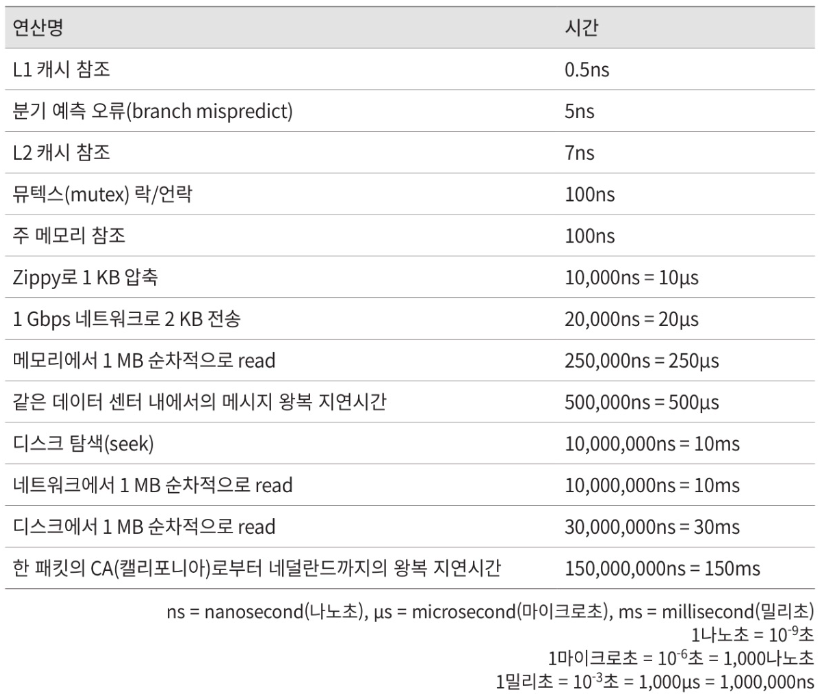
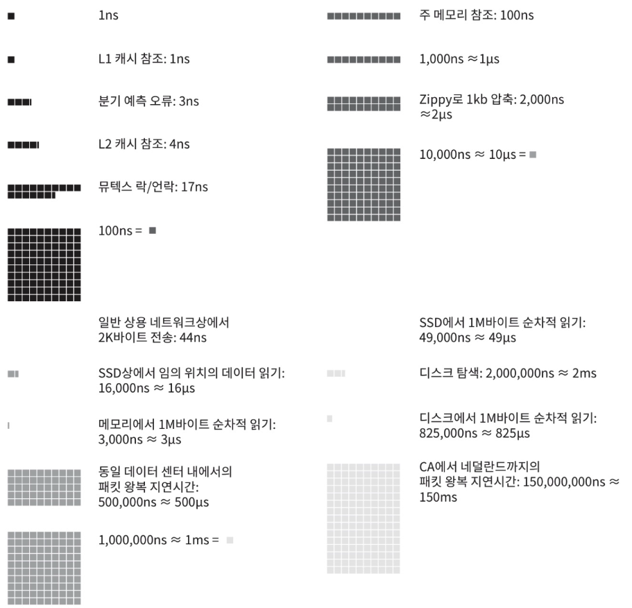

# Chapter 02: 개략적인 규모 측정

`개략적인 규모 추정`은 **보편적으로 통용되는 성능 수치상**에서 사고 실험을 행하여 **추정치를 계산하는 행위**로서, `어떤 설계가 요구사항에 부합할 것인지` 보기 위한 것이다.

> 👉🏻 이번 장에서는 여기서 말하는 **_"보편적으로 통용되는 성능 수치상"_** 을 알아보고, **_추정치를 계산하는 간단한 예시_** 를 살펴본다.

시스템 설계 면접을 볼 때, 때로는 `시스템 용량`이나 `성능 요구사항`을 개략적으로 추정해 보라는 요구를 받게 된다.

이를 효과적으로 해내려면 규모 확장성을 표현하는 데 필요한 기본기에 능숙해야 한다.

- 2의 제곱수
- 응답지연 값
- 가용성에 관계된 수치들

그리고 아래와 관련된 수치들을 계산하는 것에 익숙해져야 한다.

- QPS (Query Per Second)
- 최대 QPS
  - 👉🏻 시스템에 부하가 발생할 수 있는 상황을 고려해서, QPS에 적정한 여유 공간을 더해서 계산한 값
- 저장소 요구량
- 캐시 요구량
- 서버 수

## 2의 제곱수

> 개념적인 내용이지만 일단 써둔다

| 2의 x제곱 | 근사치 | 축약형 |
| --------- | ------ | ------ |
| 10        | 1천    | 1KB    |
| 20        | 1백만  | 1MB    |
| 30        | 10억   | 1GB    |
| 40        | 1조    | 1TB    |
| 50        | 1000조 | 1PB    |

## 응답지연 값



> 이미지 출처: https://velog.io/@iln1027/system-design-interview-2-1

위 표를 통해 컴퓨터 연산들의 처리 속도를 짐작할 수 있다. 수치를 구체적으로 외우는 것은 말이 안 되는 것 같고, 대략적으로 각 작업들이 지연을 크게 발생시키는지 확인하는 정도면 괜찮을 것 같다.



> 이미지 출처: https://velog.io/@iln1027/system-design-interview-2-1

위의 표를 최근 기술 동향에 반영하여 2020년을 기준으로 시각화한 수치이다.

이를 분석하면 아래와 같은 결론을 얻을 수 있다.

- 메모리는 빠르나 디스크는 아직도 느리다.
  - 👉🏻 데이터 접근시 최대한 `메모리(= 캐시)`를 활용하도록 설계할 필요성
- 디스크 탐색(seek)은 가능한 피하는 것이 좋다.
  - 👉🏻 설계 측면에서는 `캐싱` 도입을, 코드 상에서는 `데이터베이스 최적화`를 적용할 필요성
    - **데이터베이스 최적화** - 쿼리 캐싱, 인덱싱 _(너무 많으면 오히려 쓰기 작업 늘어날 수도 있음)_ ...
- 단순한 `압축 알고리즘`은 빠르다.
  - 👉🏻 위 이미지에 있는 Zippy 알고리즘을 말하는듯..?
- 데이터를 인터넷으로 전송하기 전에 가능하면 `압축`한다.
- 데이터 센터는 보통 여러 지역에 분산되어 있고, 센터들(지역) 간에 데이터를 주고받는 데는 시간이 걸린다.

## 가용성에 관계된 수치들

> **고가용성**  
> 시스템이 오랜 시간 동안 지속적으로 중단 없이 운영될 수 있는 능력을 지칭

## 예제: 트위터 `QPS`와 `저장소 요구량` 추정

### 가정

```
- 월간 능동 사용자(MAU)는 3억 명이다.
- 50%의 사용자가 트위터를 매일 사용한다.
- 평균적으로 각 사용자는 매일 2건의 트윗을 올린다.
- 미디어를 포함하는 트윗은 10% 정도다.
- 데이터는 5년간 보관된다.
```

### 추정 - 1. QPS

1. 1초당 쿼리 수를 추정하기 위해, 일간 능동 사용자(DAU) 추정치를 계산  
   👉🏻 3억 X 0.5 = `1.5억`명
2. 트윗을 올리는 과정에서 총 1회의 쿼리가 발생한다고 가정하고, 일간 쿼리 수 추정치를 계산  
   👉🏻 1.5억명 X 2건 X 1회 쿼리 = `3억`회
3. 1초당 쿼리 수 추정치 계산  
   👉🏻 일간 3억회 / (24h X 60M X 60S) = `약 3500`회
4. 최대 QPS 추정  
   👉🏻 2 X 3500회 = `약 7000`회

👉🏻 QPS는 약 3500회 | 최대 QPS는 약 7000회로 추정 가능

### 추정 - 2. 미디어 저장을 위한 저장소 요구량

```md
- 평균 트윗 크기 설정
  - `tweet_id`에 64비트 _(= `long long`)_
  - `텍스트`에 140바이트
  - `미디어`에 1MB
```

1. 일간 능동 사용자(DAU)는 `1.5억`명
2. 매일 업로드 되는 미디어의 개수 추정치를 계산  
   👉🏻 1.5억명 X 2건 X 0.1 = `3000만` 개
3. 매일 업로드 되는 미디어의 용량 추정치를 계산  
   👉🏻 3000만 개 X 1MB = `30TB/일`
4. 5년간 미디어를 보관하기 위한 저장소 추정치 계산  
   👉🏻 30TB X 365일 X 5년 = `약 55PB`

## 팁

개략적인 규모 추정 관련 면접에서 가장 중요한 것은 `문제를 풀어 나가는 절차`다.

> 즉, 올바른 절차를 밟느냐가 결과를 내는 것보다 중요하다.

1. `근사치`를 사용한다.
   - 계산 능력을 확인하는 문제가 아니다.
   - 최대한 계산하기 쉬운 값으로 바꾼다.
2. `가정`을 적어둔다.
   - 앞서 예제에서 살펴봤듯, 개략적인 규모를 추정하기 위해서는 가정이 중요하다.
3. `단위`를 붙여라.
   - 단위를 붙이지 않으면 스스로도 계산 과정에서 헷갈릴 것이다.
   - 단위 붙이는 습관을 들이면 모호함을 방지할 수 있다.
