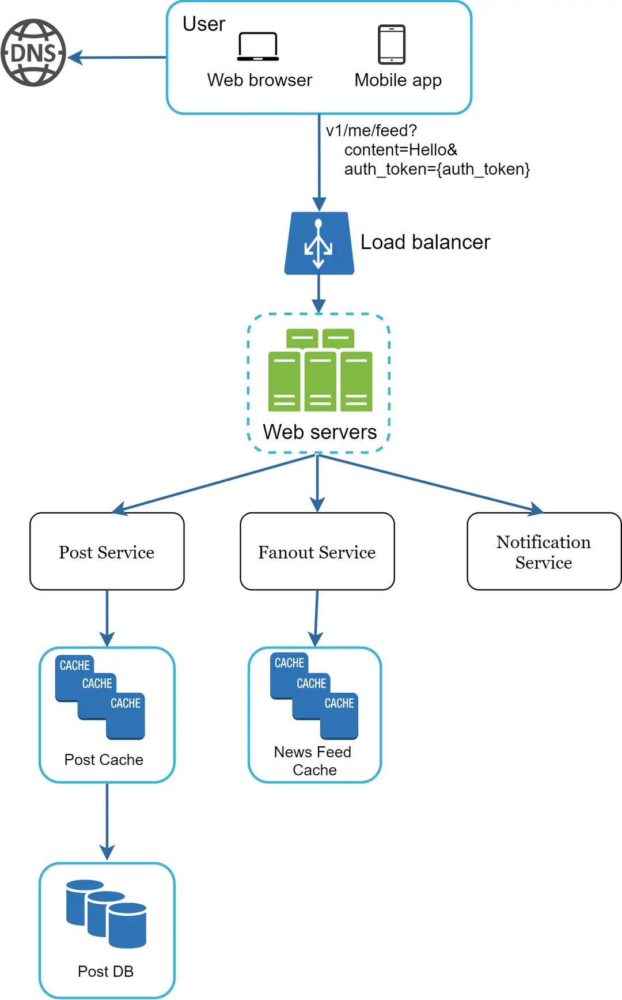
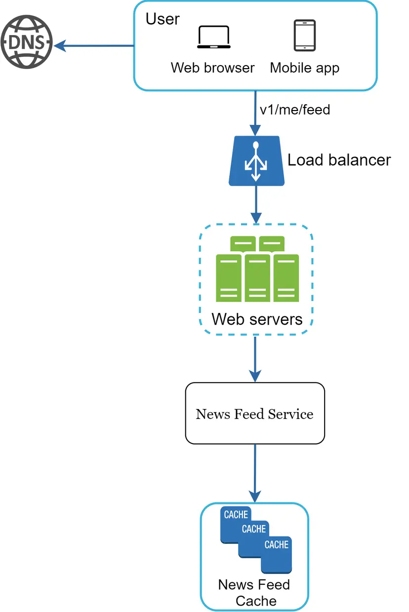
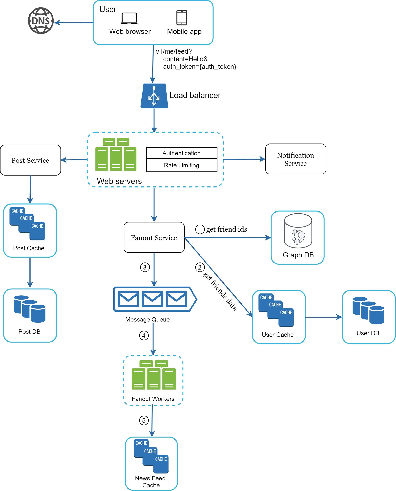
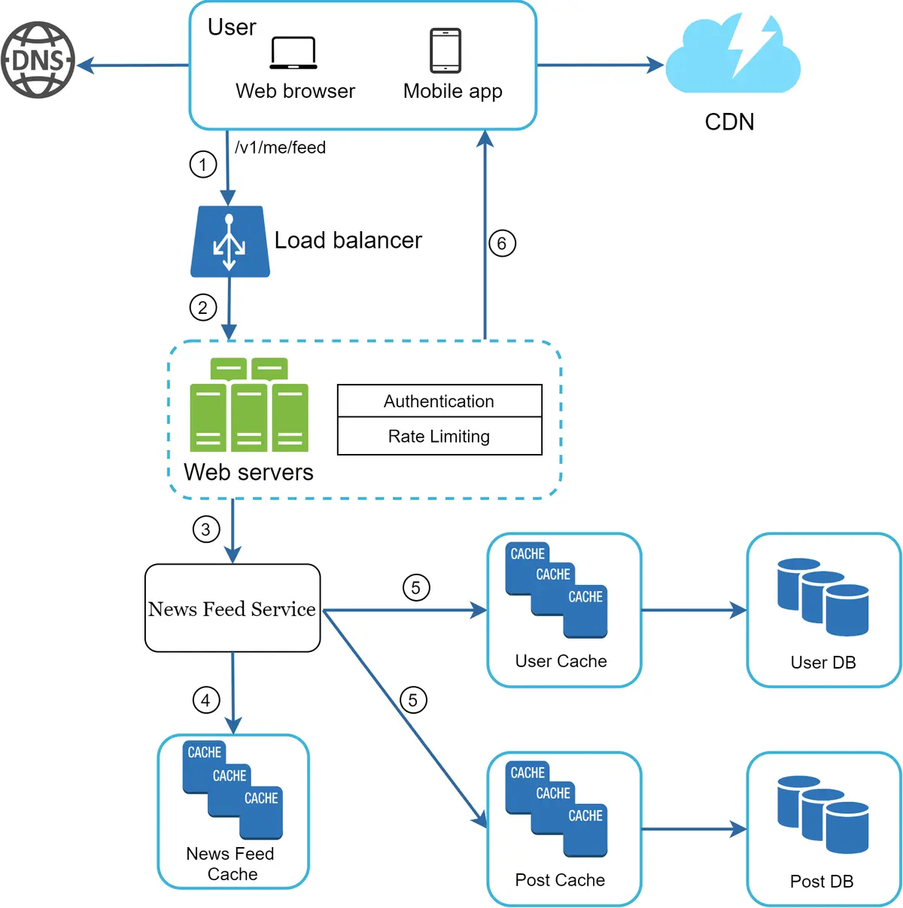

# Chapter 03: 시스템 설계 면접 공략법

시스템 설계 면접을 통해 지원자에 대해서 아래 항목들을 살펴볼 수 있다.

- 지원자가 `협력`에 적합한 사람인지
- `압박`이 심한 상황도 잘 헤쳐 나갈 자질이 있는지
- `모호한 문제`를 **건설적으로 해결할 능력**이 있는지
- `좋은 질문`을 던질 능력이 있는지

특히, 설계의 순수성에 집착한 나머지 `트레이드 오프`를 도외시하고 **오버 엔지니어링**을 하는 것은 좋지 않다.  
논리적인 근거로 트레이드 오프하는 과정 또한, 평가 과정에 포함된다고 볼 수 있겠다.

## 1단계: 문제 이해 및 설계 범위 확정

시스템 설계 면접에서는 생각 없이 바로 답을 내서는 좋은 점수를 받기 어렵다.  
시스템 설계 면접에서는 `정답이 없다는 것`을 상기해야 한다.

> 👉🏻 따라서 속도를 늦추고, 깊이 생각하고 질문하여 `요구사항`과 `가정들`을 분명히 해야한다.

1. 올바른 질문을 하는 것
2. 적절한 가정을 하는 것
3. 시스템 구축에 필요한 정보를 모으는 것

올바른 질문을 위해서는 `요구사항을 정확히 이해하는 데 필요한 질문`을 해야한다.

- 구체적으로 `어떤 기능들`을 만들어야 하는지?
- `제품 사용자 수`는 얼마나 되는지?
- `회사의 규모`는 얼마나 빨리 커지리라 예상하는지? 석 달, 여섯 달, 일년 뒤의 규모는 얼마가 되리라 예상하는지?
- 회사가 주로 사용하는 `기술 스택`은 무엇인지? **설계를 단순화하기 위해 활용**할 수 있는 `기존 서비스`로는 어떤 것들이 있는지?

### 예제

뉴스 피드 시스템을 설계하라는 요구를 받았다고 가정했을 때, `요구사항을 분명히 하기 위한 질문`을 던져야 한다.

예제는 다음과 같다.

```
지원자: 모바일 앱과 웹 앱 가운데 어느 쪽을 지원해야 하나요? 아니면 둘 다인가요?
면접관: 둘 다 지원해야 합니다.

지원자: 가장 중요한 기능은 무엇인가요?
면접관: 새로운 포스트를 올리고, 다른 친구의 뉴스 피드를 볼 수 있도록 하는 기능입니다.

지원자: 이 뉴스 피드는 시간 역순으로 정렬되어야 하나요? 아니면 다른 특별한 정렬 기준이 있습니까?
제가 특별한 정렬 기준이 있냐고 묻는 이유는, 피드에 올라갈 포스트마다 다른 가중치가 부여되어야 하는지 알고 싶어서 인데요, 가령 가까운 친구의 포스트가 사용자 그룹에 올라가는 포스트보다 더 중요하다거나.
면접관: 문제를 단순히 만들기 위해, 일단 시간 역순으로 정렬된다고 가정합시다.

지원자: 한 사용자는 최대 몇 명의 사용자와 친구를 맺을 수 있나요?
면접관: 5,000명입니다.

지원자: 사이트로 오는 트래픽 규모는 어느 정도입니까?
면접관: 일간 능동 사용자(DAU)는 천만 명입니다.

지원자: 피드에 이미지나 비디오도 올라올 수 있나요? 아니면 포스트는 그저 텍스트입니까?
면접관: 이미지나 비디오 같은 미디어 파일도 포스트 할 수 있어야 합니다.
```

뒤에서 더 학습해야 알겠지만, 위 예제의 몇몇 질문의 의도를 스스로 파악한 바는 아래와 같다.

1. `중요한 기능`을 통해서 필요한 작업들을 구체화시킬 수 있다.
2. **피드를 노출시키는 과정**에서 발생 가능한 트래픽 규모를 계산하기 위해서는 `한 사용자별 최대 가능한 친구 수`를 알아야 한다.
3. `트래픽 규모`를 계산하기 위해서는 일 평균 사용자 수를 알아야 한다.
4. `저장소 규모`를 계산하기 위해서는 각 피드에 포함되어 있는 세부 데이터의 타입을 알아야 한다. _(2장 참고)_

## 2단계: 개략적인 설계안 제시 및 동의 구하기

이 과정은 면접관과 협력하며 진행하면 좋다.

- 설계안에 대한 **최초 청사진**을 제시하고 의견을 구하기.
- 화이트보드나 종이에 핵심 컴포넌트를 포함하는 **다이어그램**을 그리기.
  - 클라이언트(모바일/웹), API, 웹 서버, 데이터 저장소, 캐시, CDN, 메시지 큐 등
- 이 최초 설계안이 시스템 규모에 관계된 **제약사항들을 만족하는지 개략적으로 계산**한다.
  - 계산 과정은 소리내어 설명한다.

> **`API 엔드 포인트`나 `데이터베이스 스키마`도 보여야 하는가?**  
> 질문에 따라 다름.  
> **"구글 검색 엔진 설계"** 와 같은 큰 규모에서는 지나치게 세부적인 내용일 수 있지만, **"멀티 플레이어 포커 게임의 백엔드 설계"** 와 같은 규모에서는 적합할 수 있다. _(면접관한테 의견을 물어보기)_

### 예제

뉴스 피드 시스템은 두 가지 처리 플로우로 나눠서 생각할 수 있다.

1. 피드 발행
   - 사용자가 포스트를 올리면, 데이터가 캐시/데이터베이스에 기록되고, 해당 사용자의 친구 뉴스 피드에 뜨게 된다.
2. 피드 생성
   - 어떤 사용자의 뉴스 피드는 해당 사용자 친구들의 포스트를 시간 역순으로 정렬하여 만든다.

아래 그림은 각각 피드 발행과 피드 생성 플로우를 개략적으로 그린 것이다.

#### 피드 발행



> 이미지 출처: https://bytebytego.com/courses/system-design-interview/a-framework-for-system-design-interviews

#### 피드 생성



> 이미지 출처: https://bytebytego.com/courses/system-design-interview/a-framework-for-system-design-interviews

_상세한 내용은 11장에서 설명한다고 함 ..._

여기까지 진행하면 다음 목표는 달성한 상태일 것이다.

- 시스템에서 전반적으로 달성해야 할 목표와 기능 범위 확인
- 전체 설계의 개략적 청사진 마련
- 해당 청사진에 대한 면접관의 의견 청취
- 상세 설계에서 집중해야 할 영역들 확인

## 3단계: 상세 설계

이제 해야 할 일은 설계 대상 컴포넌트 사이의 우선순위를 정하는 것이다.

대부분의 경우, `특정 시스템 컴포넌트들의 세부사항`을 깊이 있게 설명하는 것을 보길 원한다.

이때, 불필요한 세부 사항에 시간을 쓰면 안된다.

> `규모 확장 가능한 시스템`을 설계할 능력이 있다는 것을 입증하는 데 도움되지 않는 부분에서 집중하면 안된다.

### 예제

뉴스 피드 시스템의 개략적 설계를 마친 상황이고, 면접관도 이에 대해 만족하고 있다고 가정한다.

이제 아래의 두 가지 `사용 예시를 깊이 탐구해야` 한다.

> 👉🏻 즉, 개략적인 설계를 마쳤다면, **실제 서비스 사용 과정**에서 앞선 설계가 어떻게 동작하는지 보여줘야 한다.

1. 피드 발행
2. 뉴스 피드 가져오기

#### 피드 발행



#### 뉴스 피드 가져오기



_마찬가지로 상세한 내용은 11장에서 설명한다고 함 ..._

## 4단계: 마무리

- 오류가 발생하면 무슨 일이 생기는지 따져보면 좋다.
  - 서버 오류, 네트워크 장애 등
- 미래에 닥칠 규모 확장 요구에 어떻게 대처할 것인지도 흥미로운 주제다.
  - _ex) 현재 설계로 백만 유저를 감당할 수 있지만, 천만 사용자를 감당하려면 어떻게 해야하는가?_

## 면접에서 해야할 것

- `질문`을 통해 확인하기
  - 스스로 내린 가정이 옳다 믿고 진행하면 안 됨
- `문제의 요구사항` 이해하기
- 면접관이 자신의 사고 흐름을 이해할 수 있도록 한다.
  - 면접관과 소통하면서 진행한다.
- 가능하다면 여러 해법을 함께 제시한다.
- 개략적 설계에 면접관이 동의하면, **각 컴포넌트의 세부사항**을 설명하기 시작한다.
  - _컴포넌트 - 사용자 단말, CDN, 웹 서버 등_
  - 이때, **가장 중요한 컴포넌트부터** 진행한다.

## 면접에서 하지 말아야 할 것

- `요구사항`이나 `가정`들을 분명히 하지 않은 상태에서 설계를 제시하지 말 것
- 처음부터 특정 컴포넌트의 세부사항을 너무 깊이 설명하지 말 것
  - `개략적 설계를 마친 뒤`에 세부사항으로 넘어가기
