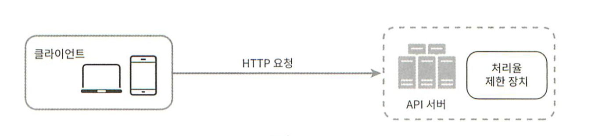
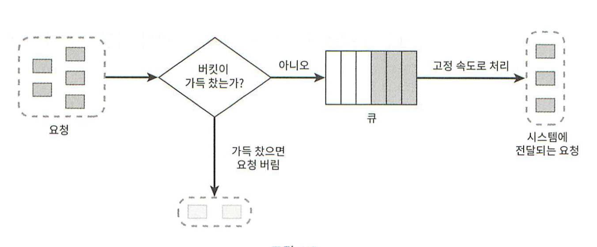
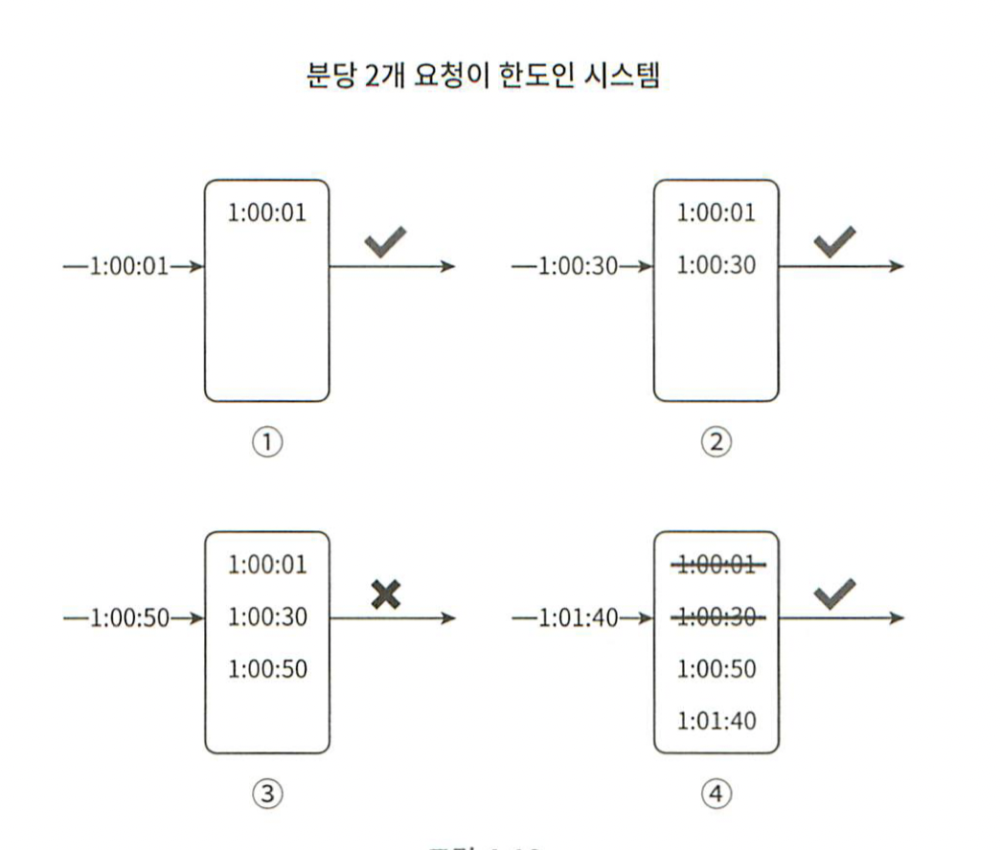
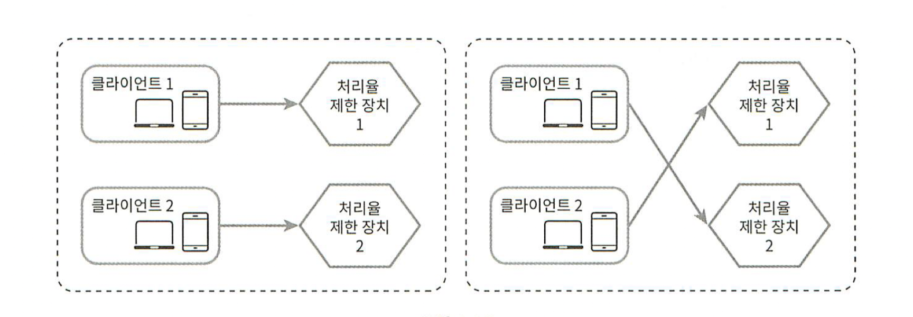

# 처리율 제한 장치의 설계

네트워크 시스템에서 처리율 제한 장치(rate limiter)는 클라이언트 또는 서비스가 보내는 트래픽의 처리율(rate)을 제어하기 위한 장치다!

HTTP를 예로 들면 특정 기간 내에 전송되는 클라이언트의 요청 횟수를 제한한다.

API 요청 횟수가 제한 장치에 정의된 임계치(threshold)를 넘어서면 추가로 도달한 모든 호출은 처리가 중단된다.

**사례**

- 사용자는 초당 2회 이상 새 글을 올릴 수 없다.
- 같은 IP 주소로는 하루에 10개 이상의 계정을 생성할 수 없다.
- 같은 디바이스로는 주당 5회 이상 리워드(reward)를 요청할 수 없다.


이런 처리율 제한 장치를 설계해보자!

---

## API에 처리율 제한 장치를 두면 좋은 점?

1. DoS (Denial of Service) 공격에 의한 자원 고갈(resource starvation)을 방지할 수 있다.
   - 처리율 제한 장치는 추가 요청에 대해서는 처리를 중단함으로써 DoS 공격을 방지한다.

2. 비용을 절감한다.
   - 우선순위가 높은 API에 더 많은 자원을 할당할 수 있다.
   - 처리율 제한은 제 3자 API에 사용료를 지불하고 있는 회사들에게는 아주 중요하다! 룃수를 제한할 수 있어야 비용을 절감한다.

3. 서버 과부화를 막는다.
   - 봇에서 오는 트래픽이나 사용자의 잘못된 이용 패턴으로 유발된 트래픽을 걸러내는데 처리율 제한 장치를 활용할 수 있다.

---

## 1단계 문제 이해 및 설계 범위 확정

지원자 : 어떤 종류의 처리율 제한 장치를 설계해야 하나요? 클라이언트 측 제한 장치입니까, 아니면 서버 측 제한 장치입니까?

면접관 : 서버측 API를 위한 장치를 설계한다고 가정합시다.

지원자 : 어떤 기준을 사용해 API 호출을 제어해야 할까요? IP 주소를 사용해야 하나요? 아니면 사용자 ID? 아니면 다른 기준이 있습니까?

면접관 : 다양한 형태의 제어 규칙(throttling rules)을 정의할 수 있도록 하는, 유연한 시스템이어야 합니다.

지원자 : 시스템 규모는 어느 정도여야 할까요? 스타트업 정도 회사를 위한 시스템입니까 아니면 사용자가 많은 큰 기업을 위한 제품입니까?

면접관 : 설계할 시스템은 대규모 요청을 처리할 수 있어야 합니다.

지원자 : 시스템이 분산 환경에서 동작해야 하나요?

면접관 : 그렇습니다.

지원자 : 이 처리율 제한 장치는 독립된 서비스입니까 아니면 애플리케이션 코드에 포함될 수도 있습니까?

면접관 : 결정은 본인이 내리면 됩니다

지원자 : 사용자의 요청이 처리율 제한 장치에 의해 걸러진 경우 사용자에게 그 사실을 알려야 하나요?

면접관 : 그렇습니다.


### 요구사항

- 설정된 처리율을 초과하는 요청은 정확하게 제한한다.
- 낮은 응답시간 : 이 처리율 제한 장치는 HTTP 응답시간에 나쁜 영향을 주어서는 곤란하다.
- 가능한 한 적은 메모리를 써야 한다.
- 분산형 처리율 제한(distributed rate limiting) : 하나의 처리율 제한 장치를 여러 서버나 프로세스에서 공유할 수 있어야 한다.
- 예외 처리 : 요청이 제한되었을 때는 그 사실을 사용자에게 분명하게 보여주어야 한다.
- 높은 결함 감내성 (fault tolerance) : 제한 장치에 장애가 생기더라도 전체 시스템에 영향을 주어서는 안 된다.

---

## 개략적 설계안 제시 및 동의 구하기

**처리율 제한 장치는 어디에 둘 것인가??**

- 클라이언트 측 
  - 클라이언트 요청은 쉽게 위변조가 가능하며, 모든 클라이언트의 구현을 통제하는 것은 어려울 수 있기 때문에 처리율 제한을 안정적으로 걸 수 있는 장소가 못 된다.

- 서버 측
  
    


- 미들웨어

    - 처리율제한 장치를 API 서버에 두는 대신, 처리율 제한 미들웨어를 만들어 해당 미들웨어로 하여금 요청을 통제하도록 하는 것
    
        
    
    
- API 서버의 처리율이 초당 2개의 요철으로 제한된 상황에서, 클라이언트가 3번째 요청을 앞의 두 요청과 같은 초 범위내에서 전송했을 때!
    
    


---

처리율 제한 장치는 보통 API 게이트웨이라 불리는 컴포넌트에 구현된다.

API 게이트웨이 == 미들웨어

API 게이트웨이는 처리율 제한, SSL 종단(termination), 사용자 인증(authentication), IP 허용 목록(whitelist) 관리 등을 지원하는 완전 위탁 관리형 서비스, 즉 클라우드 업체가 유지 보수를 담당하는 서비스다.

---

## 처리율 제한 기능을 설계할 때 중요하게 따져야 하는 것?

1. 처리율 젯한 장치는 어디 두어야 하나?
2. 서버에 두어야 하나 아니면 게이트웨이에 두어야 하나? 

정답은 없다.

일반적으로 적용될 수 있는 몇 가지 지침

- 프로그래밍 언어, 캐시 서비스 등 현재 사용하고 있는 기술 스택을 점검하라.
  - 현재 사용하는 프로그래밍 언어가 서버 측 구현을 지원하기 충분할 정도로 효율이 높은지 확인하라.

- 필요에 맞는 처리율 제한 알고리즘을 찾아라!
  - 서버 측에서 모든 것을 구현하기로 했다면, 알고리즘은 자유롭게 선택 가능!
  - 제3 사업자가 제공하는 게이트웨이를 사용하기로 했다면 선택지는 제한된다!

- 설계가 마이크로서비스에 기반하고 있고, 사용자 인증이나 IP 허용목록 관리 등을 처리하기 위해 API 게이트웨이를 이미 설계에 포함시켰다면!
  - 처리율 제한 기능 또한 게이트웨이에 포함시켜야 할 수도 있다.

- 처리율 제한 장치를 구현하기에 충분한 인력이 없다면 상용 API 게이트웨이를 쓰는 것이 바람직한 방법일 것이다!

---

## 처리율 제한 알고리즘

### 토큰 버킷 (token bucket)

처리율 제한에 폭넓게 이용되고 있는 알고리즘

인터넥 기업들이 보편적으로 사용하고 있다. (아마존, 스트라이프가 API 요청을 통제하기 위해 사용)


### 동작 원리


토큰 버킷은 지정된 용량을 갖는 컨테이너이다.

토큰 공급기(refiller)는 이 버킷에 매초 2개의 토큰을 추가한다.

버킷이 가득 차면 추가로 공급된 토큰은 버려진다 (overflow)


각 요청은 처리될 때마다 하나의 토근을 사용한다.

요청이 도착하면 버킷에 충분한 토큰이 있는지 검사하게 된다.

- 충분한 토큰이 있는 경우, 버킷에서 토큰 하나를 꺼낸 후 요청을 시스템에 전달한다.
- 충분한 토큰이 없는 경우, 해당 요청은 버려진다. (dropped)


토큰 버킷의 크기는 4, 토큰 공급률(refill rate)은 분당 4인 예시


**토큰 버킷 알고리즘은 2개의 인자를 받는다.**

1. 버킷 크기 : 버킷에 담을 수 있는 토큰의 최대 개수
2. 토큰 공급률 (refill rate) : 초당 몇 개의 토큰이 버킷에 공급되는가

버킷은 몇 개나 사용해야 하나? 공급 제한 규칙에 따라 달라진다!


### 사례

- 통상적으로 API 엔드포인트(endpoint)마다 별도의 버킷을 둔다.
  - 예를 들어 사용자마다 하루에 한번 포스팅을 할 수 있고, 친구는 150명까지 추가할 수 있고, 좋아요 버튼은 다섯 번까지만 누를 수 있다면?
  - 사용자마다 3개의 버킷을 두어야 할 것이다.

- IP 주소별로 처리율 제한을 적용해야 한다면 IP 주소마다 버킷을 하나씩 할당해야 한다.

- 시스템의 처리율을 초당 10,000개 요청으로 제한하고 싶다면, 모든 요청이 하나의 버킷을 공유하도록 해야 할 것이다.


**장점**

- 구현이 쉽다.
- 메모리 사용 측면에서도 효율적이다.
- 짧은 시간에 집중되는 트래픽(burst of traffic)도 처리 가능하다. 버킷에 토큰이 남아있기만 하면 요청은 시스템에 전달될 것이다.

**단점**

- 이 알고리즘은 버킷 크기와 토큰 공급률이라는 두 개 인자를 가지고 있는데, 이 값을 적절하게 튜닝하는 것은 까다로운 일이 될 것이다.

---

### 누출 버킷 알고리즘

토큰 버킷 알고리즘과 비슷하지만 요청 처리율이 고정되어 있다는 점이 다르다!

누출 버킷 알고리즘은 보통 FIFO 큐로 구현한다.

### 동작 원리

- 요청이 도착하면 큐가 가득 차 있는지 본다. 빈자리가 있는 경우에는 큐에 요청을 추가한다.

- 큐가 가득 차 있는 경우에는 새 요청은 버린다.

- 지정된 시간마다 큐에서 요청을 꺼내어 처리한다.



**누출 버킷 알고리즘은 두 인자를 사용한다.**

1. 버킷 크기 : 큐 사이즈와 같은 값이다. 큐에는 처리될 항목들이 보관된다.
2. 처리율 (outflow rate) : 지정된 시간당 몇 개의 항목을 처리할지 지정하는 값이다. 보통 초 단위로 표현된다.

**장점**

- 큐의 크기가 제한되어 있어 메모리 사용량 측면에서 효율적이다.
- 고정된 처리율을 갖고 있기 때문에 안정적 출력(stable outflow rate)이 필요한 경우에 적합하다.

**단점**

- 단시간에 많은 트래픽이 몰리는 경우 큐에는 오래된 요청들이 쌓이게 되고, 그 요청들을 제때 처리 못하면 최신 요청들은 버려지게 된다.
- 두 개 인자를 갖고 있는데, 이들을 올바르게 튜닝하기가 까다로울 수 있다.

---

### 고정 윈도 카운터 알고리즘

### 동작 원리

- 타임라인 (timeline)을 고정된 간격의 윈도(window)로 나누고, 각 윈도마다 카운터를 붙인다.
- 요청이 접수될 때마다 이 카운터의 값은 1씩 증가한다.
- 이 카운터의 값이 사전에 설정된 임계치에 도달하면 새로운 요청은 새 윈도가 열릴때까지 버려진다.


- 타임라인의 시간 단위는 1초다.
- 시스템은 초당 3개까지의 요청만을 허용한다.
- 매초마다 열리는 윈도에 3개 이상의 요청이 밀려오면 초과분은 버려진다.

**문제점**

윈도의 경계 부근에 순간적으로 많은 트래픽이 집중될 경우 윈도에 할당된 양보다 더 많은 요청이 처리될 수 있다.


위 예시의 시스템은 분당 최대 5개의 요청만을 허용하는 시스템이다. 카운터는 매분마다 초기화된다.

예를 보면 2:00:00와 2:01:00 사이에 다섯 개의 요청이 들어왔다.

2:01:00과 2:02:00 사이에 또 다섯 개의 요청이 들어왔다.

윈도 위치를 조금 옮겨 2:00:30부터 2:01:30까지의 1분 동안을 살펴보면, 이 1분 동안 시스템이 처리한 요청은 10개이다!!

허용 한도의 2배인 것이다.


**장점**

- 메모리 효율이 좋다.
- 이해하기 쉽다.
- 윈도가 닫히는 시점에 카운터를 초기화하는 방식은 특정한 트래픽 패턴을 처리하기에 적합하다.

**단점**

- 윈도 경계 부근에서 일시적으로 많은 트래픽이 몰려드는 경우, 기대했던 시스템의 처리 한도보다 많은 양의 요청을 처리하게 된다.

---

### 이동 윈도 로깅 알고리즘

이동 윈도 로깅 알고리즘은 고정 윈도 카운터 알고리즘에 존재하는 중대한 문제를 해결한다.

윈도 경계 부근에 트래픽이 집중되는 경우 시스템에 설정된 한도보다 많은 요청을 처리하게 되는 문제를 해결한다.


### 동작 원리

- 이 알고리즘은 요청의 타임스탬프(timestamp)를 추적한다.

- 타임스탬프 데이터는 보통 레디스(Redis)의 정렬 집합(sorted set) 같은 캐시에 보관한다.

- 새 요청이 오면 만료된 타임스탬프는 제거한다. 만료된 타임스탬프는 그 값이 현재 윈도의 시작 시점보다 오래된 타임스탬프를 말한다.

- 새 요청의 타임스탬프를 로그(log)에 추가한다.

- 로그의 크기가 허용치보다 같거나 작으면 요청을 시스템에 전달한다. 그렇지 않은 경우에는 처리를 거부한다.


위 예시의 처리율 제한기는 분당 최대 2회의 요청만을 처리

- 요청이 1:00:01에 도착하였을 때, 로그는 비어 있는 상태다. 따라서 요청은 허용된다.
- 새로운 요청이 1:00:30에 도착한다. 
  - 해당 타임스탬프가 로그에 추가된다. 
  - 추가 직후 로그의 크기는 2이며, 허용 한도보다 크지 않은 값이다. 따라서 요청은 시스템에 전달된다.
- 새로운 요청이 1:00:50에 도착한다.
  - 해당 타임스탬프가 로그에 추가된다.
  - 추가 직후 로그의 크기는 3으로, 허용 한도보다 큰 값이다. 따라서 타임스팸트는 로그에 남지만 요청은 거부된다.
- 새로운 요청이 1:01:40에 도착한다.
  - [1:00:40, 1:01:40] 범위 안에 있는 요청은 1분 윈도 안에 있는 요청이지만,
  - 1:00:40 이전의 타임스탬프는 전부 만료된 값이다.
  - 따라서 두 개의 만료된 타임스탬프 1:00:01과 1:00:30을 로그에서 삭제한다.
  - 삭제 직후 로그의 크기는 2이다.
  - 따라서 1:01:40의 신규 요청은 시스템에 전달된다.

**장점**

- 이 알고리즘을 구현하는 처리율 제한 메커니즘은 아주 정교하다.
- 어느 순간의 윈도를 보더라도, 허용되는 요청의 개수는 시스템의 처리율 한도를 넘지 않는다.

**단점**

- 이 알고리즘은 다량의 메모리를 사용하는데, 거부된 요청의 타임스탬프도 보관하기 때문이다.

---

### 이동 윈도 카운터 (sliding window counter) 알고리즘

이동 윈도 카운터 알고리즘은 고정 윈도 카운터 알고리즘과 이동 윈도 로깅 알고리즘을 결합한 것이다.


처리율 제한 장치의 한도가 분당 7개 요청으로 설정되어 있고, 이전 1분 동안 5개의 요청이, 그리고 현재 1분동안 3개의 요청이 왔다고 해보자.

- 현재 1분간의 요청 수 + 직전 1분간의 요청 수 * 이동 윈도와 직전 1분이 겹치는 비율
- 위 예시에서는 공식에 따라 요청은 6.5개. 반올림 또는 내림하여 쓸 수 있음

위 예제의 경우 처리율 제한 한도가 분당 7개 요청이라고 했으므로, 현재 1분 30% 시점에 도착한 신규 요청은 시스템으로 전달될 것이다.

하지만 그 직후에는 한도에 도달하였으므로 더 이상 요청은 받을 수 없을 것이다.


**장점**

- 이전 시간대의 평균 처리율에 따라 현재 윈도 상태를 계산하므로 짧은 시간에 몰리는 트래픽에도 잘 대응한다.
- 메모리 효율이 좋다.

**단점**

- 직전 시간대에 도착한 요청이 균등하게 분포되어 있다고 가정한 상태에서 추정치를 계산하기 때문에 다소 느슨하다.
- 하지만 이 문제는 생각만큼 심각한 것은 아니다.

---

## 개략적인 아키텍쳐

**처리율 제한 알고리즘의 기본 아이디어!?**

얼마나 많은 요청이 접수되었는지를 추적할 수 있는 카운터를 추적 대상별로 두고 

(사용자별로 추적할 것인가? 아니면 IP 주소별로? 아니면 API 엔트포인트나 서비스 단위로?)

이 카운터의 값이 어떤 한도를 넘어서면 한도를 넘어 도착한 요청은 거부하는 것!!!


**그렇다면 이 카운터는 어디 보관할 것인가????**

데이터베이스 -> 디스크 접근 때문에 느려서 사용 X

**메모리상에서 동작하는 캐시가 바람직한데, 빠른데다 시간에 기반한 만료 정책을 지원하기 때문!**

> 레시드는 처리율 제한 장치를 구현할 때 자주 사용된다.
> 
> INCR : 메모리에 저장된 카운터의 값을 1만큼 증가시킨다.
> EXPIRE : 카운터에 타임아웃 값을 설정한다. 설정된 시간이 지나면 카운터는 자동으로 삭제된다.


처리율 제한 장치의 개략적 구조

### 동작원리

- 클라이언트가 처리율 제한 미들웨어에게 요청을 보낸다.
- 처리율 제한 미들웨어는 레디스의 지정 버팃에서 카운터를 가져와서 한도에 도달했는지 아닌지를 검사합니다.
  - 한도에 도달했다면 요청은 거부된다.
  - 한도에 도달하지 않았다면 요청은 API 서버로 전달된다.
  - 한편 미들웨어는 카운터의 값을 증가시킨 후 다시 레디스에 저장한다.


---

## 상세 설계

### 처리율 제한 규칙은 어떻게 만들어지고 어디에 저장되나요??


예시)


리프트(Lyft)는 처리율 제한에 오픈 소스를 사용하고 있다. 

규칙들은 보통 설정 파일 (configuration file) 형태로 디스크에 저장된다.

시스템이 처리할 수 있는 마케팅 메시지의 최대치를 하루 5개로 제한한 설정 파일
```
domain: messaging
descriptors:
 - key: message_type
   Value: marketing
   rate_limit:
       unit: day
       requests_per_unit: 5
```

클라이언트가 분당 5회 이상 로그인 할 수 없도록 제한한 설정 파일
```
domain: auth
descriptors:
 - key: auth_type
   Value: login
   rate_limit:
       unit: minute
       requests_per_unit: 5
```


### 처리가 제한된 요청들은 어떻게 처리되나요??

어떤 요청이 한도 제한에 걸리면 API는 HTTP 429 응답을 클라이언트에게 보낸다.

경우에 따라서는 한도 제한에 걸린 메시지를 나중에 처리하기 위해 큐에 보관할 수도 있다.

예를 들어 어떤 주문이 시스템 과부하 때문에 한도 제한에 걸렸다고 해 보자.

해당 주문들은 보관했다가 나중에 처리할 수도 있을 것이다.

#### 처리율 제한 장치가 사용하는 HTTP 헤더

클라이언트가 자기 요청이 처리율 제한에 걸리고 있는지를 어떻게 감지할 수 있나??

자기 요청이 처리율 제한에 걸리기까지 얼마나 많은 요청을 보낼 수 있는지 어떻게 알 수 있나??

**정답**

HTTP 응답 헤더 (response header)에 있다!!

- X-Ratelimit-Remaining : 윈도 내에 남은 처리 가능 요청의 수
- X-Ratelimit-Limit : 매 윈도마다 클라이언트가 전송할 수 있는 요청의 수
- X-Ratelimit-Retry-After : 한도 제한에 걸리지 않으려면 몇 초 뒤에 요청을 다시 보내야 하는지 알림

사용자가 너무 많은 요청을 보내면 429 too many requests 오류를 X-Ratelimit-Retry-After 헤더와 함께 반환하도록 한다.

---

### 상세 설계


- 처리율 제한 규칙은 디스크에 보관한다. 작업 프로세스는 수시로 규칙을 디스트에서 읽어 캐시에 저장한다.

- 클라이언트가 요청을 서버에 보내면 요청은 먼저 처리율 제한 미들웨어에 도달한다.

- 처리율 제한 미들웨어는 제한 규칙을 캐시에서 가져온다.

- 아울러 카운터 및 마지막 요청의 타임스탬프를 레디스 캐시에서 가져온다.

- 가져온 값들에 근거하여 해당 미들웨어는 다음과 같은 결정을 내린다.
  - 해당 요청이 처리율 제한에 걸렸다면 429 too many requests 에러를 클라이언트에 보낸다.
  - 한편 해당 요청은 그대로 버릴 수도 있고 메시지 큐에 보관할 수도 있다.

---

### 분산 환경에서의 처리율 제한 장치의 구현

여러 대의 서버와 병렬 스레드를 지원하도록 시스템을 확장할 때에는 두 가지 문제를 해결해야 한다.

1. 경쟁 조건 (race condition)
2. 동기화 (synchronization)

#### 경쟁 조건

처리율 제한 장치는 대략 다음과 같이 동작한다.

- 레디스에서 카운터의 값을 읽는다 (counter)
- counter + 1의 값이 임계치를 넘는지 본다.
- 넘지 않는다면 레디스에 보관된 카운터 값을 1만큼 증가시킨다.


병행성이 심한 환경에서는 경쟁 조건 이슈가 발생할 수 있다.


경쟁 조건 문제를 해결하는 가장 널리 알려진 해결책은 락(lock)이다.

하지만 락은 시스템의 성능을 상당히 떨어뜨린다는 문제가 있다.

**위 설계에서 락 대신 쓸 수 있는 해결책 두가지**

1. 루아 스크립트
2. 정렬 집합


#### 동기화 이슈

수백만 사용자를 지원하려면 한 대의 처리율 제한 장치 서버로는 충분하지 않을 수 있다.

그래서 처리율 제한 장치 서버를 여러 대 두게 되면 동기화가 필요해진다.



웹 계층은 무상태이므로 클라이언트는 요청을 각기 다른 제한 장치로 보내게 될 수 있다.

이때 동기화를 하지 않는다면 제한 장치 1은 클라이언트 2에 대해서는 아무것도 모르므로 처리율 제한을 올바르게 수행할 수 없을 것이다.


이에 대한 한 가지 해결책은 고정 세션(sticky session)을 활용하여 같은 클리언트로부터의 요청은 항상 같은 처리율 제한 장치로 보낼 수 있도록 하는 것이다.
(규모면에서 확장 가능하지도 않고 유연하지 않아 추천 X)


**더 나은 해결책 : 레디스와 같은 중앙 집중형 데이터 저장소를 쓰는 것!!**


#### 성능 최적화

1. 여러 데이터센터를 지원하는 문제는 처리율 제한 장치에 매우 중요한 문제이다.

데이터센터에서 멀리 떨어진 사용자를 지원하려다보면 지원시간(latency)이 증가할 수밖에 없기 때문이다!

대부분의 클라우드 서비스 사업자는 세계 곳곳에 edge server를 심어놓고 있다.

사용자의 트래칙을 가장 가까운 edge server로 전달하여 지연시간을 줄인다!

2. 제한 장치 간에 데이터를 동기화할 때 최종 일관성 모델(eventual consistency model)을 사용하는 것


#### 모니터링

처리율 제한 장치를 설치한 이후에는 효과적으로 동작하고 있는지 보기 위해 데이터를 모을 필요가 있다.

**모니터링을 통해 확인하려는 것?**

- 채택된 처리율 제한 알고리즘이 효과적이다.
- 정의한 처리율 제한 규칙이 효과적이다.

처리율 제한 규칙이 너무 빡빡하게 설정되었다면 많은 유효 요청이 처리되지 못하고 버려질 것이다!

깜짝 세일 같은 이벤트 때문에 트래픽이 급증할 때 처리율 제한 장치가 비효율적으로 동작한다면?

그런 트래픽 패턴을 잘 처리할 수 있도록 알고리즘을 바꾸는 것을 생각해 봐야 한다.

그런 상황에는 토큰 버킷이 적합할 것이다!

---

## 마무리

- 경성(hard) 또는 연성(soft) 처리율 제한
  - 경성 처리율 제한 : 요청의 개수는 임계치를 절대 넘어설 수 없다.
  - 연성 처리율 제한 : 요청 개수는 잠시 동안은 임계치를 넘어설 수 있다.

- 다양한 계층에서의 처리율 제한
  - 이번 장에서는 애플리케이션 계층에서의 처리율 제한에 대해서만 살펴보았다.
  - 하지만 다른 계층에서도 처리율 제한이 가능하다.
  - ex) Iptables를 사용하면 IP 주소에 처리율 제한을 적용하는 것이 가능하다.
    - OSI (Open Systems Interconnection model) 7 계층 
    - 1번 계층 - 물리 (physical) 계층
    - 2번 계층 - 데이터 링크 (data link) 계층
    - 3번 계층 - 네트워크 (network) 계층
    - 4번 계층 - 전송 (transport) 계층
    - 5번 계층 - 세션 (session) 계층
    - 6번 계층 - 표현 (presentation) 계층
    - 7번 계층 - 애플리케이션 (application) 계층

- 처리율 제한을 회피하는 방법. 클라이언트를 어떻게 설계하는 것이 최선인가???
  - 클라이언트 측 캐시를 사용하여 API 호출 횟수를 줄인다.
  - 처리율 제한의 임계치를 이해하고, 짧은 시간 동안 너무 많은 메시지를 보내지 않도록 한다.
  - 예외나 에러를 처리하는 코드를 도입하여 클라이언트가 예외적 상황으로부터 우아하게(gracefully) 복구될 수 있도록 한다.
  - 재시도(retry) 로직을 구현할 때는 충분한 백오프(back-off) 시간을 둔다.

---

