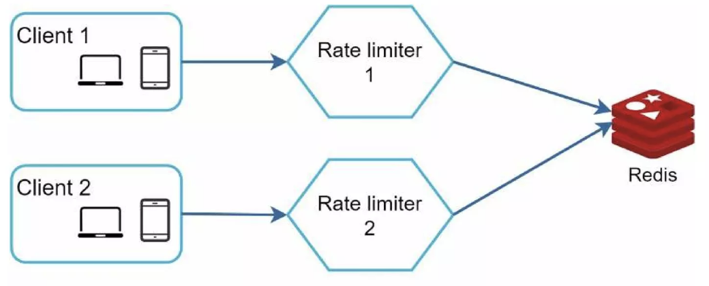

# Chapter 04: 처리율 제한 장치의 설계

네트워크 시스템에서 처리율 제한 장치는 클라이언트 또는 서비스가 보내는 `트래픽의 처리율을 제어하기 위한 장치`다.  
API 요청 횟수가 제한 장치에 **정의된 임계치**를 넘어서면, 추가로 도달한 모든 호출은 처리가 중단된다.

- 사용자는 초당 2회 이상 새 글을 올릴 수 없음
- 같은 IP주소로는 하루에 10개 이상의 계정을 생성할 수 없음
- 같은 디바이스로는 주당 5회 이상 리워드를 요청할 수 없음

---

# 1단계: 문제 이해 및 설계 범위 확정

`처리율 제한 장치`를 구현하는 데는 여러 알고리즘을 사용할 수 있다.  
그 각각은 **고유한 장단점**을 갖고 있으며, 면접관과 소통하면 어떤 제한 장치를 구현해야 하는지 분명히 할 수 있다.

```md
지원자: 어떤 `종류`의 `처리율 제한 장치`를 설계해야 하나요? 클라이언트 측 제한 장치입니까, 아니면 서버 측 제한 장치입니까?
면접관: 서버측 API를 위한 장치를 설계한다고 가정합시다.

지원자: 어떤 `기준`을 사용해서 API 호출을 `제어`해야 할까요? IP 주소를 사용해야 하나요? 아니면 사용자 ID? 아니면 생각하는 다른 어떤 기준이 있습니까?
면접관: 다양한 형태의 제어 규칙을 정의할 수 있도록 하는, 유연한 시스템이어야 합니다.

지원자: `시스템 규모`는 어느 정도여야 할까요? 스타트업 정도 회사를 위한 시스템입니까 아니면 사용자가 많은 큰 기업을 위한 제품입니까?
면접관: 설계할 시스템은 대규모 요청을 처리할 수 있어야 합니다.

지원자: 시스템이 `분산 환경`에서 동작해야 하나요?
면접관: 네

지원자: 이 처리율 제한 장치는 `독립된 서비스`입니까? 아니면 `애플리케이션 코드에 포함`될 수 있습니까?
면접관: 그 결정은 본인이 내려주시면 됩니다.

지원자: 사용자의 요청이 처리율 제한 장치에 의해 걸러진 경우, `사용자에게 그 사실을 알려야` 하나요?
면접관: 그렇습니다.
```

## 요구사항

시스템 요구사항을 요약하면 다음과 같다.

- 설정된 처리율을 초과하는 요청은 정확하게 제한한다.
- **낮은 응답시간**: 이 처리율 제한 장치는 HTTP 응답시간에 나쁜 영향을 주면 안된다.
- 가능한 한 적은 메모리를 써야 한다.
- **분산형 처리율 제한**: 하나의 처리율 제한 장치를 여러 서버나 프로세스에서 공유할 수 있어야 한다.
- **예외 처리**: 요청이 제한되었을 때는 그 사실을 사용자에게 분명하게 보여줘야 한다.
- **높은 결함 감내성**: 제한 장치에 장애가 생기더라도 전체 시스템에 영향을 주어서는 안 된다.

## 최종 설계

설계 과정을 살펴보기에 앞서, 최종 설계 결과는 다음과 같다.


> 출처: https://www.slideshare.net/slideshow/systemdesigninterviewaninsidersguide2nbsped9798664653403pdf/257681007#65

---

# 2단계: 개략적 설계안 제시 및 동의 구하기

일단 기본적인 클라이언트-서버 통신 모델을 사용한다.

## Q. 처리율 제한 장치는 어디에 둘 것인가?

### A1. 클라이언트 측에 둔다

일반적으로 클라이언트는 처리율 제한 장치를 안정적으로 걸 수 있는 장소가 아니다.  
`클라이언트 요청`은 **쉽게 위변조가 가능하기 때문**이다. 또한, 모든 클라이언트의 구현을 통제하는 것도 어려울 수 있다.

### A2. 서버 측에 둔다


서버 측에 처리율 제한 장치를 두어도 된다.  
이 경우 사업 필요에 맞는 `처리율 제한 알고리즘`을 찾아서 사용한다. 만약 서버 측에서 모든 것을 구현하기로 했다면, 알고리즘은 자유롭게 선택할 수 있다.

### A3. 또 다른 위치?


`처리율 제한 미들웨어`를 만들어 해당 미들웨어로 하여금 API 서버로 가는 요청을 통제하도록 하는 것이다.

여기서의 동작 과정은 아래와 같다.


- API 서버 처리율이 **초당 2개의 요청**으로 제한
- 클라이언트가 **3번째 요청**을 앞의 두 요청과 **같은 초 범위 내**에서 전송
- 앞선 두 요청은 서버로 전달
- 세 번째 요청은 **미들웨어에 의해 가로막히고**, 클라이언트에 `429 too many requests 상태 코드`를 반환

`마이크로서비스`의 경우, 처리율 제한 장치는 보통 `API 게이트웨이`라 불리는 컴포넌트에 구현된다.

```
[ API 게이트웨이의 역할 ]

- 처리율 제한 👈🏻
- SSL 종단
- 사용자 인증
- IP 허용 목록 관리
```

하지만 지금은 `API 게이트웨이`가 **처리율 제한을 지원하는 미들웨어**라는 점만 기억해둔다.

처리율 제한 장치를 `서버`에 둘 것인지, `게이트웨이`에 둘 것인지에 대해서는 정답이 없다.

- 하지만, **마이크로서비스**에 기반하고 있고, **API 게이트웨이**를 이미 설계에 포함시켰다면, 처리율 제한 기능 또한 게이트웨이에 포함시켜야 할 수도 있다.

## 처리율 제한 알고리즘

처리율 제한 알고리즘에는 여러가지가 있으며 각각 장단점이 존재한다.

- 토큰 버킷
- 누출 버킷
- 고정 윈도 카운터 _(fixed window counter)_
- 이동 윈도 로그 _(sliding window log)_
- 이동 윈도 카운터 _(sliding window counter)_

### 1. 토큰 버킷 알고리즘

토큰 버킷 알고리즘은 처리율 제한에 폭넓게 이용된다.


- 각 요청은 하나의 토큰을 사용한다.
  - **버킷에 토큰이 존재**하면, 토큰 하나를 꺼내어(= 토큰 개수를 감소) 요청을 시스템에 존달한다.
  - **버킷에 토큰이 존재하지 않으면**, 해당 요청은 버려진다.

이 토큰 버킷은 두 개의 인자(= `버킷 크기`, `토큰 공급률`)를 받는다.

- **버킷 크기** - 버킷에 담을 수 있는 토큰의 최대 개수
- **토큰 공급률** - 초당 몇 개의 토큰이 버킷에 공급되는가


#### Q. 버킷을 몇 개 사용해야 하는가?

- **API 엔드포인트 기준**
  - 통상적으로 **API 엔드포인트**마다 별도의 버킷을 둔다. _(사용자마다 하루에 한 번만 포스팅 가능, 친구는 150명까지 추가 가능, 좋아요 버튼은 다섯 번까지만 가능 👉🏻 사용자마다 `3개의 버킷` 필요)_
- **IP 주소 기준**
  - IP 주소별로 처리율 제한을 적용해야 할 경우, IP 주소마다 버킷을 하나씩 할당해야 한다.
- **공유 버킷**
  - 시스템 처리율을 기준으로 적용해야 할 경우, 모든 요청이 하나의 버킷을 공유하도록 해야 한다.

```
[ 토큰 버킷 알고리즘 ]

< 장점 >
- 구현이 쉬움
- 메모리 사용 측면에서 효율적
- ⭐️ 짧은 시간에 집중되는 트래픽도 처리 가능

< 단점 >
- 두 개의 인자를 적절하게 튜닝하는 것이 까다로움
```

### 2. 누출 버킷 알고리즘

토큰 버킷과 유사하지만, `요청 처리율이 고정되어 있다`는 점에서 차이가 있다.  
이 알고리즘은 `FIFO` 큐를 사용한다.


이 알고리즘은 **지정된 시간마다** 큐에서 **요청을 꺼내서 처리**한다.

이 누출 버킷은 두 개의 인자(= `버킷 크기`, `처리율`)를 받는다.

- **버킷 크기** - 큐 사이즈와 같은 값. 큐에는 처리될 항목들이 보관됨
- **처리율** - 지정된 **시간당 몇 개의 요청을 처리할 지** 지정하는 값. 보통 `초 단위`로 표현

```
[ 누출 버킷 알고리즘 ]

< 장점 >
- 메모리 사용량 측면에서 효율적 (큐의 크기가 제한되어 있기 때문)
- ⭐️ 고정된 처리율을 갖고 있어, 안정적 출력(stable outflow rate)이 필요한 경우 적합

< 단점 >
- ⭐️ 단시간에 많은 트래픽이 몰리는 경우 부적합
    - 큐에는 오래된 요청들이 쌓이게 되고, 그 요청들을 제때 처리하지 못하면 최신 요청들이 버려지기 때문
- 두 개의 인자를 올바르게 튜닝하기 까다로움
```

### 3. 고정 윈도 카운터

> 이동 윈도 알고리즘 설명을 위한 개념 빌드업 느낌

타임라인을 **고정된 간격으로 나누**고, 각 간격마다 `카운터`를 붙이는 방식이다.  
아래 그림은 **고정 간격을 `1초`로**, **최대 요청을 `3개`로** 설정한 경우이다.


하지만 이 알고리즘은 **윈도우의 경계 부근**에 순간적으로 많은 트래픽이 집중될 경우, 윈도우에 **할당된 양보다 더 많은 요청이 처리**될 수 있다는 문제점이 있다.

```
[ 고정 윈도우 알고리즘 ]

< 장점 >
- 메모리 효율이 좋음
- 이해하기 쉬움
- 특정한 트래픽 패턴을 처리하기에 적합 (윈도우가 닫히는 시점에 카운터를 초기화하는 방식이기 때문)
    - 트래픽 패턴이 예측 가능한 경우?

< 단점 >
- 윈도우 경계 부근에서 일시적으로 많은 트래픽이 몰려드는 경우, 기대했던 시스템의 처리 한도보다 많은 양의 요청을 처리할 수 있음
```

### 4. 이동 윈도 로깅

이동 윈도우 로깅 알고리즘은 고정 윈도우 카운터의 문제 _(= 윈도우가 고정되어 있어서 발생하는 문제)_ 를 해결할 수 있다.

각 요청의 `타임 스탬프`를 로그(= 보통 redis 같은 캐시에 보관)에 저장하여 윈도우가 이동하는 듯한 효과를 낸다.

새로운 요청이 올 때마다 **로그에 타임스탬프를 기록**하고, **만료된 타임스탬프가 존재하는지 검사**하는 방식으로 동작한다.

- 만료된 타임스탬프는 로그에서 삭제


> 분당 최대 2회의 요청을 처리하도록 설정

```
[ 이동 윈도우 로깅 알고리즘 ]

< 장점 >
- 어느 순간의 윈도우를 보더라도, 허용되는 요청 수는 시스템 처리율 한도를 넘지 않음

< 단점 >
- 다량의 메모리 사용 (거부된 요청의 타임스탬프도 보관하기 때문)
```

### 5. 이동 윈도 카운터

`고정 윈도우 카운터 알고리즘`과 `이동 윈도우 로깅 알고리즘`을 결합한 것이다.  
이 알고리즘을 구현하는 데 두 가지 접근법이 사용되나, 책에서는 하나만 설명한다.


> 현재 윈도우에 들어있는 요청 = `3 + (5 X 70%) = 6.5개 = 6개`

```
[ 이동 윈도우 카운터 알고리즘 ]

< 장점 >
- ⭐️ 짧은 시간에 몰리는 트래픽에도 잘 대응할 수 있음 (이전 시간대의 평균 처리율에 따라 현재 윈도우의 상태를 계산하기 때문)
- 메모리 효율이 좋음

< 단점 >
- 직전 시간대의 요청이 균등하게 도착했다는 가정이므로 부정확할 수 있음
    - 하지만 실제 테스트에서 잘못 처리된 요청은 0.003%에 불과했다고 함
```

## 개략적인 아키텍처

이처럼 처리율 제한 알고리즘을 사용하기 위해선, **얼마나 많은 요청이 접수되었는지** 추적할 수 있는 `카운터`를 보관해야 한다.

### Q. 카운터를 어디에 보관할 것인가?

메모리상에서 동작하는 `캐시`가 바람직하다.

- 속도가 빠르며, 시간에 기반한 만료 정책을 지원하기 때문
- `Redis`는 처리율 제한 장치를 구현할 때 자주 사용되는 저장장치


> 위 구조에 따르면 `Redis`를 카운터 값 관리 용도로 사용할 수 있으며, 개략적인 과정은 다음과 같다.

1. 클라이언트가 처리율 제한 미들웨어로 요청을 보낸다.
2. 처리율 제한 미들웨어는 레디스의 지정 버킷에서 카운터를 가져와서 한도에 도달했는 체크한다.  
   2-1. 한도에 도달하면 거부한다.  
   2-2. 한도에 도달하지 않았다면 API 서버로 전달한다. 미들웨어는 카운터의 값을 증가 후 레디스에 다시 저장한다.

---

# 3단계: 상세 설계

앞선 개략적인 설계를 통해서는 다음 사항을 알 수는 없다.

- `처리율 제한 규칙`은 **어떻게** 만들어지고 **어디에** 저장되는가?
- `처리가 제한된 요청들`은 **어떻게** 처리되는가?

## 처리율 제한 규칙

처리율 제한 규칙은 보통 `설정 파일` 형태로 `디스크`에 저장된다. 아래는 설정 파일의 예시이다.

```yaml
domain: messaging
descriptors:
    - key: message_type
    Value: marketing
    rate_limit:
        unit: day
        request_per_unit: 5
```

> 시스템이 처리 가능한 마케팅 메시지의 최대치를 하루 5개로 제한

## 처리율 한도를 초과한 요청의 처리 방안

어떤 요청이 한도 제한에 걸리면 API는 **HTTP 429 응답**(too many requests)을 클라이언트에 응답한다.  
이때, 해당 요청을 어떻게 처리하는지도 아래와 같이 분류할 수 있다.

- 한도에 걸린 메시지를 버린다.
- 한도에 걸린 메시지를 메시지 큐에 보관하고, 나중에 처리한다.

### Q. 클라이언트는 자신의 요청이 처리율 제한에 걸리고 있는지를 어떻게 알 수 있나?

`HTTP 응답 헤더`를 통해 아래와 같은 정보를 알 수 있다.

- 윈도우 내에 남은 처리 가능 요청 수
- 윈도우마다 클라이언트가 전송할 수 있는 요청의 수
- 한도 제한에 걸리지 않으려면 몇 초 뒤에 요청을 다시 보내야 하는지

## 상세 설계

최종 설계는 다음과 같다.


위 설계로 요청을 처리하는 과정은 다음과 같다.

1. 처리율 제한 규칙은 디스크에 보관한다.
   - 이때, 작업 프로세스(workers)는 수시로 규칙을 디스크에서 읽어 캐시에 저장한다.
2. 클라이언트가 요청을 서버에 보내면, 요청은 먼저 처리율 제한 미들웨어에 도달한다.
3. 처리율 제한 미들웨어가 필요한 정보를 가져온다.
   1. 제한 규칙을 캐시에서 가져온다.
   2. 카운터 및 마지막 요청의 타임스탬프를 레디스 캐시에서 가져온다.
4. 읽어온 정보를 토대로, 미들웨어는 다음과 같은 결정을 내린다.
   - 해당 요청이 처리율 제한에 걸리지 않은 경우, API 서버로 요청을 보낸다.
   - 해당 요청이 처리율 제한에 걸린 경우, 429 에러를 클라이언트에 보낸다.
     - 해당 요청은 그대로 버릴 수도, 메시지 큐에 보관할 수도 있다.

## 분산 환경에서의 처리율 제한 장치 구현

`여러 대의 서버`와 `병렬 스레드`를 지원하도록 시스템을 확장하는 경우, 아래 두 가지 문제를 풀어야 한다.

1. 경쟁 조건
2. 동기화

### 경쟁 조건

병렬 스레드 환경의 경우, 레디스에 저장된 변수 `counter` 값을 다루는 과정에서 **여러 스레드가 `counter` 값에 동시 접근**할 수 있다.

> 락을 사용해서 해결할 수 있지만, 시스템 성능을 저하시키는 문제가 있다.  
> 위 설계의 경우 두 가지 해결책을 제안할 수 있다.
>
> - 루아 스크립트
> - 정렬 집합 _(`Redis` 자료구조)_

### 동기화 이슈

동기화는 `분산 환경`에서 고려해야 할 중요한 요소이다.  
**수백만 사용자**를 지원하기 위해, **처리율 제한 장치 서버를 여러 대** 두게 된다면, `동기화`가 필요하다.


> 웹 계층은 `무상태`이므로, 클라이언트는 서로 다른 요청을 서로 다른 처리율 제한 장치로 보낼 수도 있다.
>
> - 로드밸런서에 의해 임의의 서버로 매핑될 수 있음

고정 세션으로 클라이언트와 장치를 1대1로 매핑할 수 있지만, 2장에서 살펴봤듯이 이는 좋은 방법이 못 된다.

더 나은 해결책은 **Redis**와 같은 `중앙 집중형 데이터 저장소`를 사용하는 것이다.



> `각 유저의 처리율 제한 상태`를 어느 서버에서도 접근할 수 있다.

### 성능 최적화

- 세계 곳곳에 `Edge Server`를 심어서(= 여러 데이터 센터를 두어서) 응답 지연 시간을 줄이는 것이 좋다.

  - 가장 가까운 Edge Server로 트래픽을 전달

- 제한 장치 간에 데이터를 동기화할 때 최종 일관성 모델을 사용한다.
  - `6장 키-값 저장소 설계`의 `데이터 일관성` 항목 참고

### 모니터링

**깜짝 세일 같은 이벤트** 때문에 **트래픽이 급증**할 때, 처리율 제한 장치가 비효율적으로 동작한다면, 그런 트래픽 패턴을 잘 처리할 수 있도록 알고리즘을 바꾸는 것을 고려해야 한다.

- 이 상황에서는 `토큰 버킷 알고리즘`이 적합할 것

# 4단계: 마무리

- hard / soft 처리율 제한
  - **hard** - 요청의 개수는 임계치를 절대 넘어설 수 없음
  - **soft** - 요쳥의 개수는 잠시 동안은 임계치를 넘어설 수 있음
- 다양한 OSI 계층에서의 처리율 제한
- 처리율 제한을 회피하는 방법 _(클라이언트를 어떻게 설계하는 것이 최선인가?)_
  - 클라이언트 측 캐시를 사용하여 API 호출 횟수 줄이기
  - ...
