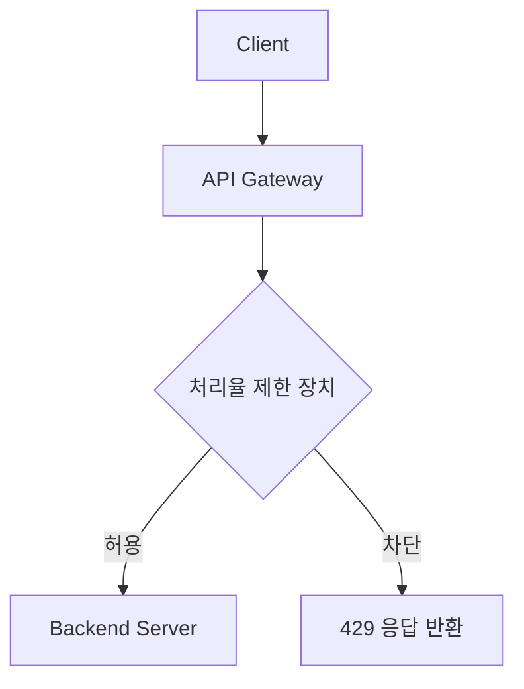
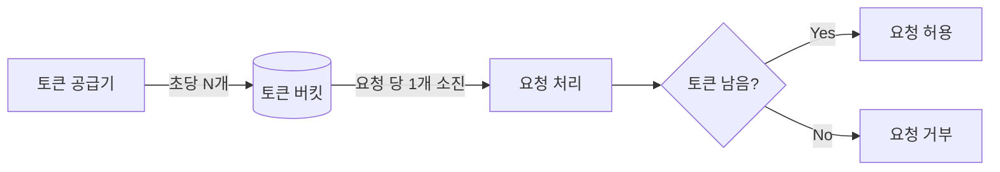
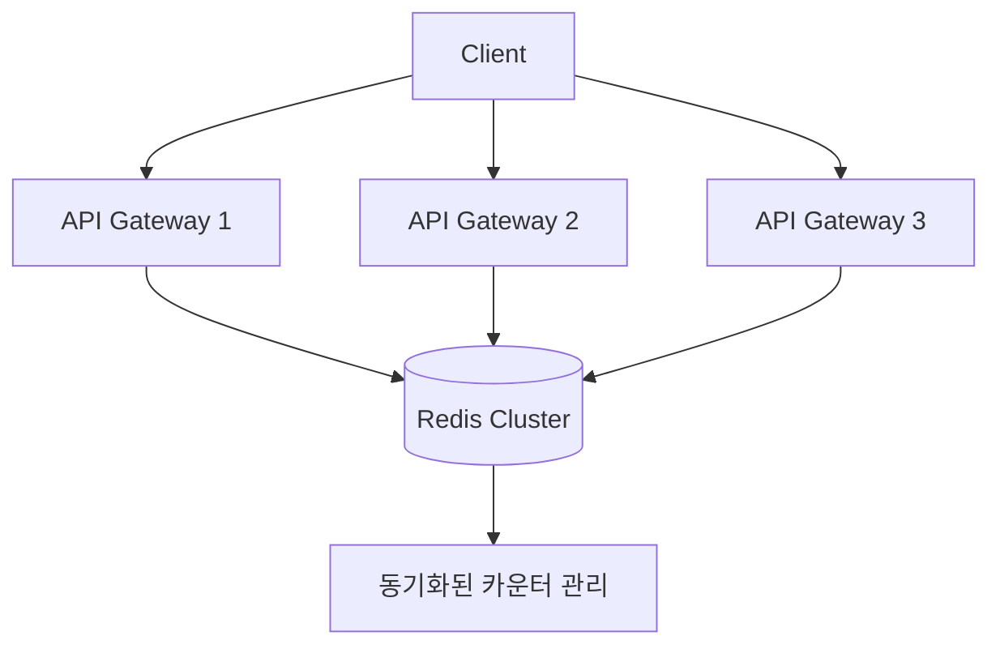

# 4. 처리율 제한 장치의 설계

> ❗**처리율 제한장치(rate limiter)란?**   
> 클라이언트 또는 서비스가 보내는 트래픽의 처리율(rate)을 제어하기 위한 장치로, 정해진 임계치(threshold)를 넘어서면 추가로 도달한 모든 호출은 처리 중단(block)됩니다.

## 장점

1. **DoS(Denial of Service) 공격 방지:** 자원 고갈(resource starvation)을 막아 서버 안정성을 향상시킵니다.
2. **비용 효율성:** 서버 자원을 효율적으로 사용하고 제3자 API 호출 비용을 절감합니다.
3. **서버 과부하 방지:** 트래픽 급증 시 서버 장애를 예방합니다.

---

# 설계 범위 확정

- **위치:** 클라이언트 vs. 서버 측 (API 게이트웨이 통합을 고려합니다).
- **요청 식별자:** IP, 사용자 ID, API 키 등을 사용합니다.
- **분산 환경 대응:** 여러 서버/데이터 센터에서의 일관된 처리율 제한을 지원합니다.
- **사용자 통지:** 제한 시 HTTP 429 응답 또는 재시도 지연 시간(Retry-After 헤더)을 포함합니다.
- **결함 감내성(fault tolerance):** 장애 발생 시 서비스 중단 없이 우아하게 대응합니다.

---

# 설계안

## 처리율 제한 장치의 위치

- 클라이언트 측에서는 위변조가 가능하며 구현을 통제하기 어려울 수 있어, 안정적으로 처리율 제한이 이루어지지 않을 수 있습니다.
- 서버 측에서는 서버 내부에 장치를 두는 방법과 미들웨어를 구축하여 요청을 통제하는 방법이 있습니다.
    - 일반적으로 API 게이트웨이(gateway)라는 컴포넌트에 구현됩니다.
    - 처리율 제한뿐만 아니라 SSL 종단(termination), 사용자 인증(authentication), IP 허용 목록(whitelist) 관리 등을 지원합니다.
- **서버 내외부를 결정할 때 고려할 선택 기준은 다음과 같습니다:**
    - 프로그래밍 언어, 캐시 서비스 등 현재 사용하고 있는 기술 스택을 점검합니다.
    - 비즈니스에 적합한 처리율 제한 알고리즘을 선택합니다.
    - 기존에 구축된 API 게이트웨이가 있는지 확인합니다.
    - 직접 구축할 충분한 인력이 있는지 검토합니다.


---


## 처리율 제한 장치의 위치

- 클라이언트 측에서는 위변조가 가능하며 구현을 통제하기 어려울 수 있어, 안정적으로 처리율 제한이 이루어지지 않을 수 있습니다.
- 서버 측에서는 서버 내부에 장치를 두는 방법과 미들웨어를 구축하여 요청을 통제하는 방법이 있습니다.
    - 일반적으로 API 게이트웨이(gateway)라는 컴포넌트에 구현됩니다.
    - 처리율 제한뿐만 아니라 SSL 종단(termination), 사용자 인증(authentication), IP 허용 목록(whitelist) 관리 등을 지원합니다.
- 서버 내외부를 결정할 때 고려할 때의 선택 기준
    - 프로그래밍 언어, 캐시 서비스 등 현재 사용하고 있는 기술 스택을 점검합니다.
    - 비즈니스에 적합한 처리율 제한 알고리즘을 선택합니다.
    - 기존에 구축된 API 게이트웨이가 있는지 확인합니다.
    - 직접 구축할 충분한 인력이 있는지 검토합니다.



## 처리율 제한 알고리즘

### 토큰 버킷(token bucket)

- 알고리즘
    - 토큰 버킷은 지정된 용량을 갖는 컨테이너입니다.
    - 토큰 버킷은 사전에 설정된 양의 토큰이 주기적으로 채워지며, 토큰은 용량 이상으로 채워지지 않습니다.
    - 각 요청은 처리될 때마다 하나의 토큰을 사용하게 됩니
    - 충분한 토큰이 없는 경우, 해당 요청은 버려집니다.(dropped)
- 파라미터
    - 버킷 크기: 버킷이 담을 수 있는 최대 토큰 수
    - 토큰 공급률(refill rate): 초당 몇 개의 토큰이 버킷에 공급되는지
- 장점
    - 구현이 쉽고 메모리 사용 측면에서도 효율적입니다.
    - 짧은 시간에 집중되는 트래픽(burst of traffic)도 처리 가능하다.
- 단점
    - 이 알고리즘은 버킷 크기와 토큰 공급률이라는 두 개의 인자를 가지는 데 이를 적절하게 튜닝하는 것은 어렵습니다.

- 사례:
  버스트 트래픽 처리에 적합 (AWS WAF, Google Cloud에서 사용)


### 누출 버킷(leaky bucket)

- **알고리즘**
    - 요청이 도착하면 큐가 가득 차 있는지를 확인합니다.
        - 빈 자리가 있다면 요청을 큐에 추가합니다.
        - 큐가 가득 차 있다면 요청을 버립니다.
    - 지정된 시간마다 큐에서 요청을 꺼내어 처리합니다.
- **파라미터**
    - **버킷 크기:** 큐의 사이즈를 의미합니다.
    - **처리율(overflow rate):** 지정된 시간당 처리할 요청의 수를 나타내는 값으로, 보통 초 단위로 표현됩니다.
- **장점**
    - 큐의 크기가 제한되어 있어 메모리 사용 측면에서 효율적입니다.
    - 고정된 처리율을 가지고 있기 때문에 안정적인 출력(stable outflow rate)이 필요한 경우에 적절합니다.
- **단점**
    - 단시간에 많은 트래픽이 몰리는 경우, 큐에 오래된 요청이 쌓이게 되고 이를 제때 처리하지 못하면 최신 요청들이 버려집니다.
    - 두 개의 인자를 올바르게 튜닝하기 어렵습니다.
- **사례**
    - Nginx rate limiting. (FIFO 큐 기반 처리)

### 고정 윈도우 카운터(fixed window counter)

- **알고리즘**
    - 타임라인을 고정된 간격의 윈도우로 나누고, 각 윈도우마다 카운터를 할당합니다.
    - 요청이 접수될 때마다 카운터의 값을 증가시킵니다.
    - 이 카운터의 값이 임계치(threshold)에 도달하면, 새로운 윈도우가 열릴 때까지 요청을 버립니다.
- **파라미터**
    - **윈도우 간격:** 윈도우의 간격을 설정합니다.
    - **임계치:** 카운터 값의 임계치를 설정합니다.
- **장점**
    - 메모리 효율이 좋습니다.
    - 이해하기 쉽습니다.
    - 윈도우가 닫히는 시점에 카운터를 초기화하는 방식은 특정한 트래픽 패턴을 처리하기에 적합합니다.
- **단점**
    - 윈도우 경계 부분에 트래픽이 몰리는 경우, 예상보다 많은 요청을 처리하게 됩니다.
- **사례:** 기본적인 API 제한

### 이동 윈도우 로그(sliding window log)

- **알고리즘**
    - 요청의 타임스탬프를 추적합니다. 보통 데이터를 레디스의 정렬 집합(sorted set)과 같은 캐시에 보관합니다.
    - 새 요청이 오면 만료된 타임스탬프를 제거합니다.
    - 새 요청의 타임스탬프를 로그에 추가합니다.
    - 로그의 크기가 허용치보다 같거나 작으면 요청을 전달하고, 그렇지 않으면 처리를 거부합니다.
- **파라미터**
    - **로그의 크기:** 로그에 저장할 수 있는 타임스탬프의 최대 개수를 의미합니다.
- **장점**
    - 처리율 제한이 매우 정교하여, 어느 순간에도 허용되는 요청 개수가 처리율 한도를 넘지 않습니다.
- **단점**
    - 거부된 요청의 타임스탬프도 저장하기 때문에 메모리를 많이 사용하게 됩니다.
- **사례:** 높은 정확도가 필요한 금융 API


### 이동 윈도우 카운터(sliding window counter)

- **알고리즘** (두 가지 접근이 가능하나 한 가지만 설명합니다)
    - 요청이 오면 현재 1분 간 요청 수에 직전 1분 간 요청 수와 이동 윈도우의 직전 1분이 겹치는 비율을 곱한 값을 더합니다.
    - 계산 결과 값이 제한 한도보다 높은지 확인하여, 높지 않다면 요청을 전달하고, 높다면 요청을 버립니다.
- **파라미터**
    - **처리율 제한 한도:** 단위 시간당 요청 수를 의미합니다.
- **장점**
    - 이전 시간대의 평균 처리율에 따라 현재 윈도우 상태를 계산하기 때문에, 짧은 시간에 몰리는 트래픽에도 대응할 수 있습니다.
    - 메모리 효율이 좋습니다.
- **단점**
    - 직전 시간대에 요청이 균등하게 분포되어 있다고 가정하기 때문에 다소 느슨할 수 있습니다. 그러나 클라우드플레어의 실험에 따르면 40억 개의 요청 중 실제로 버려진 요청은 0.003%에 불과했습니다.
- **사례:** Cloudflare의 DDoS 보호


## 개략적인 아키텍처

💡처리율 제한 알고리즘의 기본 아이디어 

얼마나 많은 요청이 접수 되었는 지를 추적하는 카운터를 추적 대상별로 두고 어떤 한도를 넘어서면 도착한 요청을 거절하는 것입니다.

❓카운터를 어디에 보관할 것인가?

데이터 베이스는 디스크 접근 때문에 느려 메모리 기반에 캐시가 적합합니다.

메모리 사용하면서 만료 정책을 지원하는 레디스가 자주 사용됩니다.

레디스는 INCR, EXPIRE라는 명령어를 지원합니다.
 INCR(증가), EXPIRE(만료 설정).

- INCR: 메모리에 저장된 카운터 값을 1 증가시킵니다.
- EXPIRE: 카운터에 타임아웃 값을 설정합니다. 설정된 시간이 지나면 카운터는 삭제됩니다.



## 상세 설계

### 처리율 제한 규칙 처리 흐름
```mermaid
sequenceDiagram
    participant Client
    participant RateLimiter
    participant Redis
    participant Backend

    Client->>RateLimiter: API 요청
    RateLimiter->>Redis: 카운터 조회 (INCR key)
    Redis-->>RateLimiter: 현재 값
    RateLimiter->>RateLimiter: 임계치 확인
    alt 허용
        RateLimiter->>Backend: 전달
        Backend-->>Client: 200 OK
    else 차단
        RateLimiter-->>Client: 429 에러
    end
    
 ```   

    
❓ 처리율 제한 규칙은 어떻게 만들고 어디에 저장되는가?

❓ 처리가 제한된 요청들은 어떻게 처리되는것인가?

### 처리율 제한 규칙

- 보통 설정파일(configuration file)형태로 디스크에 저장합니다.

### 처리가 제한된 요청 처리

- 한도 제한에 걸리면 API는 HTTP 429 응답(too many requests)을 클라이언트에게 보냅니다.
- 경우에 따라서는 나중에 처리하기 위해 Queue에 보관할 수도 있습니다.

### 분산 환경에서의 처리율 제한 장치의 구현

- 경쟁 조건(race condition)
- 동기화(synchronization)

### 경쟁조건

병행성이 심한 환경에서는 카운트 값을 올릴 때 경쟁조건 이슈가 발생할 수 있다.

널리 알려진 해결책은 락(Lock)이다. 락은 성능을 상당히 떨어뜨린다는 문제가 있다.

락 대신 쓸 수 있는 해결 책이 2가지가 있다.

1. 루아 스크립트 ( Redis에서 원자적 연산 수행 )
2. 정렬 집합 ( 범위 쿼리로 만료된 데이터 삭제. )

### 동기화 이슈

처리율 제한 장치를 여러 대 두게 되면 동기화가 필요해집니다.

이에 대한 한 가지 해결책은 고정 세션(sticky session)을 활용하여 같은 클라이언트로부터의 요청을 항상 같은 처리율 제한 장치로 보낼 수 있도록 하는 것입니다. 하지만 이 방법은 규모 면에서 확장 가능성이 없고 유연함이 떨어져 추천하지 않습니다.

더 나은 해결책으로는 레디스(Redis)와 같은 중앙 집중형 데이터 저장소를 사용하는 것입니다.


📌참고)
동기화:

중앙 집중식 저장소(Redis): 모든 인스턴스가 동일한 데이터 소스 참조.

참고: AWS ElastiCache, Google Memorystore.

### 성능 최적화

- 처리율 제한 장치는 멀리 떨어진 사용자를 처리하기 위해 지연시간(latency)이 증가할 수 밖에 없습니다. 이를 줄이기 위해 지역 곳곳에 엣지 서버(edge server)를 설치하여 지연시간을 감소시킬 수 있습니다.
- 최종 일관성 모델(eventual consistency model)을 사용하는 것입니다.

📌참고)
지연 시간 감소:

지역별 엣지 서버 배치 (예: Cloudflare CDN).

캐시 전략(Write-back, TTL 조정).

### 모니터링

모니터링을 통해 확인하려는 사항은 다음과 같습니다:

- 채택된 처리율 제한 알고리즘이 효과적인지 여부
- 정의한 처리율 제한 규칙이 효과적인지 여부

예를들면 깜짝 세일 같은 이벤트 때문에 트래픽이 급증할 때 처리율 제한 장치가 비효율적으로 동작한다면, 
그런 트래픽 패턴을 잘 처리할 수 있도록 알고리즘을 바꾸는 것을 고려해야합니다. 이런 경우는 토큰 버킷이 적합할 것입니다.


(추가)
핵심 지표:

허용/거부된 요청 수.

지연 시간(latency) 분포.

도구: Prometheus(메트릭 수집), Grafana(시각화), ELK Stack(로그 분석).

### 추가 논의점

1. **경성(hard) vs. 연성(soft) 처리율 제한**

    - **경성(hard) 처리율 제한**
        - 엄격한 임계치를 적용합니다: 절대 허용량을 초과할 수 없습니다.
        - **사례:** 금융 거래 API, 보안이 중요한 인증 시스템

    - **연성(soft) 처리율 제한**
        - 유연한 임계치를 적용합니다: 단시간 임계치 초과를 허용하되, 장시간 평균 처리율을 제어합니다.
        - **사례:** 소셜 미디어 API, 일시적 트래픽 버스트 수용이 필요한 서비스.

2. **다양한 계층에서의 처리율 제한**

    - **애플리케이션 계층(OSI 7계층):**
        - HTTP 기반의 API 요청을 사용자 ID, IP, 엔드포인트별로 제한합니다.

    - **네트워크 계층(OSI 3계층):**
        - IPtables를 활용한 IP 주소 기반 트래픽 제어입니다 (예: limit 모듈로 초당 패킷 수를 제한).
        - DDoS 공격 방어에 주로 사용되지만, 애플리케이션 로직에 따른 세밀한 제어는 불가능합니다.

```mermaid
graph TB
    A[OSI 3계층] -->|IP 기반 차단| B[네트워크 레벨 보호]
    C[OSI 7계층] -->|사용자별 제한| D[애플리케이션 레벨 보호]
    E[DB] -->|쿼리 복잡도 제어| F[데이터 레벨 보호]
    
```
3. **처리율 제한 회피를 위한 클라이언트 설계**

    - **클라이언트 측 최적화:**
        - **캐시 활용:**
            - 자주 변경되지 않는 데이터는 클라이언트 측 캐시에 저장하여 API 호출 횟수를 감소시킵니다.
        - **임계치 인지:**
            - 서버의 처리율 제한 정책을 사전에 이해하고, 짧은 시간 내 과도한 요청을 방지합니다.
        - **우아한 오류 처리:**
            - HTTP 429 응답 시 Retry-After 헤더를 확인하고, 지정된 시간 이후 재시도합니다.
            - 예외 발생 시 사용자에게 명확한 안내 메시지를 제공합니다.
        - **지수 백오프(exponential backoff):**

    
> ✅ 결론:
>처리율 제한 장치는 트래픽 제어의 핵심 컴포넌트로, 시스템의 안정성과 효율성을 보장합니다. 다양한 알고리즘을 통해 DoS 공격을 방지하고, 비용을 절감하며, 서버 과부하를 예방할 수 있습니다. 알고리즘 선택은 트레이드오프 분석을 통해 이루어져야 하며, 분산 환경에서는 Redis와 같은 중앙 집중식 저장소와 모니터링 도구의 조합이 필수적입니다. 적절한 모니터링을 통해 시스템의 효율성을 지속적으로 평가하고 개선해야 하며, 클라이언트 측에서도 처리율 제한 회피를 방지하기 위한 설계가 요구됩니다. 이를 통해 전체 시스템의 신뢰성과 사용자 경험을 향상시킬 수 있습니다.

