# Chapter 05. 안정 해시 설계

**안정 해시란??**

수평적 규모 확장을 달정하기 위해서는 요청 또는 데이터를 서버에 균등하게 나누는 것이 중요하다.

안정해시는 이를 위해 보편적으로 사용하는 기술이다.

---

## 안정 해시가 풀고자 하는 문제**

### 해시 키 재배치(rehash) 문제

N개의 캐시 서버에 부하를 균등하게 나누는 보편적인 방법

serverIndex = hash(key)%N (N은 서버의 개수이다)

총 4대의 서버를 사용한다고 가정해보면 아래와 같이 기 값이 서버에 분산된다.

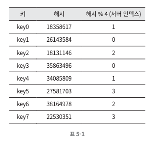

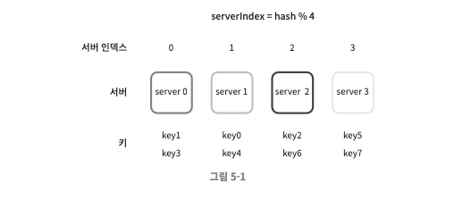

위 방법은 서버 풀의 크기가 고정되어 있을 때, 그리고 데이터 분포가 균등할 때는 잘 동작한다.

하지만 서버가 추가되거나 기존 서버가 삭제되는 등의 문제에 취약하며 대규모 캐시 미스가 발생할 수 있다.

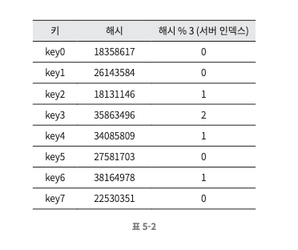

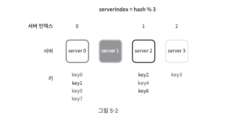

---

## 안정 해시

해시 테이블 크기가 조정될 때 평균적으로 오직 k/n개의 키만 재배치하는 해시 기술입니다.

k -> 키의 개수
n -> 슬롯(slot)의 개수

전통적 해시 테이블은 슬록의 수가 바뀌면 거의 대부분 키를 재배치한다.

---

### 해시 공간과 해시 링

해시 함수 f로는 SHA-1을 사용한다고 하자.

> SHA-1 ??
> 
> SHA-1은 Secure Hash Algorithm 1의 줄임말로, 주로 데이터의 무결성을 확인하는 데 사용되는 해시 함수입니다. 
> 이 함수는 원본 데이터가 변경되지 않았는지 검증하는 데 유용하게 쓰입니다. 
> 보통 파일이나 메시지의 고유한 '지문'을 생성하는 데 사용되며, 데이터가 변경되면 해시 값도 크게 달라지는 특성이 있습니다. 
> 이런 특성 때문에 소프트웨어 다운로드의 무결성 검사나 버전 관리 시스템에서의 데이터 변경 감지 등에 널리 사용됩니다.

해당 함수의 출력 값 범위는 x0, x1, x2, x3, ... xn 과 같다고 하자.

SHA-1의 해시 공간(hash space) 범위는 0부터 2^160 - 1 이며, 

x0는 0, xn은 2^160 - 1, 

나머지 x1부터 xn - 1 까지는 그 사이의 값을 갖게 될 것이다.

이 해시 공간의 양쪽을 구부려 접으면 해시 링 (hash ring)이 만들어진다.

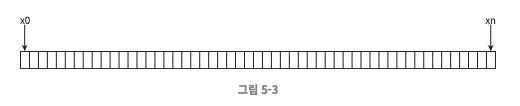

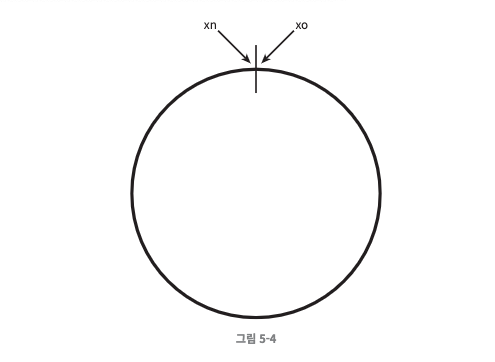

---

### 해시 서버

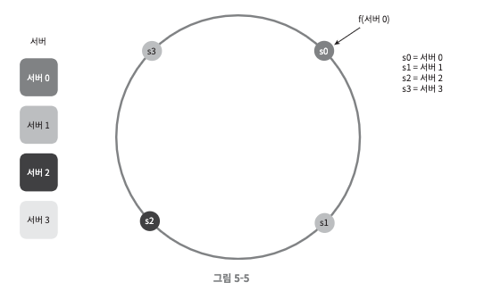

이 해시 함수 f를 사용하면 서버 IP나 이름을 이 링 위의 어떤 위치에 대응시킬 수 있다.

---

### 해시 키

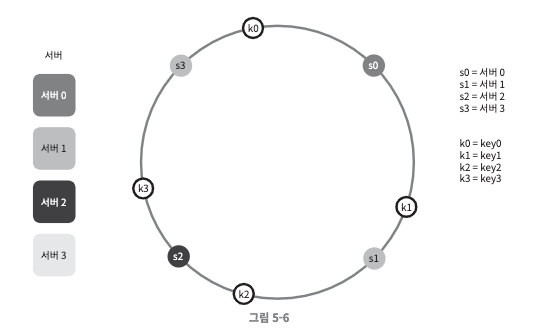

여기 사용된 해시 함수는 "해시 키 재배치 문제"에 언급된 함수와는 다르며, 나머지 연산 %는 사용하지 않는다.

캐시할 키 또한 해시 링 위의 어느 지점에 배치할 수 있다.

---

### 서버 조회

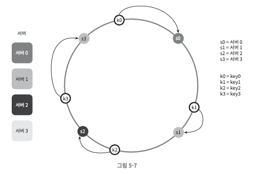

어떤 키가 저장되는 서버는, 해당 키의 위치로부터 시계 방향으로 링을 탐색해 나가면서 만나는 첫 번째 서버다.

---

### 서버 추가

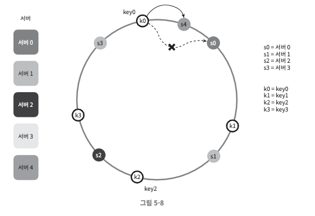

서버를 추가하더라도 키 가운데 일부만 재배치하면 된다.

서버 4가 추가된 뒤에 key 0은 서버 4에 저장될 것인데, 

왜냐하면 key0의 위치에서 시계 방향으로 순회했을 때 처음으로 만나게 되는 서버가 서버 4 이기 때문입니다.

다른 키들은 재배치되지 않습니다.

---

### 서버 제거

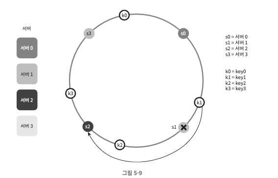

하나의 서버가 제거되면 키 가운데 일부만 재배치된다.

나머지 키에는 영향이 없다.

---

### 기본 구현법의 두 가지 문제점

안정 해시 알고리즘의 기본 절차

- 서버와 키를 균등 분포 해시 함수를 사용해 해시 링에 배치한다.

- 키의 위치에서 링을 시계 방향으로 탐색하다 만나는 최초의 서버가 키가 저장될 서버다.

해당 접근법에는 두 가지 문제가 있다.

1. 서버가 추가되거나 삭제되는 상황을 감안하면 파티션의 크기를 균등하게 유지하는 게 불가능하다.

파티션 -> 인접한 서버 사이의 해시 공간

어떤 서버는 굉장히 작은 해시 공간을 할당 받고, 어떤 서버는 굉장히 큰 해시 공간을 할당 받는 상황이 가능하다는 것이다.

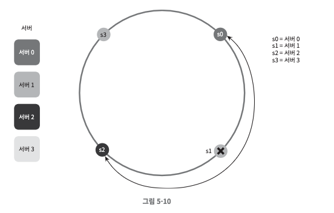

2. 키의 균등 분호를 달성하기가 어렵다.

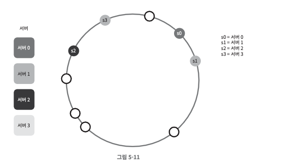

서버 1과 서버 3은 아무 데이터도 갖지 않는 반면, 대부분의 키는 서버 2에 보관될 것이다.

**이 문제를 해결하기 위해 제안된 기법이 가상 노드 (virtual node) 또는 복제 (replica)라 불리는 기법이다.**

---

### 가상 노드

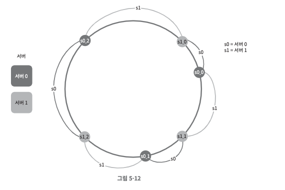

가상 노드는 실제 노드 또는 서버를 가리키는 노드로서, 하나의 서버는 링 위에 여러 개의 가상 노드를 가질 수 있다.

각 서버는 하나가 아닌 여러 개의 파티션을 관리해야 한다.

위 그림에서 s0으로 표시된 파티션은 서버 0이 관리하는 파티션이고, s1로 표시된 파티션은 서버 1이 관리하는 파티션이다.

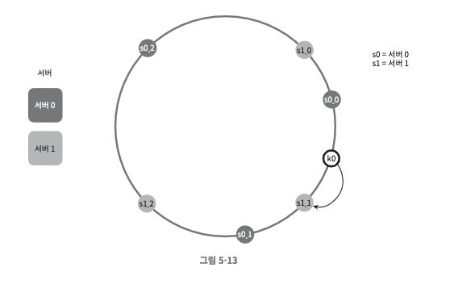

키의 위치로부터 시계방향으로 링을 탐색하다 만나는 최초의 가상 노드가 해당 키가 저장될 서버가 된다.

가상 노드의 개수를 늘리면 키의 분포는 점점 더 균등해진다.

표준 편차가 작아져서 데이터가 고르게 분포되기 때문이다.

100~200개의 가상 노드를 사용했을 경우 표준 편차의 값은 5% ~ 10% 사이다.

가상 노드의 개수를 더 늘리면 표준 편차의 값은 더 떨어지지만 가상 노드 데이터를 저장할 공간은 더 많이 필요하게 된다.

tradeoff가 필요하다! 시스템 요구사항에 맞도록 가상 노드 개수를 적절히 조정해야 할 것이다!

---

### 재배치할 키 결정

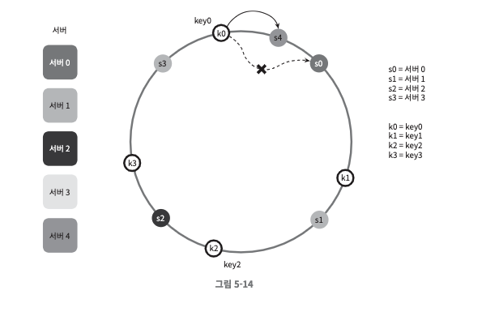

위 처럼 서버 4가 추가되었다고 해 보자.

이에 영향 받은 범위는 s4(새로 추가된 노드)부터 그 반시계 방향에 있는 첫 번째 서버 s3까지이다.

즉 s3부터 s4 사이에 있는 키들을 s4로 재배치하여야 한다.

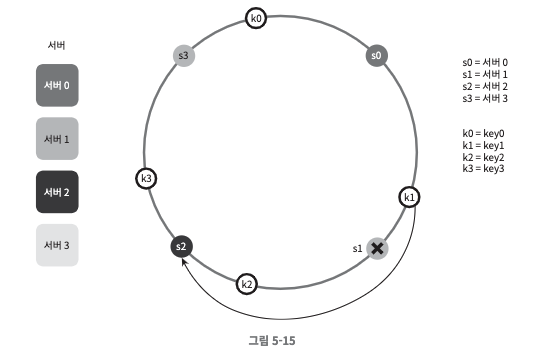

서버 s1이 위와 같이 삭제되면 s1부터(삭제된 노드) 그 반시계 방향에 있는 최초 서버 s0 사이에 있는 키들이 s2로 재배치되어야 한다.

---

## 마치며

**안정 해시의 이점**

- 서버가 추가되거나 삭제될 때 재배치되는 키의 수가 최소화된다.
- 데이터가 보다 균등하게 분포하게 되므로 수평적 규모 확장성을 달성하기 쉽다.
- 핫스팟 키 문제를 줄인다. 특정한 샤드에 대한 접근이 지나치게 빈번하면 서버 과부하 문제가 생길 수 있다.
  - 안정 해시는 데이터를 좀 더 균등하게 분배하므로 이런 문제가 생길 가능성을 줄인다.

**안정 해시가 쓰이는 기술**

- 아마존 다이나모 데이터베이스(DynamoDB)의 파티셔닝 관련 컴포넌트
- 아파치 카산드라(Apache Cassandra) 클러스터에서의 데이터 파티셔닝
- 디스코드(Discord) 채팅 어플리케이션
- 아카마이(Akamai) CDN
- 매그레프(Meglev) 네트워크 부하 분산기

---
