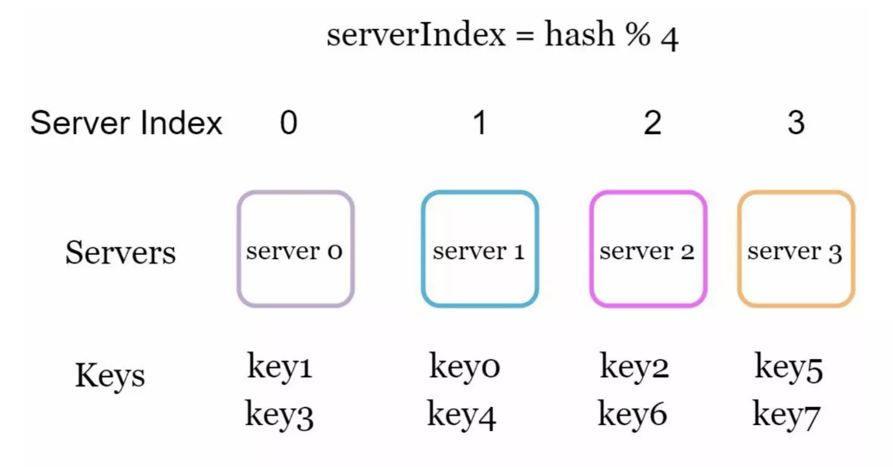
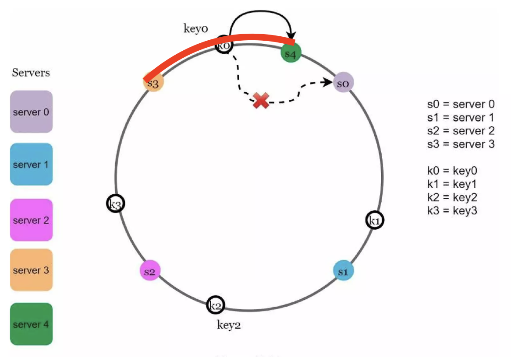

# Chapter 05: 안정 해시 설계

수평적 규모 확장성을 달성하기 위해서는 요청 또는 데이터를 서버에 균등하게 나누는 것이 중요하다. _[참고: 1장 - 샤딩](https://github.com/System-Design-Study/read-write-share/blob/main/ch01/minsan/study.md#%EC%83%A4%EB%94%A9sharding)_

- 1장에서는 샤딩 과정에서 발생할 수 있는 문제들에 대해서 알아볼 수 있었다.
  - 핫스팟 문제
  - 해시 키 재배치 문제
  - 조인

## 해시 키 재배치(rehash) 문제

N개의 캐시 서버가 있다고 가정한다. 이 서버들에 부하를 균등하게 나누는 보편적인 방법은 모듈러 연산을 이용한 해시 함수를 사용하는 것이다.

```
serverIndex = hash(key) % N
```

> N은 서버의 개수

**총 4대의 서버**를 사용한다고 가정하자.  
아래 표는 주어진 각 키에 대해서, 해시 값과 서버 인덱스를 계산한 것이다.

| 키   | 해시     | 해시 % 4 (서버 인덱스) |
| ---- | -------- | ---------------------- |
| key0 | 18358617 | 1                      |
| key1 | 26143584 | 0                      |
| key2 | 18131146 | 2                      |
| key3 | 35863496 | 0                      |
| key4 | 34085809 | 1                      |
| key5 | 27581703 | 3                      |
| key6 | 38164978 | 2                      |
| key7 | 22530351 | 3                      |

> 예를 들어 `key0`는 캐시에 보관된 데이터를 가져오기 위해서 `서버 1`에 접속해야 한다.

아래 그림은 키 값이 서버에 어떻게 분산되는지 보여준다.



> 출처: https://www.slideshare.net/slideshow/systemdesigninterviewaninsidersguide2nbsped9798664653403pdf/257681007#73

이 방법은

- 서버 풀의 크기가 고정되어 있을 때
- 데이터 분포가 균등할 때

는 잘 동작한다.

하지만 서버가 `추가`되거나 기존 서버가 `삭제`되면 **문제가 생긴다.**

- **해시 키 재배치(= rehash)** 가 발생하기 때문

### 서버가 삭제되는 경우

예를들어 1번 서버가 장애를 일으켜 중단됐다면, **서버 풀의 크기는 3으로** 변할 것이다.

- 그 결과, 키에 대한 해시 값은 변하지 않지만 **나머지 연산을 적용하여 계산한 `서버 인덱스 값`은 달라진다.**

| 키   | 해시     | 해시 % 3 (서버 인덱스) |
| ---- | -------- | ---------------------- |
| key0 | 18358617 | 0                      |
| key1 | 26143584 | 0                      |
| key2 | 18131146 | 1                      |
| key3 | 35863496 | 2                      |
| key4 | 34085809 | 1                      |
| key5 | 27581703 | 0                      |
| key6 | 38164978 | 1                      |
| key7 | 22530351 | 0                      |

아래 그림은 변화된 키 분포를 보여준다.


> 출처: https://www.slideshare.net/slideshow/systemdesigninterviewaninsidersguide2nbsped9798664653403pdf/257681007#74

장애가 발생한 1번 서버에 저장된 키 뿐만 아니라, **대부분의 키가 재분배** 되었다.

- 1번 서버가 죽으면, 대부분 캐시 클라이언트가 데이터가 없는 엉뚱한 서버에 접속하여 대규모 `캐시 미스`가 발생한다.

👉🏻 `안정 해시`는 이처럼 **서버 개수가 변할 때** 발생 가능한 rehash의 문제를 해결할 수 있는 기술이다.

## 안정 해시

**안정 해시**는 해시 테이블 크기가 조정될 때, 평균적으로 오직 `k/n개`의 키만 재배치하는 해시 기술이다. _(k: 키의 수, n: 슬롯의 수)_

- 대부분의 전통적 해시 테이블은 슬롯의 수가 바뀌면 거의 대부분의 키를 재배치

### 해시 공간과 해시 링

해시 함수는 `SHA-1`을 사용한다고 하고, 그 함수의 출력 값 범위는 x0, x1, ..., xn이라고 하자.


- `SHA-1`의 해시 공간 범위는 0 ~ 2^160 - 1
  - x0 = 0, ..., xn = 2^160 - 1

이 해시 공간의 양쪽을 구부려 접으면 아래 그림과 같은 `해시 링`이 만들어진다.


> 출처: https://www.slideshare.net/slideshow/systemdesigninterviewaninsidersguide2nbsped9798664653403pdf/257681007#75

### 해시 서버

이 해시 **함수 f**를 사용하면 `서버 IP`나 `이름`을 **링 위의 특정 위치에** 대응시킬 수 있다.

아래 그림은 `4개의 서버`를 이 **해시 링 위에 배치**한 결과이다.


### 해시 키

> 주의: 여기서 사용된 해시 함수는 앞선 모듈러 연산을 이용한 함수와는 다름

이 상태에서 캐시할 키들도 (`key0`, `key1`, `key2`, `key3`) **해시 링 위의 특정 위치에 배치**할 수 있다.


> 출처: https://www.slideshare.net/slideshow/systemdesigninterviewaninsidersguide2nbsped9798664653403pdf/257681007#76

### 서버 조회

**어떤 키가 저장되는 서버** _(= 특정 키 값을 몇 번 서버에 저장할 것인가?)_ 는 해당 키의 위치로부터 `시계 방향`으로 **링을 탐색**하면서 **만나는 첫 번째 서버**이다.

즉, 값이 저장된 서버를 찾는 과정은 아래와 같을 것이다.

- 해시 링 위에 각 서버를 배치
- 찾고자 하는 키에 대해서 `SHA-1`로 **해시 키** 생성
- 해당 **해시 키**의 위치로부터 시계 방향으로 가장 가까운 서버에 접속


> key0 👉🏻 `서버 0`에 저장  
> key1 👉🏻 `서버 1`에 저장  
> key2 👉🏻 `서버 2`에 저장  
> key3 👉🏻 `서버 3`에 저장

### 서버 추가

위 내용에 따르면, **서버를 추가**하더라도 기존에 배치된 키 중에서 `일부만 재배치`하면 된다.


> `서버 4`가 추가된 뒤, `key0`만 재배치 되며, 다른 키들은 재배치 되지 않는다.

### 서버 제거

하나의 **서버가 제거**되더라도, 기존에 배치된 키 중에서 `일부만 재배치` 된다.


> `key1`만 재배치 되며 나머지는 영향을 받지 않음

### 기본 구현법의 두 가지 문제

안정 해시 알고리즘의 기본 절차는 다음과 같다.

- 서버와 키를 **균등 분포 해시 함수**를 사용해 해시 링에 배치
  - 균등한 거리에 배치해야 _특정 서버에 몰리지 않게_ 배치 가능하다.
  - 균등한 거리에 배치해야 시계 방향에 존재하는 서버를 _최대한 짧은 거리로 탐색할_ 수 있다.
- 키의 위치에서 링을 **시계 방향으로 탐색**하다 만나는 최초의 서버가 키가 저장될 서버

이 접근법에는 두 문제가 있다.

1. 서버가 추가되거나 삭제되는 상황을 감안하면, **파티션의 크기를 균등하게 유지하는 것이 불가능**하다. _(파티션 👉🏻 인접한 서버 사이의 해시 공간)_

2. 키의 균둥 분포를 달성하기가 어렵다.

#### 첫 번째 문제

먼저 첫 번째 문제부터 살펴본다.

아래 그림은 `s1`이 삭제되면서 **`s2`의 파티션이 다른 파티션에 비해 두 배로 커지는 상황**을 보여준다.

- 즉, `s0에 근접한 키`는 서버를 찾기 위해서 비교적 더 많은 탐색 과정이 필요할 것임


#### 두 번째 문제

그 다음 문제는 **키의 균등 분포를 달성하기 어렵다는 것**이다.

예를 들어 서버가 아래와 같이 배치되어 있다고 해보자.  
`서버 1`과 `서버 3`은 아무 데이터도 갖지 않는 반면, **대부분의 키는 `서버 2`에 보관될 것**이다.


이 문제를 해결하기 위해 제안된 기법은 `가상 노드` _(또는 복제)_ 기법이다.

### 가상 노드

> 앞선 문제들을 살펴보면 모두 **서버 사이의 거리가 균등하지 않을 때** _(= 파티션 길이가 길어질 때)_ 발생한다는 것을 유추할 수 있다.

`가상 노드`는 **실제 노드 또는 서버를 가리키는 노드**로서, 하나의 서버는 링 위에 여러 개의 가상 노드를 가질 수 있다.

아래 그림에서는 `서버 0`과 `서버 1`은 각각 **3개의 가상 노드**를 가지고 있다.


- `서버 0`을 링에 배치하기 위해, `s0` 하나만 쓰는 대신 `s0_0`, `s0_1`, `s0_2` 세 개의 가상 노드를 사용
- `서버 1`을 링에 배치하기 위해, `s1` 하나만 쓰는 대신 `s1_0`, `s1_1`, `s1_2` 세 개의 가상 노드를 사용

따라서 각 서버는 하나가 아닌 **여러 개의 파티션을 관리**해야 한다.


> 👉🏻 `k0`가 저장되는 서버는 `s1_1`과 연결된 `서버 1`이 된다.

가상 노드의 수를 늘리면, 키의 분포는 점점 **더 균등해진다.**

- 서버 사이의 간격이 촘촘해지는 효과를 주기 때문에, 그만큼 고르게 분포될 수 있다.

⭐️ 그러나 가상 노드 데이터를 **저장할 공간은 더 많이 필요**하게 되므로, `트레이드오프`가 필요하다.

### 재배치할 키 결정

> 서버가 추가되거나 제거되면 데이터 일부는 재배치해야한다.  
> 어느 범위의 키들이 재배치되어야 할까?

아래 그림과 같이 `서버 4`가 추가되었다고 하자.



> 빨간색으로 표시한 부분은 서버가 추가되며 영향을 받은 영역 _(= 재배치가 필요한 영역)_ 이다.

이에 영향을 받은 범위는 **`s4` _(= 새로 추가된 노드)_ 부터 그 반시계 방향에 있는 첫 번째 서버 `s3`까지**이다.

- `s3` ~ `s4` 사이에 존재하는 키들은 재배치가 필요

만약 서버 `s1`이 삭제되면 **`s1` _(= 삭제된 노드)_ 부터 그 반시계 방향에 있는 최초 서버 `s0` 사이**에 있는 키들이 `s2`로 재배치 되어야 한다.


## 마치며

안정 해시의 이점은 다음과 같다.

1. 서버가 추가되거나 삭제될 때, **재배치되는 키의 수가 최소화** 된다.
2. 데이터가 보다 균등하게 분포되어, **수평적 규모 확장성**을 달성하기 쉽다.
3. **핫스팟 키 문제**를 줄일 수 있다.
   - `핫스팟 키 문제` 👉🏻 유명인의 데이터가 전부 같은 샤드에 몰리는 경우, 해당 샤드에 과부하가 발생함
   - 안정 해시는 데이터를 좀 더 균등하게 분배하므로, 이런 문제가 생길 가능성을 줄여준다.
