# Chapter 06. 키-값 저장소 설계

키-값 저장소(key-value store)는 키-값 데이터베이스라고도 불리는 비 관계형 데이터베이스이다.

이 저장소에 저장되는 값은 고유 식별자(identifier)를 키로 가져야 한다.

키와 값 사이의 이런 연결 관계를 "키-값" 쌍(pair)이라고 지칭한다.

- 키(key)
  - 유일해야 한다.
  - 값은 키를 통해서만 접근 가능하다.
  - 일반 텍스트일 수도 있고 해시 값일 수도 있다.
  - 성능상의 이유로 키는 짧을수록 좋다.

- 값(value)
  - 값은 무엇이 오든 상관없다.
  - 키-값 저장소 예시 => 아마존 다이나모, 레디스 ...

- put(key, value) : 키-값 쌍을 저장소에 저장한다.

- get(key) : 인자로 주어진 키에 매달린 값을 꺼낸다.

---

## 문제 이해 및 설계 범위 확정

설계하고자 하는 키-값 저장소 특성

- 키-값 쌍의 크기는 10KB 이하이다.
- 큰 데이터를 저장할 수 있어야 한다.
- 높은 가용성을 제공해야 한다. 따라서 시스템은 설사 장애가 있더라도 빨리 응답해야 한다.
- 높은 규모 확장성을 제공해야 한다. 따라서 트래픽 양에 따라 자동적으로 서버 증설/삭제가 이루어져야 한다.
- 데이터 일관성 수준은 조정이 가능해야 한다.
- 응답 지연시간(latency)이 짧아야 한다.

---

## 단일 서버 키-값 저장소

한 대 서버만 사용하는 키-값 저장소를 설계하는 것은 쉽다.

가장 직관적인 방법은 키-값 전부를 메모리에 해시 테이블로 저장하는 것이다.

위 접근법은 빠른 속도를 보장하긴 하지만 모든 데이터를 메모리 안에 두는 것이 불가능할 수도 있다는 약점을 갖고 있다.

**개선책**

- 데이터 압축 (compression)
- 자주 쓰이는 데이터만 메모리에 두고 나머지는 디스크에 저장

그러나 이렇게 해도 한 대 서버로 부족한 때가 곧 찾아온다.

많은 데이터를 저장하려면 분산 키-값 저장소 (distributed key-value store)를 만들 필요가 있다.

---

## 분산 키-값 저장소

분산 키-값 저장소는 분산 해시 테이블이라고도 불린다.

키-값 쌍을 여러 서버에 분산시키는 탓이다.

분산 시스템을 설계할 때는 CAP 정리(Consistency, Availability, Partition tolerance)를 이해해야 한다.

### CAP (Consistency, Availability, Partition tolerance)

CAP 정리는 데이터 일관성, 가용성, 파티션 감내라는 세 가지 요구사항을 동시에 만족하는 분산 시트템을 설계하는 것은 불가능하다는 정리다.

- 데이터 일관성 (Consistency)
  - 분산 시스템에 접속하는 모든 클라이언트는 어떤 노드에 접속했느냐에 관계없이 언제나 같은 데이터를 보게 되어야 한다.

- 가용성 (Availability)
  - 분산 시스템에 접속하는 클라이언트는 일부 노드에 장애가 발생하더라도 항상 응답을 받을 수 있어야 한다.

- 파티션 감내 (Partition tolerance)
  - 파티션은 두 노드 사이에 통신 장애가 발생하였음을 의미한다.
  - 파티션 감내는 네트워크에 파티션이 생기더라도 시스템은 계속 동작하여야 한다는 것을 뜻한다.
  

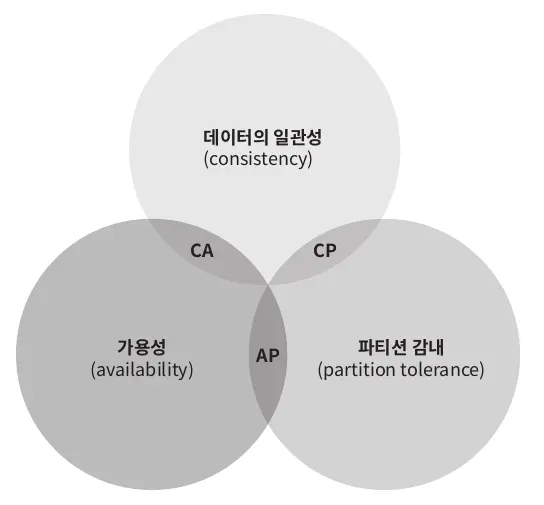

CAP 정히는 이들 가운데 어떤 두 가지를 충족하려면 나머지 하나는 반드시 희생되어야 한다는 것을 의미한다.

- CP System : 일관성과 파티션 감내를 지원하는 키-값 저장소. 가용성을 희생한다.

- AP System : 가용성과 파티션 감내를 지원하는 키-값 저장소. 데이터 일관성을 희생한다.

- CA System : 일관성과 가용성을 지원하는 키-값 저장소. 파티션 감내는 지원하지 않는다.

**그러나 통산 네트워크 장애는 피할 수 없는 일로 여겨지므로, 분산 시트템은 반드시 파티션 문제를 감내할 수 있도록 설계되어야 한다!! 그러므로 실세계에 CA System은 존재하지 않는다.**

---

분산 시스템에서 데이터는 보통 여러 노드에 복제되어 보관된다.

세 대의 복제 노드 n1,n2,n3에 데이터를 복제하여 보관하는 상황을 가정해 보자.

**이상적 상태**

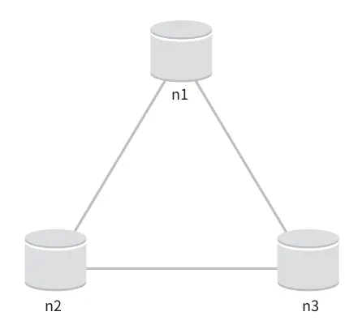

이상적 환경이라면 네트워크가 파티션되는 상황은 절대 일어나지 않을 것이다.

n1에 기록된 데이터는 자동적으로 n2와 n3에 복제된다.

데이터 일관성과 가용성도 만족된다.

**실세계의 분산 시스템**

분산 시스템은 파티션 문제를 피할 수 없다.

그리고 파티션 문제가 발생하면 우리는 일관성과 가용성 사이에서 하나를 선택해야 한다.

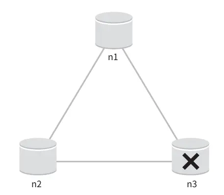

위 그림은 n3에 장애가 발생하여 n1 및 n2와 통신할 수 없는 상황이다.

클라이언트가 n1 또는 n2에 기록한 데이터는 n3에 전달되지 않는다.

n3에 기록되었으나 아직 n1 및 n2로 전달되지 않은 데이터가 있다면 n1과 n2는 오래된 사본을 갖고 있을 것이다.

**가용성 대신 일관성을 선택한다면(CP 시스템) 세 서버 사이에 생길 수 있는 데이터 불일치 문제를 피하기 위해** 

**n1과 n2에 대해 쓰기 연산을 중단시켜야 하는데, 그렇게 하면 가용성이 깨진다!**

ex) 은행권 시스템

은행권 시스템은 보통 데이터 일관성을 양보하지 않는다!

예를 들어, 온라인 뱅킹 시스템이 계좌 최신 정보를 출력하지 못한다면 큰 문제가 발생한다!

네트워크 파티션 때문에 일관성이 깨질 수 있는 상황이 발생하면 이런 시스템은 상황이 해결될 때까지는 오류를 반환해야 한다.

하지만 일관성 대신 가용성을 선택한 시스템 (AP System)은 설사 낡은 데이터를 반환할 위험이 있더라도 계속 읽기 연산을 허용해야 한다.

아울러 n1과 n2는 계속 쓰기 연산을 허용할 것이고, 파티션 문제가 해결된 뒤에 새 데이터를 n3에 전송할 것이다.

**분산 키-값 저장소를 만들 때는 그 요구사항에 맞도록 CAP 정리를 적용해야 한다.**

---

## 시스템 컴포넌트

키-값 저장소 구현에 사용될 핵심 컴포넌트들 및 기술

- 데이터 파티션
- 데이터 다중화
- 일관성
- 일관성 불일치 해소
- 장애처리
- 시스템 아키텍처 다이어그램
- 쓰기 경로
- 읽기 경로

---

### 데이터 파티션

대규모 애플리케이션의 경우 전체 데이터를 한 대 서버에 욱여넣는 것은 불가능하다.

가장 단순한 해결책은 데이터를 작은 파티션들로 분할한 다음 여러 대 서버에 저장하는 것이다.

데이터를 파티션 단위로 나눌 때는 다음 두 가지 문제를 중요하게 따져봐야 한다.

- 데이터를 여러 서버에 고르게 분산할 수 있는가
- 노드가 추가되거나 삭제될 때 데이터의 이동을 최소화 할 수 있는가

안정 해시 (consistent hash)는 이런 문제를 푸는 데 적합한 기술이다!

**안정 해시를 사용하여 데이터를 파티션하면 좋은 점!**

- 규모 확장 자동화 (automatic scaling): 시스템 부하에 따라 서버가 자동으로 추가되거나 삭제되도록 만들 수 있다.

- 다양성(heterogeneity) : 각 서버의 용량에 맞게 가상 노드의 수를 조정할 수 있다. 다시 말해 고성능 서버는 더 많은 가상 노드를 갖도록 설정할 수 있다.

---

### 데이터 다중화

높은 가용성과 안정성을 확보하기 위해서는 데이터를 N개 서버에 비동기적으로 다중화(replication)할 필요가 있다. (N은 튜닝 가능한 값)

**N개 서버를 선정하는 방법**

어떤 키를 해시 링 위에 배치한 후, 그 지점으로부터 시계 방향으로 링을 순회하면서 만나는 첫 N개 서버에 데이터 사본을 보관하는 것이다.

따라서 N=3으로 설정한 경우 key0은 s1, s2, s3에 저장된다.

But!!!

가상 노드를 사용한다면 위와 같이 선택한 N개의 노드가 대응될 실제 물리 서버의 개수가 N보다 작아질 수 있다.

이 문제를 피하려면 노드를 선택할 때 같은 물리 서버를 중복 선택하지 않도록 해야 한다.

같은 데이터 센터에 속한 노드는 정전, 네트워크 이슈, 자연재해 등의 문제를 동시에 겪을 가능성이 있다.

따라서 안정성을 담보하기 위해 데이터의 사본은 다른 센터의 서버에 보관하고, 센터들은 고속 네트워크로 연결한다.

---

### 데이터 일관성

여러 노드에 다중화된 데이터는 적절히 동기화가 되어야 하낟!

정족수 합의(Quorum Consensus) 프로토콜을 사용하면 읽기/쓰기 연산 모두에 일관성을 보장할 수 있다.

- N = 사본 개수
- W = 쓰기 연산에 대한 정족수. 쓰기 연산이 성공한 것으로 간주되려면 적어도 W개의 서버로부터 쓰기 연산이 성공했다는 응답을 받아야 한다.
- R = 읽기 연산에 대한 정족수. 읽기 연산이 성공한 것으로 간주되려면 적어도 R개의 서버로부터 응답을 받아야 한다.

N = 3인 경우 예제
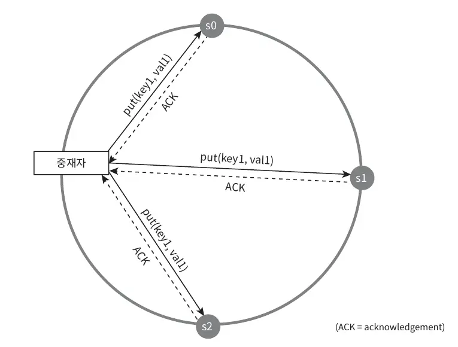

W = 1은 데이터가 한 대 서버에만 기록된다는 뜻이 아니다.

위 그림과 같이 데이터가 s0, s1, s2에 다중화되는 상황을 예로 들어 살펴보자.

W = 1은 쓰기 연산이 성공했다고 판단하기 위해 중재자(coordinator)는 최소 한 대 서버로부터 쓰기 성공 응답을 받아야 한다는 뜻이다.

s1으로부터 성공 응답을 받았다면 s0, s2로부터의 응답은 기다릴 필요가 없다.

중재자는 클라이언트와 노드 사이에서 프락시(proxy) 역할을 한다.

W,R,N의 값을 정하는 것은 응답 지연과 데이터 일관성 사이의 타협점을 찾는 전형적인 과정이다.

R = 1, W = N : 빠른 읽기 연산에 최적화된 시스템
W = 1, R = N : 빠른 쓰기 연산에 최적화된 시스템
W + R > N : 강한 일관성이 보장됨 (보통 N = 3, W = R = 2)
W + R <= N : 강한 일관성이 보장되지 않음

요구되는 일관성 수준에 따라 W,R,N의 값을 조정하면 된다,.

---

### 일관성 모델

일관성 모델 (consistency model)은 키-값 저장소를 설계할 때 고려해야 할 또 하나의 중요한 요소다.

- 강한 일관성 (strong consistency)
  - 모든 읽기 연산은 가장 최근에 갱신된 결과를 반환한다.
  - 다시 만해서 클라이언트는 절대로 낡은(out-of-date) 데이터를 보지 못한다.

- 약한 일관성 (weak consistency)
  - 읽기 연산은 가장 최근에 갱신된 결과를 반환하지 못할 수 있다.

- 결과적 일관성 (eventual consistency)
  - 약한 일관성의 한 형태로, 갱신 결과가 결국에는 모든 사본에 반영(즉, 동기화)되는 모델이다.

강한 일관성을 달성하는 일반적인 방법은?

모든 사본에 현재 쓰기 연산의 결과가 반영될 때까지 해당 데이터에 대한 읽기/쓰기를 금지하는 것이다!

이 방법은 새로운 요청의 처리가 중단되기 때문에 고가용성 시스템에는 적합하지 않다.

다이나모 또는 카산드라 같은 저장소는 결과적 일관성 모델을 택하고 있다.

**결과적 일관성 모델을 따르는 경우 쓰기 연산이 병렬적으로 방생하면 시스템에 저장된 값의 일관성이 깨어질 수 있다.**

이 문제는 클라이언트가 해결해야 한다.

클라이언트 측에서 데이터의 버전 정보를 활용해 일관성이 깨진 데이터를 읽지 않도록 하는 기법을 사용해야 한다.

---

### 비 일관성 해소 기법 : 데이터 버저닝

데이터를 다중화하면 가용성은 높아지지만 사본 간 일관성이 깨질 가능성은 높아진다.

버저닝(versioning)과 벡터 시계(vector clock)는 그 문제를 해소하기 위해 등장한 기술이다.

**버저닝 (versioning) : 데이터를 변경할 때마다 해당 데이터의 새로운 버전을 만드는 것을 의미**

각 버전의 데이터는 변경 불가능하다!

**데이터 일관성이 깨지는 예제**

서버 1은 "name"에 매달린 값을 "johnSanFrancisco"로 바꾸고, 서버 2는 "johnNewYork"으로 바꾼다고 하자.

그리고 이 두 연산은 동시에 이뤄진다고 하자.

이제 우리는 충동(conflict)하는 두 값을 갖게 되었다. 그리고 각각을 버전 v1, v2라고 하자.

이 변경이 이루어진 이후에, 원래 값은 무시할 수 있다. 변경이 끝난 옛날 값이어서다.

하지만 마지막 두 버전 v1과 v2 사이의 충돌은 해소하기 어려워 보인다.

이 문제를 해결하려면, 충돌을 발견하고 자동으로 해결해 낼 버저닝 시스템이 필요하다.

벡터 시계는 이런 문제를 푸는데 보편적으로 사용되는 기술이다. 

#### 벡터 시계

벡터 시계는 [서버, 버전]의 순서쌍을 데이터에 매단 것이다.

어떤 버전이 선행 버전인지, 후행 버전인지, 아니면 다른 버전과 충동이 있는 판별하는데 쓰인다.

벡터 시계는 D([S1, v1],[S2, v2],...,[Sn, vn])와 같이 표현한다고 가정하자.

여기서 D는 데이터이고, vi는 버전 카운터, Si는 서버 번호이다.

만일 데이터 D를 서버 Si에 기록하면, 시스템은 아래 작업 가운데 하나를 수행하여야 한다.

- [Si, vi]가 있으면 vi를 증가시킨다.
- 그렇지 않으면 새 항목 [Si, 1]를 만든다.

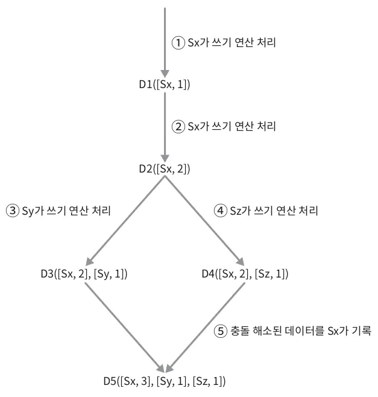

1. 클라이언트가 데이터 D1을 시스템에 기록한다. 이 쓰기 연산을 처리한 서버는 Sx이다. 따라서 백터 시계는 D1[(Sx, 1)]으로 변한다.

2. 다른 클라이언트가 데이터 D1을 읽고 D2로 업데이트한 다음 기록한다. D2는 D1에 대한 변경이므로 D1을 덮어쓴다. 이때 쓰기 연산은 같은 서버 Sx가 처리한다고 가정하자. 벡터 시계는 D2([Sx,2])로 바뀔 것이다.

3. 다른 클라이언트가 D2를 읽어 D3로 갱신한 다음 기록한다. 이 쓰기 연산은 Sy가 처리한다고 가정하자. 벡터 시계 상태는 D3([Sx,2],[Sy,1])로 바뀐다.

4. 또 다른 클라이언트가 D2를 읽고 D4로 갱신한 다음 기록한다. 이때 쓰기 연산은 서버 Sz가 처리한다고 가정하자. 벡터 시계는 D4([Sx,2],[Sz,1])일 것이다.

5. 어떤 클라이언트가 D3과 D4를 읽으면 데이터 간 충돌이 있다는 것을 알게 된다. D2를 Sy와 Sz가 각기 다른 값으로 바꾸었기 때문이다.
   이 충돌은 클라이언트가 해소한 후에 서버에 기록한다. 이 쓰기 연산을 처리한 서버는 Sx였다고 하자. 벡터 시계는 D5([Sx,3],[Sy,1],[Sz,1])로 바뀐다.
   
**어떤 버전이 이전 버전인지 (따라서 충돌이 없는지) 판단하는 법?**

버전 Y에 포함된 모든 구성요소의 값이 X에 포함된 모든 구성요소 값보다 같거나 큰지만 보면 된다.

예를 들어 벡터 시계 D([S0,1],[S1,1])은 D([S0,1],[S1,2])의 이전 버전이다. 따라서 두 데이터 사이에 충돌은 없다.

어떤 버전 X와 Y 사이에 충동이 있는지 보려면

(다시 말해 그 두 버전이 같은 이전 버전에서 파생된 다른 버전들인지 보려면) 

Y의 벡터 시계 구성요소 가운데 X의 벡터 시계 동일 서버 구성요소보다 작은 값을 갖는 것이 있는지 보면 된다.

(물론 모든 구성요소가 작은 값을 갖는 경우에는 Y는 X의 이전 버전이다.)

예를 들어, D([s0,1],[s1,2])와 D([s0,2],[s1,1])는 서로 충돌한다.

**벡터 시계를 사용해 충돌을 감지하고 해소하는 방법의 단점**

1. 충돌 감지 및 해소 로직이 클라이언트에 들어가야 하므로, 클라이언트 구현이 복잡해진다.

2. [서버:버전]의 순서쌍 개수가 굉장히 빨리 늘어난가는 것이다.
   이 문제를 해결하여면 그 길이에 어떤 임계치를 설정하고 임계치 이상으로 길이가 길어지면 오래된 순서쌍을 벡터 시계에서 제거하도록 해야 한다.
   그러나 이렇게 하면 버전 간 선후 관계가 정확하게 결정될 수 없기 때문에 충돌 해소 과정의 효율성이 낮아지게 된다.
   하지만 다이나모 데이터베이스에 관계된 문헌에 따르면 아마존은 실제 서비스에서 그런 문제가 벌어지는 것을 발견한 적이 없다고 한다.

--- 

### 장애 처리

대다수 대규모 시스템에서 장애는 아주 흔하게 벌어지는 사건이다.

따라서 장애를 어떻게 처리할 것이냐 하는 것은 굉장히 중요한 문제다.

장애 감지 기법을 살펴보고, 그 다음으로 장애 해소 전략들을 짚어보자

---

### 장애 감지

분산 시스템에서는 그저 한 대 서버가 죽었다고 해서 바로 서버 A를 장애처리 하지는 않는다.

보통 두 대 이상의 서버가 똑같이 서버 A의 장애를 보고해야 해당 서버에 실제로 장애가 발생했다고 간주하게 된다.

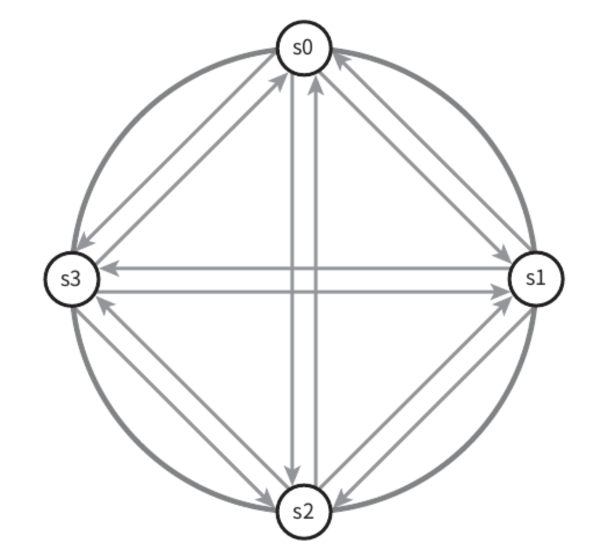

모든 노드 사이에 멀티캐스팅(multicasting) 채털을 구축하는 것이 서버 장애를 감지하는 가장 손쉬운 방법이다.

하지만 이 방법은 서버가 많을 때는 분명 비효율적이다.

가십(gossip protocol) 같은 분산형 장애 감지(decentralized failure detection) 솔루션을 채택하는 편이 보다 효율적이다.

**가십 프로토콜의 동작 원리**

- 각 노드는 멤버십 목록(membership list)을 유지한다. 멤버십 목록은 각 멤버 ID와 그 박동 카운터(heartbeat counter) 쌍의 목록이다.

- 각 노드는 주기적으로 자신의 박동 카운터를 증가시킨다.

- 각 노드는 무작위로 선정된 노드들에게 주기적을 자기 박동 카운터 목록을 보낸다.

- 박동 카운터 목록을 받은 노드는 멤버십 목록을 최신 값으로 갱신한다.

- 어떤 멤버의 박동 카운터 값이 지정된 시간 동안 갱신되지 않으면 해당 멤버는 장애 상태인 것으로 간주한다.
  

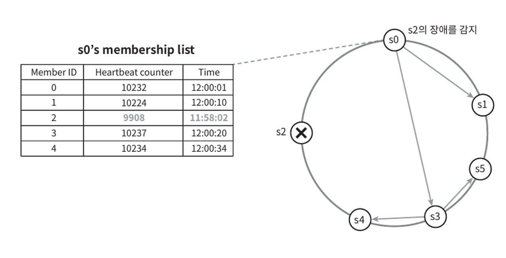

- 노드 s0은 그림 좌측의 테이블과 같은 멤버십 목록을 가진 상태다.
- 노드 s0은 노드 s2(멤버 ID=2)의 박동 카운터가 오랫동안 증가되지 않았다는 것을 발견한다.
- 노드 s0은 노드 s2를 포함하는 박동 카운터 목록을 무작위로 선택된 다른 노트에게 전달한다.
- 노드 s2의 박동 카운터가 오랫동안 증가되지 않았음을 발견한 모든 노드는 해당 노드를 장애 노드로 표시한다.

---

### 일시적 장애 처리

가십 프로토콜로 장애를 감지한 시스템은 가용성을 보장하기 위해 필요한 조치를 해야 한다.

엄격한 정족수(strict quorum) 접근법을 쓴다면, "데이터 일관성" 절에서 설명한 대로, 읽기와 쓰기 연산은 금지해야 할 것이다.

느슨한 정족수(sloppy quorum) 접근법은 이 조건을 완화하여 가용성을 높인다.

정족수 요구사항을 강제하는 대신, 쓰기 연산을 수행할 W개의 건강한 서버와 읽기 연산을 수행할 R개의 건강한 서버를 해시 링에서 고른다.

이때 장애 상태인 서버는 무시한다.

네트워크나 서버 문제로 장애 상태인 서버로 가는 요청은 다른 서버가 잠시 맡아 처리한다.

그동안 발생한 변경사항은 해당 서버가 복구되었을 때 일괄 반영하여 데이터 일관성을 보존한다.

이를 위해 임시로 쓰기 연산을 처리한 서버에는 그에 돤한 단서를 남겨둔다.

따라서 이런 장애 처리 방안을 단서 후 임시 위탁 (hinted handoff) 기법이라 부른다.

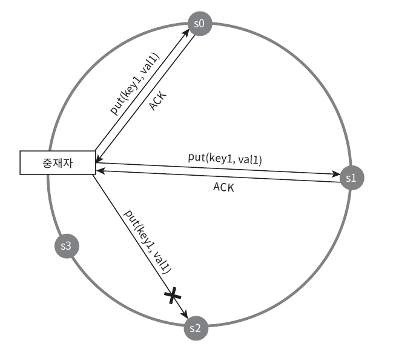

장애 상태인 노드 s2에 대한 읽기 및 쓰기 연산은 일시적을 노드 s3가 처리한다.

s2가 복구되면, s3은 갱신된 데이터를 s2로 인계할 것이다.

---

### 영구 장애 처리

단서 후 임시 위탁 기법은 일시적 장애를 처리하기 위한 것이다.

영구적인 노드의 장애 상태는 어떻게 처리해야 할까?

그런 상황을 처리하기 위해 우리는 반-엔트로피(anti-entropy) 프로토콜을 구현하여 사본들을 동기화할 것이다.

anti-entropy protocol 은 사본들을 비교하여 최신 버전으로 갱신하는 과정을 포함한다.

사본 간의 일관성이 망가진 상태를 탐지하고 전송 데이터의 양을 줄이기 위해서는 머클(merkle) 트리를 사용할 것이다.

#### 머클 트리(merkle tree)

해시 트리라고도 불리는 머클 트리는 각 노드에 그 자식 노드들에 보관된 값의 해시(자식 노드가 종단 노드인 경우), 또는 자식 노드들의 레이블로부터 계산된 해시 값을 레이블로 붙여두는 트리다.

해시 트리를 사용하면 대규모 자료 구조의 내용을 효과적이면서도 보안상 안전한 방법으로 검증할 수 있다.

#### 머클 트리 예제

키 공간이 1~12 일 때 머클 트리

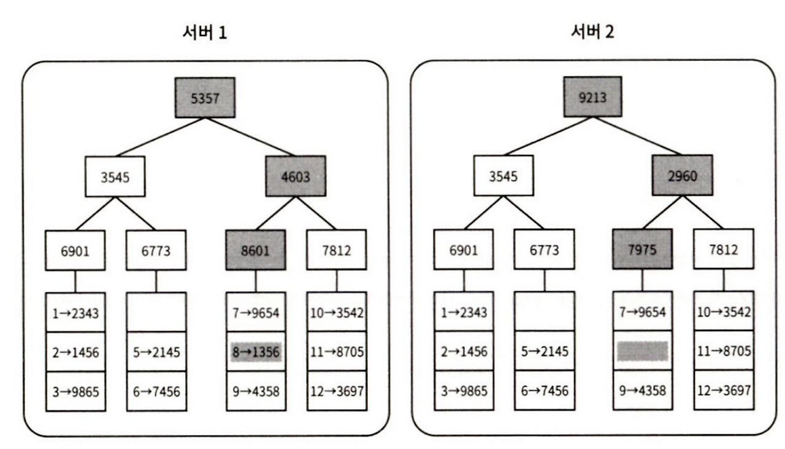

일관성이 망가진 데이터가 위치한 상자는 다른색이다.

- 1 단계 : 키 공간을 버킷으로 나눈다.
- 2 단계 : 버킷에 포함된 각각의 키에 균등 분포 해시 함수를 적용하여 해시 값을 계산한다.
- 3 단계 : 버킷별로 해시값을 계산한 후, 해당 해시 값을 레이블로 갖는 노드를 만든다.
- 4 단계 : 자식 노드의 레이블로부터 새로운 해시 값을 계산하여, 이진 트리를 상향식으로 구성해 나간다.

두 머클 트리의 비교는 루트 노드의 해시값을 비교하는 것으로 시작한다.

루트 노드의 해시 값이 일치하면 두 서버는 같은 데이터를 갖는다.

그 값이 다른 경우에는 왼쪽 자식 노드의 해시값을 비교하고, 그 다음으로 오른쪽 자식 노드의 해시값을 비교한다.

이렇게 하면서 아래쪽으로 탐색해 나가다 보면 다른 데이터를 갖는 버킷을 찾을 수 있으므로, 그 버킷들만 동기화하면 된다.

머클 트리를 사용하면 동기화해야 하는 데이터의 양은 실제로 존재하는 차이의 크기에 비례할 뿐, 두 서버에 보관된 데이터의 총량과는 무관해진다.

하지만 실제로 쓰이는 시스템의 경우 버킷 하나의 크기가 꽤 크다는 것은 알아두여야 한다.

---

### 데이터 센터 장애 처리

데이터 센터 장애는 정전, 네트워크 장애, 자연재해 등 다양한 이유로 발생할 수 있다.

데이터 센터에 대응할 수 있는 시스템을 반들려면 데이터를 여러 데이터 센터에 다중화하는 것이 중요하다.

한 데이터센터가 완전히 망가져도 사용자는 다른 데이터 센터에 보관된 데이터를 이용할 수 있을 것이다.

---

## 시스템 아키텍처 다이어그램

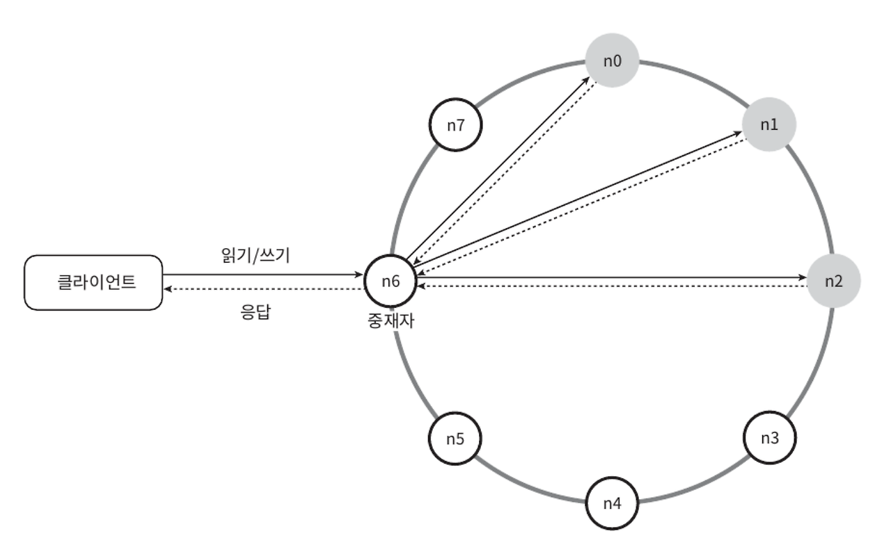

이 아키텍처의 주된 기능은 다음과 같다.

- 클라이언트는 키-값 저장소가 제공하는 두 가지 단순한 API, 즉 get(key) 및 put(key, value)와 통신한다.
- 중재자(coordinator)는 클라이언트에게 키-값 저장소에 대한 프락시(proxy) 역할을 하는 노드다.
- 노드는 안정 해시의 해시 링 위에 분포한다.
- 노드를 자동으로 추가 또는 삭제할 수 있도록, 시스템은 완전히 분산된다.
- 데이터는 여러 노드에 다중화된다.
- 모든 노드가 같은 책임을 지므로, SPOF(Single Point Of failure)는 존재하지 않는다.

완전히 분산된 설계를 채택하였으므로, 모든 노드는 아래 기능을 전부 지원해야 한다.

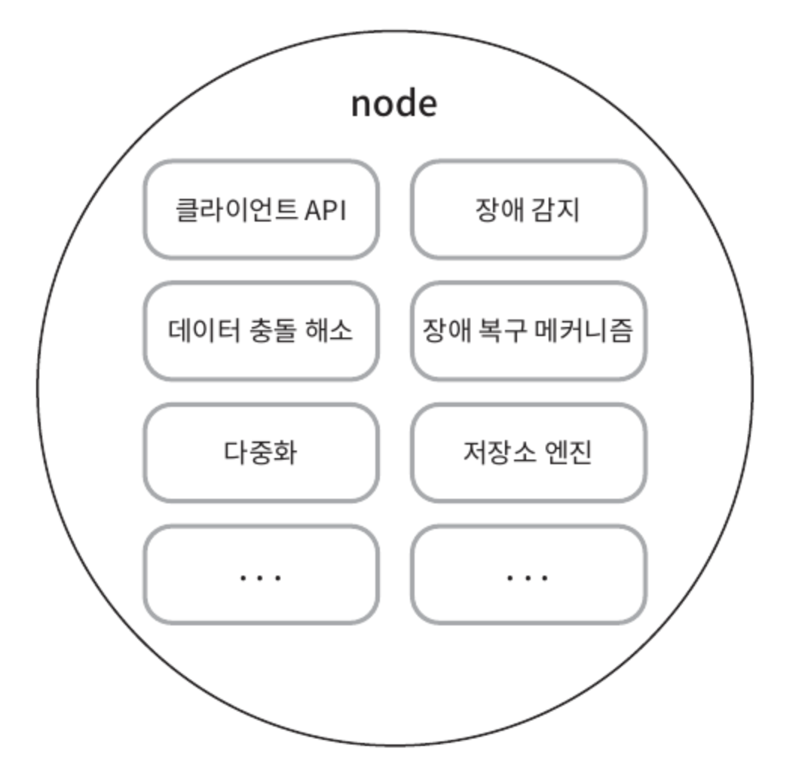

---

### 쓰기 경로

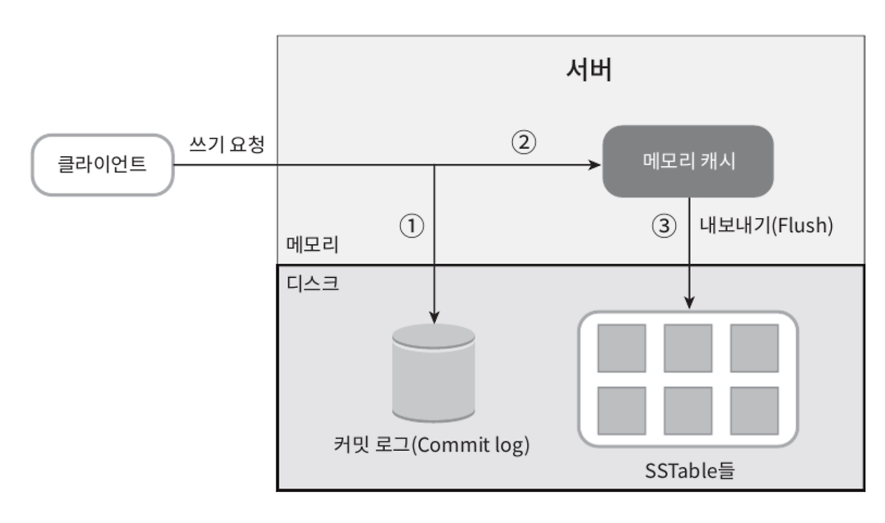

쓰기 요청이 특정 노드에 전달되면 무슨일이 벌어질까?

1. 쓰기 요청이 커밋 로그 파일에 기록된다.
2. 데이터가 메모리 캐시에 기록된다.
3. 메모리 캐시가 가득차거나 사전에 정의된 어떤 임계치에 도달하면 데이터는 디스크에 있는 SSTable에 기록된다.
- SSTable (Sorted-String Table) : <키,값>의 순서쌍을 정렬된 리스트 형태로 관리하는 테이블이다.

---

### 읽기 경로

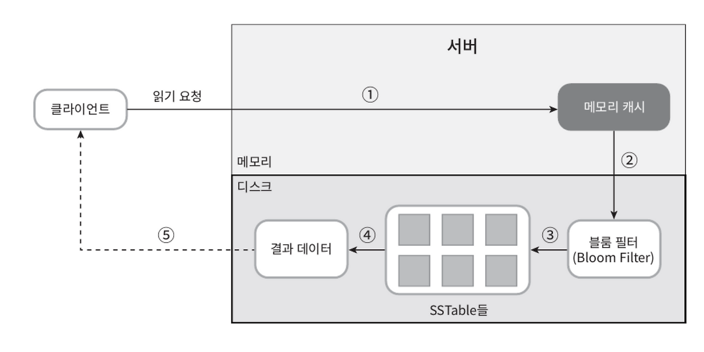

데이터가 메모리에 없는 경우에는 디스크에서 가져와야 한다.

어느 SSTable에 찾는 키가 있는지 알아낼 효율적인 방법이 필요할 것이다.

이런 문제를 푸는데는 블룸 필터(Bloom filter)가 흔히 사용된다.

데이터가 메모리에 없을 때 읽기 연산이 처리되는 경로를 보면 아래와 같다.

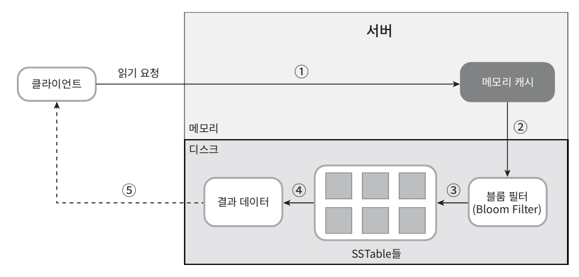

1. 데이터가 메모리 있는지 검사한다. 없으면 2로 간다.
2. 데이터가 메모리에 없으므로 블룸 필터를 검사한다.
3. 블룸 필터를 통해 어떤 SSTable에 키가 보관되어 있는지 알아낸다.
4. SSTable에서 데이터를 가져온다.
5. 해당 데이터를 클라이언트에게 반환한다.

---

### **1. 블룸 필터(Bloom Filter)란?**
블룸 필터는 **공간 효율적인 확률적 데이터 구조**로, **특정 요소가 집합에 포함되어 있는지를 빠르게 검사**할 때 사용됩니다.

✅ **특징:**
- **거짓 긍정(false positive)** 가능성이 있음 → 어떤 요소가 "존재한다"는 결과는 확실하지 않지만, "존재하지 않는다"는 결과는 100% 확실
- 해시 함수를 여러 개 사용하여 특정 비트 배열을 조작
- **빠른 조회(O(1))** 및 **공간 절약 효과** → 메모리가 제한적인 환경에서 유용

✅ **사용 예시:**
- **데이터베이스 (DB) 캐싱**: 키-값 저장소(RocksDB, LevelDB, Cassandra)에서 특정 키가 존재하는지 확인
- **네트워크 보안**: 악성 URL 목록 조회
- **검색 엔진**: 크롤링한 문서를 중복 검사

---

### **2. SSTable (Sorted String Table)이란?**
SSTable은 **정렬된 키-값 데이터 구조**로, 주로 **로그-구조 병합 트리(Log-Structured Merge Tree, LSM-Tree)** 기반 저장소에서 사용됩니다.

✅ **특징:**
- 키-값 쌍이 **정렬된 상태로 저장**
- 디스크에서 **빠르게 검색 가능** (바이너리 서치, 블룸 필터 활용)
- 변경 불가능(Immutable) → 새로운 데이터는 메모리(MemTable)에 쓰이고, 일정 크기가 되면 SSTable로 변환되어 디스크에 저장

✅ **사용 예시:**
- **Cassandra, LevelDB, RocksDB** 같은 키-값 저장소
- **HBase**와 같은 NoSQL 데이터베이스
- **검색 엔진의 색인 저장 방식**

✅ **블룸 필터와 SSTable의 관계:**  
SSTable은 키-값 데이터를 저장하지만, **특정 키가 있는지 빠르게 검사하려면 블룸 필터를 함께 사용**합니다.  
즉, 블룸 필터가 **"이 키가 SSTable에 있을 가능성이 높은지"** 먼저 판단한 후, **실제로 SSTable을 검색할지 결정**하는 최적화 역할을 합니다. 🚀

---

## 요약

분산 키 - 값 저장소가 가져야 하는 기능과 그 기능 구현에 이용되는 기술

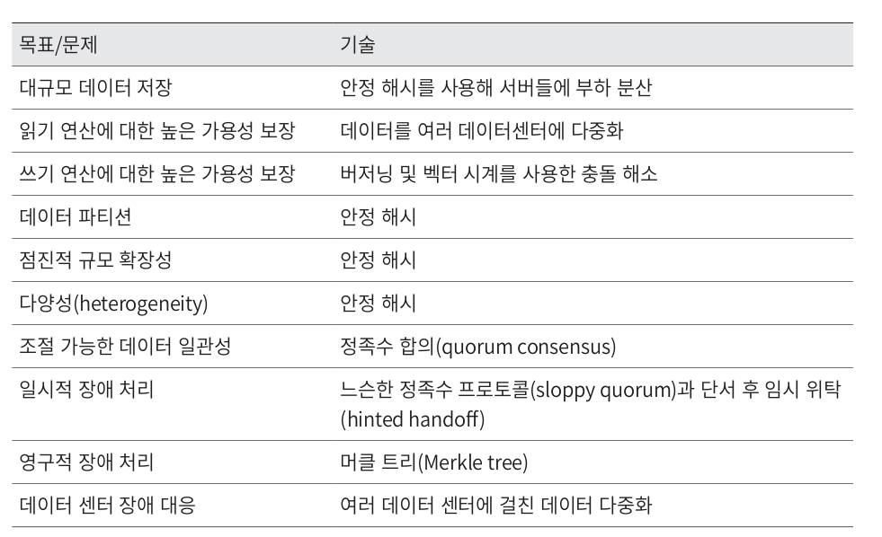

---

