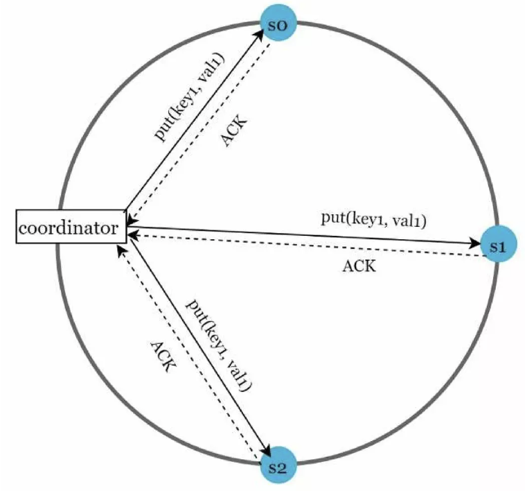
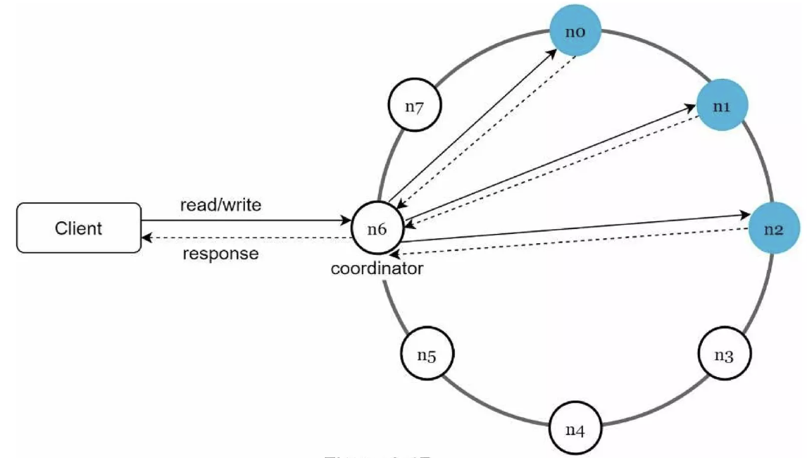
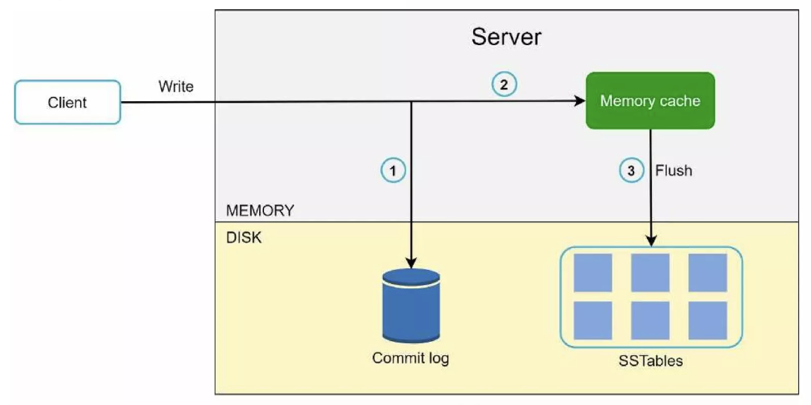
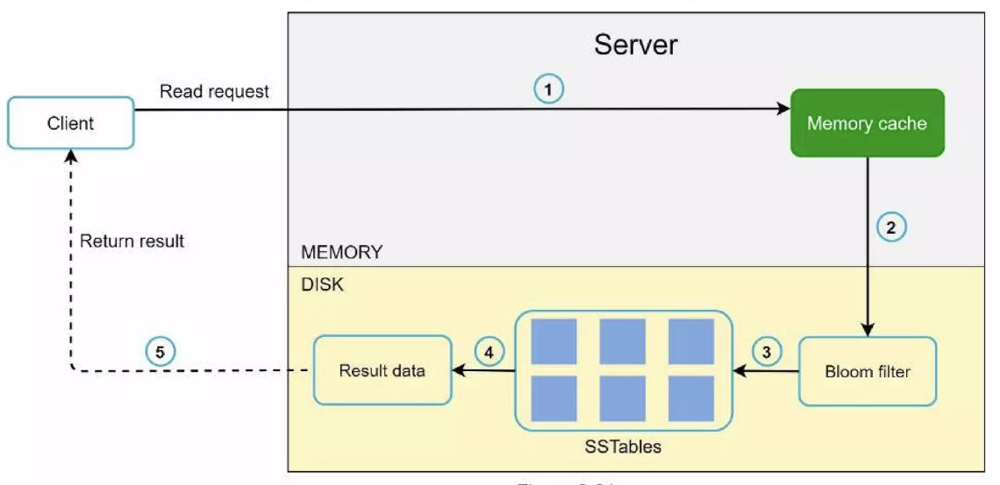

# Chapter 06: 키-값 저장소 설계

> **키-값 저장소**  
> **비관계형 데이터베이스**이며, 이 저장소에 저장되는 값은 고유 식별자를 키로 가져야 함

아래와 같이 키-값 쌍을 저장할 수 있으며, 키는 다양한 데이터 타입으로 설정 가능하다.

| 키  | 값    |
| --- | ----- |
| 145 | john  |
| 147 | bob   |
| 160 | julia |

이번 장에서는 다음 연산을 지원하는 키-값 저장소를 설계한다.

- `put(key, value)`
- `get(key)`

---

# 1. 문제 이해 및 설계 범위 확정

완벽한 설계는 없다.

- `읽기`, `쓰기` 그리고 `메모리 사용량` 사이에 어떤 균형을 찾고,
- `데이터의 일관성`과 `가용성` 사이에서 타협적인 결정을 내린

설계를 만들어야 한다.

이번 장에서는 다음 특성을 갖는 키-값 저장소를 설계한다.

```
- 키-값 쌍의 크기는 10KB 이하이다.
- 큰 데이터를 저장할 수 있어야 한다.
- 높은 가용성을 제공해야 한다.
    - 따라서 시스템은 설사 장애가 있더라도 빨리 응답해야 한다.
- 높은 규모 확장성을 제공해야 한다.
    - 따라서 트래픽 양에 따라 자동적으로 서버 증설/삭제가 이루어져야 한다. (오토 스케일링)
- 데이터 일관성 수준은 조정이 가능해야 한다.
- 응답 지연시간이 짧아야 한다.
```

---

# 2. 단일 서버 키-값 저장소

가장 직관적인 방법은 키-값 쌍 전부를 메모리에 해시 테이블로 저장하는 것이다.

이는 빠른 속도를 보장하지만, 모든 데이터를 메모리 안에 두는 것이 불가능할 수 있다.  
이를 위한 개선책은 아래와 같다.

- 데이터 압축
- 자주 쓰이는 데이터만 메모리에 두고, 나머지는 디스크에 저장

그러나 이렇게 개선한다고 하더라도, 언젠가는 한 대 서버로도 부족한 때가 찾아온다.

👉🏻 **많은 데이터를 저장**하려면 결국 `분산 키-값 저장소`가 필요하다.

---

# 3. 분산 키-값 저장소

분산 키-값 저장소는 **키-값 쌍을 여러 서버에 분산**시키기 때문에, **분산 해시 테이블**이라고도 불린다.

**분산 시스템**을 설계할 때는 `CAP 정리`를 이해하고 있어야 한다.

## CAP 정리

- **Consistency** (일관성)
- **Availability** (가용성)
- **Partition Tolerance** (파티션 감내)

분산 시스템을 설계할 때, 위의 **세 가지 요구사항을 동시에 만족하는 시스템을 설계하는 것은 불가능하다**는 정리이다.

### 데이터 일관성

분산 시스템에 접속하는 모든 클라이언트는 _어떤 노드에 접속했느냐에 관계없이_ **언제나 같은 데이터를 보게 되어야** 한다.

### 가용성

분산 시스템에 접속하는 클라이언트는 _일부 노드에 장애가 발생하더라도_ 항상 응답을 받을 수 있어야 한다.

### 파티션 감내

파티션은 **두 노드 사이에 통신 장애가 발생하였음**을 의미한다.  
즉, 파티션 감내는 _네트워크에 통신 장애가 발생하더라도_ **시스템은 계속 동작해야** 한다는 것이다.


> 출처: https://www.slideshare.net/slideshow/systemdesigninterviewaninsidersguide2nbsped9798664653403pdf/257681007#90

- `CP 시스템`
  - **일관성**과 **파티션 감내**를 지원하는 키-값 저장소. **가용성**을 희생
- `AP 시스템`
  - **가용성**과 **파티션 감내**를 지원하는 키-값 저장소. **일관성**을 희생
- `CA 시스템`
  - **일관성**과 **가용성**을 지원하는 키-값 저장소. **파티션 감내**는 지원하지 않음
  - 그러나 네트워크 장애는 피할 수 없는 일로 여겨진다.
    - ⭐️ **분산 시스템은 반드시 `파티션 감내성`을 가져야** 한다.
  - _실세계에서 존재하지 않는 시스템_

### 실세계의 분산 시스템

분산 시스템은 파티션 문제를 피할 수 없다. 그리고 파티션 문제가 발생하면 우리는 **`일관성`과 `가용성` 사이에서 하나를 선택해야** 한다.

아래 그림은 **`n3`에 장애가 발생**하여 `n1` 및 `n2`와 통신할 수 없는 상황을 보여준다.


> 클라이언트가 `n1` 또는 `n2`에 기록한 데이터는 `n3`에 전달되지 않는다.

- `CP 시스템` - 가용성 < 일관성
  - `n3`에 쓸 수 없는 상황이므로, 세 서버 사이에 **데이터 불일치 문제**가 발생한다.
  - 이 경우, `n1`과 `n2`에 대해 쓰기 연산을 중단시킬 수 있다.
  - 이 경우 가용성이 깨진다. _(= 시스템이 중단된다)_
- `AP 시스템` - 가용성 > 일관성
  - `n3`와 일치하지 않는(= 낡은) 데이터를 반환할 가능성이 있더라도, 계속 읽기 연산을 허용해야 한다.
  - `n1`과 `n2`는 계속 쓰기 연산을 허용한다.
  - 파티션 문제가 해결된 뒤에 새 데이터를 `n3`에 전송한다.

```md
[ 서비스의 특성에 따라서 적절한 시스템을 선택해야 한다 ]

가령, 데이터의 일관성이 매우 중요한 `은행권 시스템`의 경우, 가용성을 포기하고 `CP 시스템`을 적용하는 것이 합리적일 것이다.

- ex. 네트워크 파티션으로 인해 계좌 최신 정보를 출력하지 못할 경우
  - 일관성을 유지하기 위해 시스템을 중지시키고, 상황이 해결될 때까지 오류를 반환
```

> 👉🏻 분산 키-값 저장소를 설계할 때는 **요구사항에 맞도록** `CAP 정리`를 적용해야 한다.

## 시스템 컴포넌트

키-값 저장소 구현에 사용될 핵심 컴포넌트들 및 기술들

- 데이터 파티션
- 데이터 다중화 (replication)
- 일관성
- 일관성 불일치 해소
- 장애 처리
- 시스템 아키텍처 다이어그램
- 쓰기 경로
- 읽기 경로

### 데이터 파티션

> 샤딩과 비슷한 개념으로 보인다.

전체 데이터를 한 대의 서버에 넣지 않고, 작은 파티션들로 **분할하여 여러 서버에 저장**하는 것이다.

데이터를 파티션 단위로 나눌 때는 다음 두 가지 문제를 중요하게 따져야 한다.

- 데이터를 여러 서버에 고르게 분산할 수 있는가
- 노드가 추가/삭제될 때 데이터의 이동을 최소화할 수 있는가
  - 5장의 **rehash**와 비슷한 의미인 듯

5장의 `안정 해시`는 이런 문제를 푸는 데 적합한 기술이다.


> 출처: https://www.slideshare.net/slideshow/systemdesigninterviewaninsidersguide2nbsped9798664653403pdf/257681007#93

- 서버를 해시 링에 배치한다.
- 어떤 키-값 쌍을 어떤 서버에 저장할지 결정한다.
  - 해당 키를 같은 링 위에 배치한다.
  - 그 지점으로부터 링을 시계 방향으로 순회한다.
  - 가장 처음 만난 서버에 해당 키-값 쌍을 저장한다.

즉, `key0`는 `s1`에 저장된다.

```
[ 안정 해시로 데이터를 파티션하는 장점 ]

1. 규모 확장 자동화

- 시스템 부하에 따라 서버가 자동으로 추가되거나 삭제되도록 만들 수 있다.

2. 안정성 (서버 성능에 맞게 배치 가능) 👉🏻 가장 큰 이점인듯

- 각 서버의 용량에 맞게 가상 노드의 수를 조정할 수 있다.
- 즉, 고성능 서버는 더 많은 가상 노드를 갖도록 설정할 수 있다.
```

### 데이터 다중화

높은 가용성과 안정성을 확보하기 위해서는 데이터를 **N개 서버에 비동기적으로 다중화**할 필요가 있다.

- 여기서 N은 튜닝 가능한 값

어떤 키를 해시 링 위에 배치한 후, 그 지점으로부터 **시계 방향으로 링을 순회**하면서 만나는 **첫 `N개` 서버에 데이터 사본을 보관하는 것**이다.

따라서 `N=3`으로 설정한 아래 그림의 예제에서는 `key0`는 `s1`, `s2`, `s3`에 저장된다.


하지만 데이터 다중화를 할 때 아래와 같이 고려해야 할 문제들이 있다.

1. 가상 노드 사용하는 경우 유의사항

   - 가상 노드를 사용한다면, **대응되는 실제 서버의 개수**가 N보다 작을 수 있다.

2. 데이터 센터 분산
   - 같은 데이터 센터에 속한 노드는 정전과 같은 문제를 동시에 겪을 가능성이 높다.
   - 따라서 **하나의 데이터**에 대해서는 **여러 데이터 센터의 서버에 보관**하고, 센터들은 고속 네트워크로 연결한다.

### 데이터 일관성

여러 노드에 다중화된 데이터는 적절히 동기화 되어야 한다.

`정족수 합의 프로토콜`을 사용하면 읽기/쓰기 연산 모두에 일관성을 보장할 수 있다.

프로토콜에 사용되는 개념의 정의는 아래와 같다.

- `N` = **사본 개수**
- `W` = **쓰기 연산에 대한 정족수**
  - 쓰기 연산이 성공한 것으로 간주되려면, **적어도 W개의 서버로부터 쓰기 연산이 성공했다는 응답**을 받아야 함
- `R` = **읽기 연산에 대한 정족수**
  - 읽기 연산이 성공한 것으로 간주되려면, **적어도 R개의 서버로부터 읽기 연산이 성공했다는 응답**을 받아야 함

`N = 3`인 경우의 예시는 아래와 같다.



> `W = 1` 은 데이터가 한 대의 서버에만 기록된다는 의미가 아니다.
>
> 중재자는 **최소 한 대 서버로부터** 쓰기 성공 응답을 받아야, **쓰기 연산이 성공했다고 판단**할 수 있다는 것이다. _(= s1으로부터 성공 응답을 받으면, 나머지 서버의 응답은 기다릴 필요가 없음)_

여기서 중재자는 클라이언트와 노드 사이에서 **프록시 역할**을 수행한다.

`W`, `R`, `N` 값을 정하는 것은 **`응답 지연`과 `데이터 일관성` 사이의 타협점**을 찾는 과정이다.

> 👉🏻 `W`나 `R` 값이 클수록 일관성은 커지지만, 그만큼 응답 시간은 늦어짐

- `R = 1, W = N` 👉🏻 빠른 읽기 연산에 최적화된 시스템 _(쓰기 작업은 일관성을 유지)_
- `W = 1, R = N` 👉🏻 빠른 쓰기 연산에 최적화된 시스템 _(읽기 작업은 일관성을 유지)_
- `W + R > N` 👉🏻 강한 일관성이 보장됨
- `W + R <= N` 👉🏻 강한 일관성이 보장되지 않음

```
[ 일관성 모델 ]

- 강한 일관성 (strong consistency)
  모든 읽기 연산은 가장 최근에 갱신된 결과를 반환
  다시 말해, 클라이언트는 절대로 낡은 데이터를 보지 못한다.

- 약한 일관성 (weak consistency)
  읽기 연산은 가장 최근에 갱신된 결과를 반환하지 못할 수 있다.

- 결과적 일관성 (eventual consistency)
  갱신 결과가 결국에는 모든 사본에 반영(= 동기화)되는 모델이다.
```

만약 쓰기 연산이 병렬적으로 발생하면, 시스템에 저장된 값의 일관성이 깨질 수 있다.  
이 문제는 클라이언트가 해결해야 한다.

- 클라이언트 측에서 `데이터의 버전 정보`를 활용해야 한다.

### 비 일관성 해소 기법: 데이터 버저닝

> **데이터 다중화**를 하면 **가용성은 높아지지만, 사본 간 일관성이 깨질 가능성이 높아**진다.

- **버저닝**
  - 데이터를 변경할 때마다 해당 데이터의 새로운 버전을 만드는 것
  - 버저닝을 사용하더라도, **동시에 데이터가 수정되어 충돌이 발생**할 수 있다.
- **벡터 시계**
  - 벡터 시계는 이렇게 충돌이 발생하는 경우에 이를 발견하고 해결할 수 있는 버저닝 시스템이다.

```
[ 벡터 시계 단점 ]

- 충돌 감지 및 해소 로직이 클라이언트에 들어가므로, 클라이언트의 구현이 복잡해짐

- [서버:버전]의 순서쌍 개수가 매우 빠르게 늘어남
    - 이를 해소하기 위해서는 임계치를 설정하고, 임계치를 넘으면 오래된 것부터 제거해야 함
```

### 장애 처리

장애 감지 기법과 장애 해소 전략을 차례대로 알아본다.

### 장애 처리 - 장애 감지

- 멀티 캐스팅 채널

  아래 그림처럼, **모든 노드 사이에 멀티캐스팅 채널을 구축**하는 것이 가장 쉬운 방법이다.

  

  👉🏻 하지만 이 방식은 **서버가 많아질 경우 비효율적**이다.

- 가십 프로토콜 _(분산형 장애 감지 솔루션)_

  멀티 캐스팅 채널 방식보다는 분산형 장애 감지 솔루션을 채택하는 것이 보다 효율적이다.

  👉🏻 관련 내용은 `교재 106쪽`을 참고한다. _(현재 수준에서는 이 내용까지는 다루기 어렵게 느껴짐)_

### 장애 처리 - 장애 해소: 일시적 장애 처리

장애를 감지한 시스템은 가용성을 보장하기 위해 필요한 조치를 해야 한다.

- **엄격한 정족수 접근법 사용**
  - 읽기와 쓰기 연산을 금지해야 한다.
- **느슨한 정족수 접근법 사용**
  - **쓰기 연산을 수행할** `W개`의 서버와 **읽기 연산을 수행할** `R개`의 서버를 해시 링에서 고른다.

#### 단서 후 임시 위탁 _(hinted handoff)_


장애 상태에 빠진 서버로 가는 요청은 **다른 서버가 잠시 맡아서** 처리한다.  
그동안 발생한 **변경사항**은 해당 **서버가 복구되었을 때 일괄 반영**하여 데이터 `일관성`을 보존할 수 있다.

- 이를 위해 임시로 쓰기 연산을 처리한 서버에는 그에 관한 단서(Hint)를 남겨둔다.
- `s2`가 복구되면, `s3`는 갱신된 데이터를 `s2`로 인계할 것임

### 장애 처리 - 장애 해소: 영구적 장애 처리

단서 후 임시 위탁 방법은 일시적 장애를 처리하기 위한 것이다.

영구적인 노드의 장애 상태를 처리하기 위해 `반-엔트로피 프로토콜`을 구현하여 사본들을 동기화할 수 있다. _(with 머클 트리)_

- **머클 트리** (= 해시 트리)
  - 원본 노드의 값은 해시 값으로 변환된다.
  - 해시 값으로 변환된 노드로 해시 트리를 구성한다.
    - 부모 노드는 자식 노드의 해시 값으로 결정된다.

이러한 머클 트리의 특징 때문에, **일관성이 깨진 노드**에 대해서는 서로 다른 해시 값을 갖게 된다.


> 👉🏻 자식 노드의 해시 값은 부모 노드 값에 영향을 주기 때문에, 일관성이 하나라도 깨지면 **루트 노드의 값도 서로 달라진다.**  
> 즉, 각 서버의 **루트 노드 값이 서로 다르다**는 것은 **일관성이 깨졌다**는 의미로 해석할 수 있다.

👉🏻 `교재 108쪽` 참고

### 장애 처리 - 데이터 센터 장애 처리

데이터 센터 장애에 대응할 수 있는 시스템을 만들려면, **데이터를 여러 데이터 센터에 다중화**하는 것이 중요하다.

- 하나의 데이터를 하나의 데이터 센터에 저장하는 것이 아닌, **여러 데이터 센터에 걸쳐서** 저장하라는 의미

### 시스템 아키텍처 다이어그램



> 클라이언트는 키-값 저장소가 제공하는 `get`, `put` API로 통신한다.

- 노드를 자동으로 추가/삭제할 수 있도록, **시스템은 완전히 분산**된다.
- 데이터는 **여러 노드에 다중화** 된다.
- 모든 노드가 같은 책임을 지므로, `SPOF`는 존재하지 않는다.

### 쓰기 경로

아래 그림은 쓰기 요청이 특정 노드에 전달되면 무슨 일이 일어나는지 보여준다. _(Cassandra 사례 참고한 것)_



1. 쓰기 요청이 **커밋 로그 파일**에 기록된다.
2. 데이터가 **메모리 캐시**에 기록된다.
3. 메모리 캐시가 가득 차거나 임계치에 도달하면, 데이터는 **디스크**에 있는 **SSTable (Sorted String Table)** 에 기록된다. _(SSTable - 키, 값 순서쌍을 정렬된 리스트 형태로 관리하는 테이블)_

### 읽기 경로

읽기 요청을 받은 노드는 데이터가 **메모리 캐시**에 있는지부터 살핀다.


> 데이터가 메모리에 존재하는 경우

데이터가 메모리에 없는 경우에는 **디스크**에서 가져와야 한다.



> 데이터가 메모리에 존재하지 않아 디스크에 접근하는 경우

읽기 경로 과정을 서술하면 아래와 같다.

1. 데이터가 메모리에 있는지 검사한다. 없으면 2로 간다.
2. 데이터가 메모리에 없으므로 블룸 필터를 검사한다.
3. 블룸 필터를 통해 어떤 SSTable에 키가 보관되어 있는지 알아낸다.
4. SSTable에서 데이터를 가져온다.
5. 해당 데이터를 클라이언트에게 반환한다.

> 디스크에 접근할 때, **찾고자 하는 키가 어느 SSTable에 있는지** 효율적으로 알아내는 방법이 필요할 것이다. 👉🏻 **블룸 필터(Bloom filter)** 가 흔히 사용됨

# 4. 요약

분산 키-값 저장소가 가져야하는 기능과 그 기능 구현에 이용되는 기술을 정리한 것이다.

| 목표/문제                         | 기술                                       |
| --------------------------------- | ------------------------------------------ |
| 대규모 데이터 저장                | 안정 해시를 사용해 서버들에 부하 분산      |
| 읽기 연산에 대한 높은 가용성 보장 | 데이터를 여러 데이터센터에 다중화          |
| 쓰기 연산에 대한 높은 가용성 보장 | 버저닝 및 벡터 시계를 사용한 충돌 해소     |
| 데이터 파티션                     | 안정 해시                                  |
| 점진적 규모 확장성                | 안정 해시                                  |
| 다양성                            | 안정 해시                                  |
| 조절 가능한 데이터 일관성         | 정족수 합의                                |
| 일시적 장애 처리                  | 느슨한 정족수 프로토콜과 단서 후 임시 위탁 |
| 영구적 장애 처리                  | 머클 트리                                  |
| 데이터 센터 장애 대응             | 여러 데이터 센터에 걸친 데이터 다중화      |
