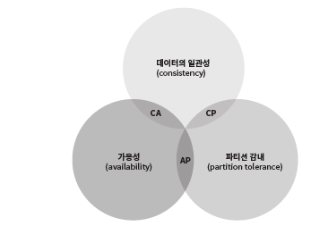
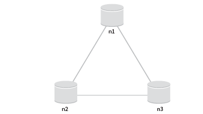
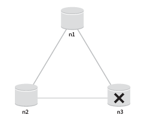
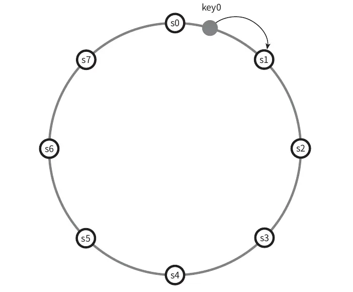
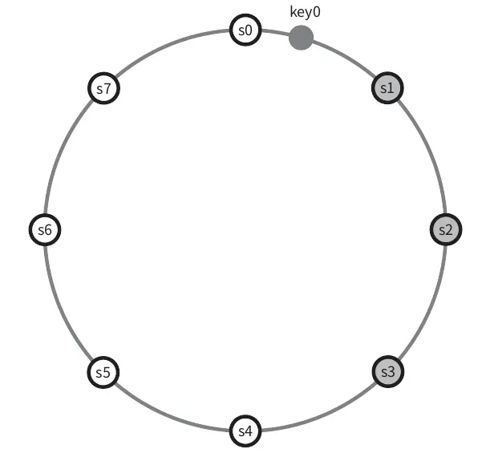
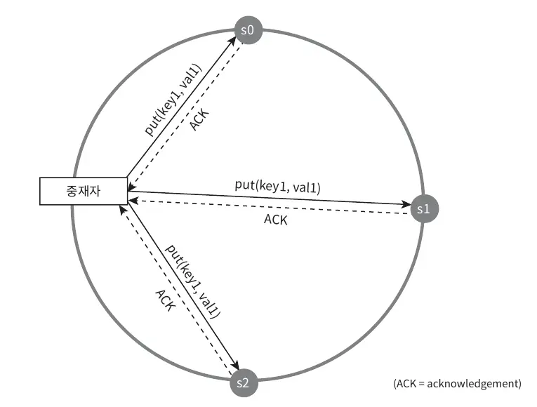
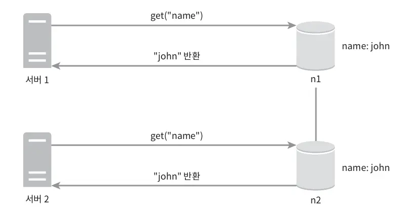
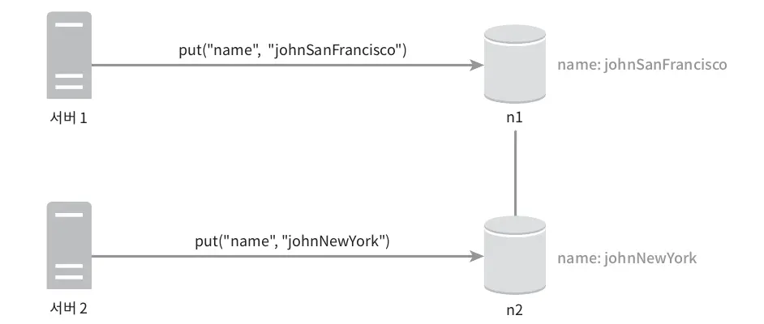
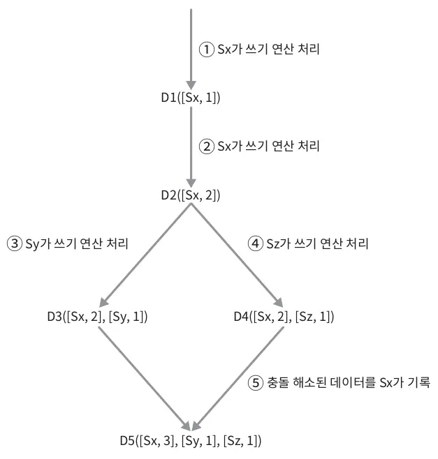

# Chapter 06: 키-값 저장소 설계

현대 시스템은 단순한 관계형 데이터베이스로는 충족할 수 없는 높은 확장성, 빠른 응답 속도, 그리고 내결함성을 요구하며, 이러한 요구사항을 충족하기 위해 키-값 저장소(Key-Value Store)가 널리 사용되고 있습니다.
키-값 저장소는 키-값 데이터베이스라고도 불리는 비관계형 데이터베이스로, 키와 값의 쌍(pair)으로 데이터를 저장합니다. 
여기서 키는 고유 식별자 역할을 하며, 값은 어떤 형태의 데이터라도 저장할 수 있다는 유연성을 제공합니다. 
이러한 특성은 분산 환경에서 높은 확장성과 빠른 응답 속도를 실현하는 데 적합하며, 내결함성도 보장합니다. 
실제로 아마존의 DynamoDB, memcached, Redis와 같은 시스템들은 이러한 키-값 저장소의 대표적인 사례입니다. 
이 글에서는 분산 환경에서 키-값 저장소 설계의 핵심 요소와 기술들을 심층적으로 분석하며, 실제 사례를 통해 실용적인 전략을 탐구해보고자 합니다.

---

### 1. 문제 이해 및 설계 범위 확정

모든 것을 만족하는 완벽한 설계는 없습니다.  
읽기, 쓰기, 메모리 사용량 간의 적절한 균형을 찾고, 데이터 일관성과 가용성 사이에서 타협점을 도출하는
설계를 구축해야 합니다.

다음은 책에서 정리한 요구사항입니다.

- 키-값 쌍 크기: 10KB 이하.
- 대용량 데이터 저장: 큰 데이터를 처리할 수 있어야 함.
- 높은 가용성: 장애 시에도 빠른 응답이 가능해야 함.
- 확장성: 트래픽에 따라 서버를 자동으로 증설/삭제할 수 있어야 함.
- 데이터 일관성 조정: 일관성 수준을 유연하게 조정 가능해야 함.
- 지연 응답⬇️: 응답 시간이 짧아야 함.

---

### 2. 단일 서버 vs 분산 환경

**단일 서버 설계**
•	장점: 구현이 간단하고, 모든 데이터를 메모리 내 해시 테이블에 저장하여 빠른 조회가 가능합니다.

•	한계:

•	메모리 및 저장 한계: 전체 데이터를 메모리에 올리기 어렵고, 디스크와의 조합은 복잡성을 가중시킵니다.

•	단일 실패 지점(SPOF): 서버 장애 시 전체 서비스 중단 위험이 큽니다.

이러한 메모리 부족의 문제의 해결법으로는 **데이터 압축**과 **자주 쓰이는 데이터만 메모리에 올리고** 다른 데이터는 디스크에 저장하는 방법이 있습니다.
해당 방법을 사용해도 부족하다면 분산 키-값 저장소를 만들어야 합니다.

**분산 키-값 저장소 설계**

분산 키-값 저장소는 분산 해시 테이블이라고도 불립니다.
분산된 저장소에서는 CAP정리에 따라 모든 요구사항을 만족할 수는 없고 상황에 따라 한 가지 요구사항은 희생하여야 합니다.

`Consistency(일관성)` : 클라이언트는 어떤 노드에 접속하던간에 같은 데이터를 받아야 합니다.

`Availability(가용성`) : 일부 노드에 장애가 발생하더라도 클라이언트는 항상 응답을 받을 수 있어야 합니다.

`Partition Tolerance(파티션 감내)` : 노드 사이에 통신 장애가 발생한 파티션이 발생하여도 시스템은 계속 동작해야 합니다.

•	CAP 정리 고려:

분산 시스템에서는 **일관성(Consistency**), **가용성(Availability)**, **파티션 감내(Partition Tolerance)** 중 두 가지를 동시에 만족할 수 있다는 제약이 있습니다.

•	CP 시스템: 데이터 일관성과 파티션 감내를 선택 (예: 금융 결제 시스템)

•	AP 시스템: 가용성과 파티션 감내를 선택 (예: 소셜 미디어 피드)

•	CA 시스템:  일관성과 가용성을 선택 But 현실에서는 존재할 수 없는 시스템.
-> 현실에서는  네트워크 장애가 불가피하기 때문에, 분산 시스템은 반드시 파티션 감내성을 가져야 한다.

#### 이상적인 상태

모두 원본 데이터를 완벽히 복제한 상태입니다. 이상적인 환경이라면 네트워크가 파티션이 일어나지 않을 환경입니다.
**데이터 일관성**과 **가용성** 모두 만족하게 됩니다.

#### 실세계의 분산 시스템

하지진 현실 분산 시스템에서는 파티션 문제를 피할 수 없다. 그리고 파티션 문제가 발생하면 우리는 일관성과 가용성 사이에서 트레이드 오프를 해야합니다.

if (일관성):
- 데이터 불일치 문제를 피하기 위해 n1과 n2 에 쓰기 연산을 중단 -> 가용성을 만족하지 못하게 됩니다.
- 예를 들어, 은행권 시스템은 일관성이 중요하므로 CP 시스템이 합리적인 선택일 것입니다. 
하지만 쓰기 연산을 중단하여 최신 계좌를 반환하지 못하는데, 어쩔 수 없이 파티션 문제를 해결할 때까지 오류를 반환하는 수 밖에 없습니다.
  
if(가용성):

- 낡은 데이터를 반환할 위험이 있더라도 계속해서 읽기 연산을 허용해야 합니다. n1, n2는 계속 쓰기를 허용할 것이고, 파티션 문제가 해결 된 뒤에 새 데이터를 n3에 전송할 것입니다.

> 💬분산 설계에서는 네트워크 장애나 노드 간 통신 장애가 발생할 것을 고려하여, 요구사항을 토대로 적절한 트레이드오프 전략을 선택해야 합니다.

### 시스템 컴포넌트

키-값 저장소 구현에는 아래의 핵심 컴포넌트들이 사용됩니다.

- 데이터 파티션
- 데이터 다중화(replication)
- 일관성(consistency)
- 일관성 불일치 해소(inconsistency resolution)
- 장애 처리
- 시스템 아키텍처 다이어그램
- 쓰기 경로
- 읽기 경로

#### 데이터 파티션
대규모 서비스에서는 전체 데이터를 한 개의 서버에 넣는건 무리가 있어서 작은 파티션으로 나누어 여러 서배에 분할하여 저장합니다.

데이터를 파티션으로 나눌 때는 데이터를 고르게 분산시키는 점과 노드의 추가, 삭제시 발생하는 데이터 이동 문제를 고려해야하는데 이는 **안정 해시(consistent hash)** 를 통해 해결할 수 있습니다. (👉🏻5장)

-> 

### 데이터 다중화 (replication)

높은 가용성과 안정성을 확보하기 위해서는 데이터를 N개의 서버에 비동기적으로 다중화를 해둬야 합니다.

서버 선정 방법: 키를 해시 링 위에 배치한 후, 시계방향으로 순회하며 만나는 N개의 물리 서버에 저장합니다.

주의: 가상 노드를 사용할 때는 같은 물리 서버를 중복 선택하지 않도록 조심해야 한다.

위 그림을 보면 만약 N을 3이라고 친다면, 위 예제에서 key0은 s1,s2,s3에 저장이 됩니다.

### 일관성 (Consistency)

데이터들은 여러 노드에 다중화가 되어 있어 동기화를 하여야 합니다.
동기화는 정족수 합의(Quorum Consensus) 프로토콜을 사용하면 **읽기/쓰기** 연산에 모두 일관성을 보장할 수 있습니다.

정족수 합의에서는 응답 지연시간과 데이터 일관성의 타협점을 찾아 W, R, N의 값을 설정하여 진행합니다. W와 R은 1보다 클 경우 일관성의 수준은 향상되지만 응답 속도는 줄어들 것입니다. 
이에 시스템에 맞는 적절한 값을 정하는 것이 좋으며 일반적으로 W + R > N 인 경우, 강한 일관성(Strong Consistency)이 보장이 됩니다.

- N = 사본의 개수

- W = 쓰기 연산에 대한 정족수로 쓰기 연산이 성공하려면 중재자가 W개 이상의 서버로부터 성공했다는 응답을 받아야 합니다.

- R = 읽기 연산에 대한 정족수로 읽기 연산이 성공하려면 중재자가 R개 이상의 서버로부터 응답을 받아야 합니다.

W가 1이라는 것은, 한 대의 서버에만 기록하겠다는 뜻은 아니며 중재자가 최소 한 대의 서버로부터 쓰기 응답을 받아야 한다는 뜻입니다.
1대를 받으면 나머지는 받지 않아도 됩니다. 중재자는 클라이언트와 노드 사이에서 proxy역할을 하게 됩니다. 

- R = 1, W = N : 빠른 읽기 연산에 최적화된 시스템
- W = 1, R = N : 빠른 쓰기 연산에 최적화된 시스템
- W + R > N : 강한 일관성이 보장됨
- W + R ≤ N : 강한 일관성이 보장되지 않음

### 일관성 불일치 해소 (Inconsistency Resolution)

- 일관성 모델에는 클라이언트가 항상 최신의 결과를 반환받는 **강한 일관성(Strong Consistency)**, 
- 항상 최신의 결과를 반환받지 못할 수 있는 **약한 일관성(Weak Consistency**), 
- 그리고 약한 일관성의 한 형태로 갱신 결과가 최종적으로는 모든 사본에 동기화되는 것을 보장하는 **최종 일관성(Eventual Consistency)모델**이 있습니다.
- 다이나모, 카산드라의 경우 최종 일관성 모델을 채택합니다.

**최종 일관성 모델**의 경우 쓰기 연산이 병렬적으로 발생하면 일관성이 깨질 수 있는데 이는 클라이언트가 해결해야 합니다. 

🧩 해결

**데이터 버저닝(Data Versioning)**:

데이터 버저닝은 데이터를 변경할 때마다 해당 데이터의 새로운 버전을 만드는 것을 의미합니다.

a)

b)

a와 같은 저장소에서 쓰기 연산을 통해 데이터를 동시에 변경한다고 하면, 
충돌이  발생하는데 이 충돌을 해결하기 위해 자동으로 해결할 수 있는 버저닝 시스템이 필요합니다.
**벡터 시계**는 이 시스템을 기반으로 문제를 해결하기 위해 보편적으로 사용되는 기술이다.

**벡터 시계(Vector Clock)**

[서버, 버전]의 순서쌍을 데이터에 매단 것입니다.
어떤 버전이 선행 버전인지 후행버전인지, 그리고 버전의 충돌이 있는지 판별하는데 사용된다.

1.	D1 기록 (초기 쓰기)
- 클라이언트가 데이터 D1을 서버 Sx에 기록합니다.
- 백터시계: [(Sx, 1)]
2.	D2 기록 (동일 서버에서 업데이트)
- 다른 클라이언트가 D1을 읽고, D1을 기반으로 D2로 업데이트하여 같은 서버 Sx에 기록합니다.
- 벡터 시계: [(Sx, 2)]
(Sx의 버전이 1에서 2로 증가)
3.	D3 기록 (다른 서버에서 업데이트)
- 또 다른 클라이언트가 D2를 읽고, D2를 기반으로 D3로 업데이트하는데 이번에는 서버 Sy에서 처리합니다.
- 벡터 시계: [(Sx, 2), (Sy, 1)]
(Sy가 새롭게 업데이트되어 추가됨)
4.	D4 기록 (다른 경로에서 업데이트)
- 또 다른 클라이언트가 D2(이전 버전)를 읽고, 이를 기반으로 D4로 업데이트합니다. 이 쓰기는 서버 Sz에서 처리합니다.
- 벡터 시계: [(Sx, 2), (Sz, 1)]
(Sz가 새롭게 업데이트되어 추가됨)
5.	충돌 감지 및 D5 기록 (충돌 해결 후 최종 업데이트)
- 클라이언트가 D3와 D4를 모두 읽으면서 두 버전 간 충돌을 감지합니다.
- 충돌을 해결한 후, 서버 Sx에서 최종 업데이트 D5를 기록합니다.
- 최종 벡터 시계: [(Sx, 3), (Sy, 1), (Sz, 1)]
(Sx의 버전이 다시 증가되어 3이 되고, Sy와 Sz의 업데이트 정보가 유지됨)

이처럼 벡터 시계는 각 서버의 업데이트 정보를 기록하며, 
충돌 발생 시 이를 비교해 어떤 업데이트가 누락되었는지 파악하고, 
최종적으로 충돌을 해결하여 올바른 데이터 버전을 결정하는 데 도움을 줍니다.

## 장애 처리

분산 시스템에서는 특정 노드에 장애가 발생하였을 때, 2개 이상의 서버가 보고해야 장애가 발생했다고 간주합니다.

장애 감지는 분산형 장애감지 솔루션인 **가십 프로토콜(gossip protocol)**을 사용하는 것이 효율적이다.

    - 각 노드는 멤버 ID와 Heartbeat counter쌍을 가진 멤버십 목록을 유지합니다.
    - 각 노드는 주기적으로 자신의 박동 카운터를 증가시키고 무작위로 선정된 노드들에게 주기적으로 자신의 박동 카운터 목록을 보냅니다.
    - 박동 카운터 목록을 받은 노드는 멤버십 목록을 최신 값으로 갱신합니다.
    - BUT 어떤 멤버의 박동 카운터 값이 지정된 시간 동안 갱신되지 않았다면 해당 멤버는 장애인 것으로 판단한다.

장애 처리는 **일시적 장애 처리**와 **영구적 장애 처리**가 존재한다.

- 일시적 장애 처리 - 느슨한 정족수(Sloppy quorum) 프로토콜을 사용하고 단서 후 임시 위탁(hinted handoff) 기법에 따라 네트워크나 서버 문제로 장애 상태인 서버로 가는 요청은 다른 서버가 잠시 맡아서 처리를 하게 됩니다. 
그리고 해당 서버가 복구된다면 일괄 반영하여 일관성을 보존하게 된다.

- 영구 장애 처리 - 반 엔트로피(anti-entropy) 프로토콜을 구현하여 사본들을 동기화합니다. 반 엔트로피 프로토콜은 Merkle트리(aka.Hash tree)를 사용하여 탐색과 전송 데이터의 양을 줄입니다.

---

📌요약
분산 키-값 저장소가 가져야 하는 기능과 그 기능 구현에 이용되는 기술 정리

- 대규모 데이터 저장 ⇒ 안정 해시를 사용해 서버들에 부하 분산

- 읽기 연산에 대한 높은 가용성 보장 ⇒ 데이터를 여러 데이터센터에 다중화

-  연산에 대한 높은 가용성 보장 ⇒ 버저닝 및 벡터 시계를 사용한 충돌 해소

- 데이터 파티션 ⇒ 안정 해시

- 점진적 규모 확장성 ⇒ 안정 해시

- 다양성 ⇒ 안정 해시

- 조절 가능한 데이터 일관성 ⇒ 정족수 합의

- 일시적 장애 처리 ⇒ 느슨한 정족수 프로토콜과 단서 후 임시 위탁

- 영구적 장애 처리 ⇒ 머클 트리

- 데이터 센터 장애 대응 ⇒ 여러 데이터 센터에 걸친 데이터 다중