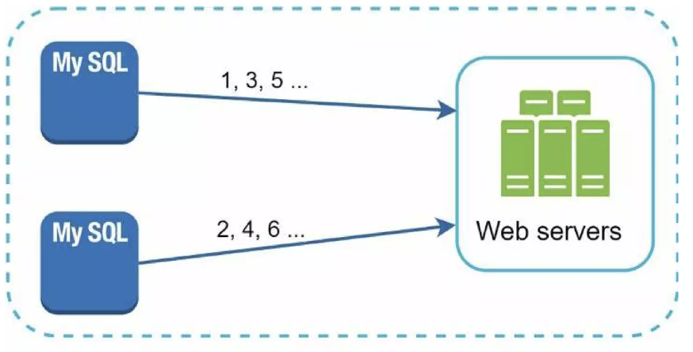
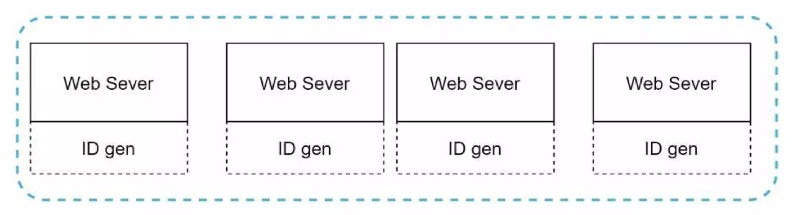
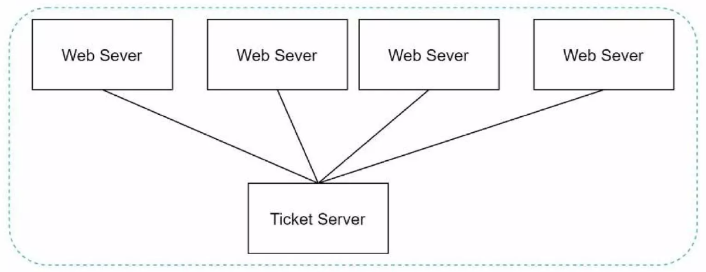

# Chapter 07: 분산 시스템을 위한 유일 ID 생성기 설계

분산 시스템에서 `auto_increment` 속성이 설정된 관계형 데이터베이스의 기본 키를 사용하면 되지 않을까 하는 생각이 들 수 있다.

하지만 분산 환경에서 이 접근법은 통하지 않는다.

- 데이터베이스 서버 한 대로는 대규모 트래픽을 감당할 수 없다.
- 여러 데이터베이스 서버를 사용하는 경우에는 지연 시간을 낮추기가 매우 힘들다.

---

# 1단계: 문제 이해 및 설계 범위 설정

```
지원자: ID는 어떤 특성을 갖나요?
면접관: ID는 유일해야 하고, 정렬 가능해야 합니다.

지원자: 새로운 레코드에 붙일 ID는 항상 1만큼 큰 값이어야 하나요?
면접관: ID의 값은 시간이 흐름에 따라 커질테지만 언제나 1씩 증가한다고 할 수는 없습니다. 다만 확실한 것은, 아침에 만든 ID보다는 저녁에 만든 ID가 큰 값을 갖는다는 점입니다.

지원자: ID는 숫자로만 구성되나요?
면접관: 그렇습니다.

지원자: 시스템 규모는 어느 정도입니까?
면접관: 초당 10,000 ID를 생성할 수 있어야 합니다.
```

질문을 할 때는 요구사항을 이해하고 모호함을 해소하는 데 초점을 맞춰야 한다.

요구사항을 정리하면 다음과 같다.

- ID는 유일해야 한다.
- ID는 숫자로만 구성되어야 한다.
- ID는 64비트로 표현될 수 있는 값이어야 한다.
- ID는 발급 날짜에 따라 정렬 가능해야 한다.
- 초당 10,000개의 ID를 만들 수 있어야 한다.

---

# 2단계: 개략적 설계안 제시 및 동의 구하기

분산 시스템에서 유일성이 보장되는 ID를 만드는 방법은 여러 가지다.

1. 다중 마스터 복제 (multi-master replication)
2. UUID
3. 티켓 서버
4. 트위터 스노플레이크 접근법

각각의 동작 원리와 장단점을 살펴보도록 한다.

## 다중 마스터 복제

다중 마스터 복제는 대략 아래 그림과 같은 구성을 갖는다.



이 접근 방식은 데이터베이스의 `auto_increment` 기능을 활용한다.  
다만, **다음 ID 값**을 구할 때 1만큼 증가시키는 것이 아니라, **k만큼 증가**시킨다. _(`k` = 현재 사용중인 데이터베이스의 서버 수)_

### 장점

- 확장성 문제를 어느정도 해결 가능 _(데이터베이스 수를 늘리면 초당 생산 가능 ID 수도 늘릴 수 있음)_

### 단점

- 여러 데이터 센터에 걸쳐 규모를 늘리기 어렵다.
- ID의 유일성은 보장되겠지만, 그 값이 시간 흐름에 맞추어 커지도록 보장할 수는 없다.
- 서버를 추가하거나 삭제할 때도 잘 동작하도록 만들기 어렵다.

## UUID

UUID 값은 충돌 가능성이 매우 낮다.  
따라서 아래 그림처럼 서버 간 조율 없이 독립적으로 생성 가능하다.



### 장점

- 서버 사이의 조율이 필요 없으므로 동기화 이슈가 없다.
- 각 서버가 자기가 쓸 ID를 알아서 만드는 구조이므로 규모 확장도 쉽다.

### 단점

- ID가 128비트로 길다. _(요구사항은 64비트)_
- ID를 시간 순으로 정렬할 수 없다.
- ID에 숫자가 아닌 값이 포함될 수 있다.

## 티켓 서버

티켓 서버도 다중 마스터 복제처럼 `auto_increment` 기능을 사용한다.



이 아이디어의 핵심은 티켓 서버 _(= `auto_increment` 기능을 갖춘 데이터베이스)_ 를 중앙 집중형으로 하나만 사용하는 것이다.

### 장점

- 유일성이 보장되는 오직 숫자로만 구성된 ID를 쉽게 만들 수 있다.
- 구현하기 쉽고, 중소 규모 애플리케이션에 적합하다.

### 단점

- 티켓 서버가 `SPOF`(Single-Point-of-Failure)가 된다.  
  즉, 이 서버에 장애가 발생하면 해당 서버를 이용하는 모든 시스템이 영향을 받는다. 이 이슈를 피하려면 티켓 서버를 여러 대 준비해야 한다. 하지만 그렇게 하면 데이터 동기화 같은 새로운 문제가 발생할 것이다.

## 트위터 스노플레이크 접근법

지금까지 살펴본 ID 생성기 구현 방법들 중에서 이번 장의 요구사항을 만족하는 것은 없었다.

이 방식은 ID의 구조를 여러 섹션으로 분할한다.


- **sign 비트**
  - 1비트를 할당한다.
  - 지금은 쓰임새가 없지만 나중을 위해 유보해둔다. 음수/양수를 구별하는 데 사용할 수 있을 것임
- **타임스탬프**
  - 41비트를 할당한다.
  - 기원 시각 이후로 몇 밀리초가 경과했는지 나타내는 값이다.
- **데이터센터 ID**
  - 5비트를 할당한다.
  - 따라서 2^5 = 32개의 데이터센터를 지원할 수 있다.
- **서버 ID**
  - 5비트를 할당한다.
  - 따라서 데이터센터당 32개 서버를 사용할 수 있다.
- **일련번호**
  - 12비트를 할당한다.
  - 각 서버에서는 ID를 생성할 때마다 이 일련번호를 1만큼 증가시킨다.
  - 이 값은 1밀리초가 경과할 때마다 0으로 초기화된다.

---

# 3단계: 상세 설계

앞서 살펴본 유일성 보장 ID 생성기 중에서, 요구사항을 만족하는 `트위터 스노플레이크 접근법`을 사용하도록 한다.

- `데이터센터 ID`, `서버 ID`
  - 시스템이 시작될 때 결정되며, 일반적으로 **시스템 운영중에 바뀌지 않음**
  - 데이터센터 ID나 서버 ID를 잘못 변경하면 ID 충돌이 발생할 수 있으므로, 이러한 작업은 신중하게 결정해야 한다.
- `타임스탬프`, `일련번호`
  - ID 생성기가 돌고 있는 중에 만들어지는 값

## 타임스탬프

타임스탬프를 이용하면 요구사항에 있던 **시간순 정렬**을 달성할 수 있다.

41비트로 표현할 수 있는 타임스탬프의 최대 값은 약 69년에 해당한다.

- 69년이 지나면 기원 시각을 바꾸거나 ID 체계를 다른 것으로 이전해야 한다.

## 일련번호

일련번호는 12비트이므로, 2^12 = 4096개의 값을 가질 수 있다.

어떤 서버가 같은 밀리초 동안 하나 이상의 ID를 만들어 낸 경우에만 0보다 큰 값을 갖는다.

- 1밀리초가 지날 때마다 0으로 초기화되기 때문

---

# 4단계: 마무리

아래 내용을 추가로 논의해볼 수 있다.

- **시계 동기화**
  - 이번 설계를 진행할 때 ID 생성 서버들이 모두 같은 시계를 사용한다고 가정했다.
  - NTP(Network Time Protocol)은 이 문제를 해결하는 가장 보편적 수단이다.
- **섹션 길이 최적화**
  - 예를 들어 **동시성이 낮고 수명이 긴** 애플리케이션의 경우, **일련번호 섹션의 길이를 줄이고 타임스탬프 섹션의 길이를 늘리는 것**이 효과적일 수 있다.
- **고가용성**
  - ID 생성기는 필수 불가결 컴포넌트이므로, 아주 높은 가용성을 제공해야 할 것이다.
