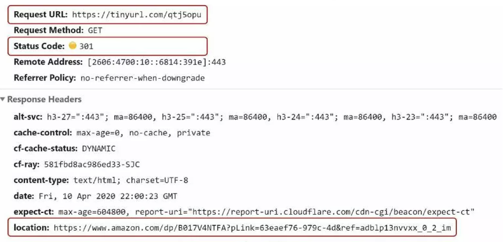
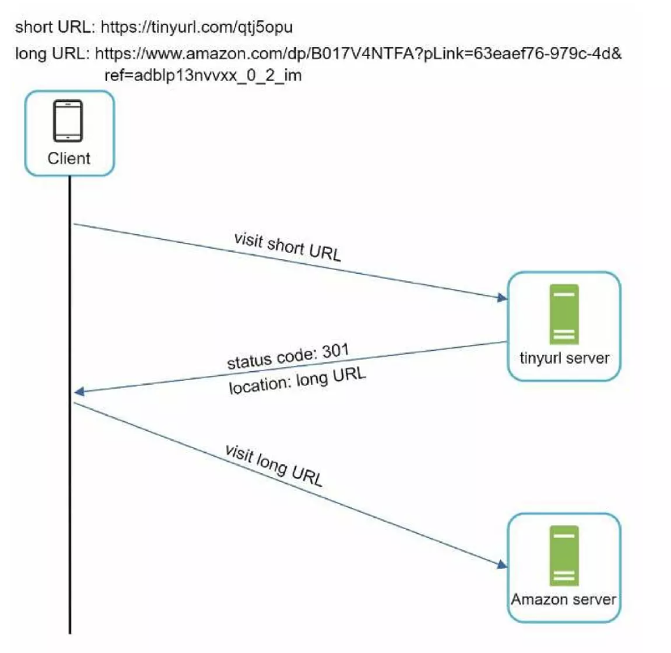
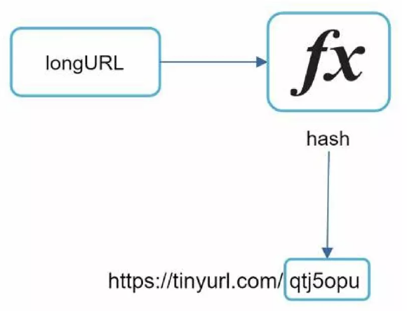
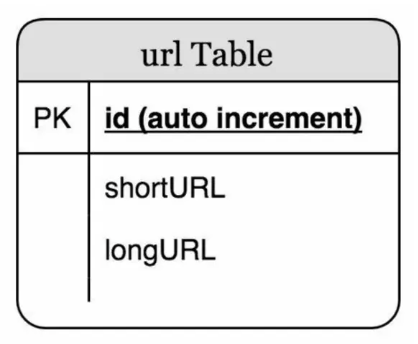
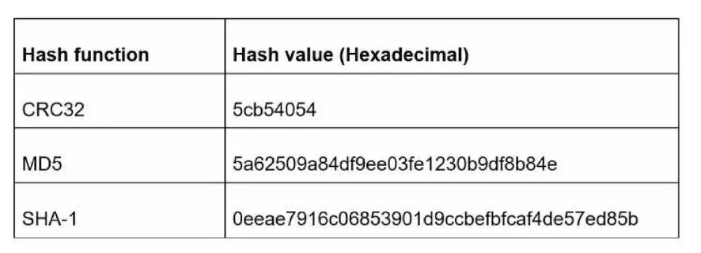
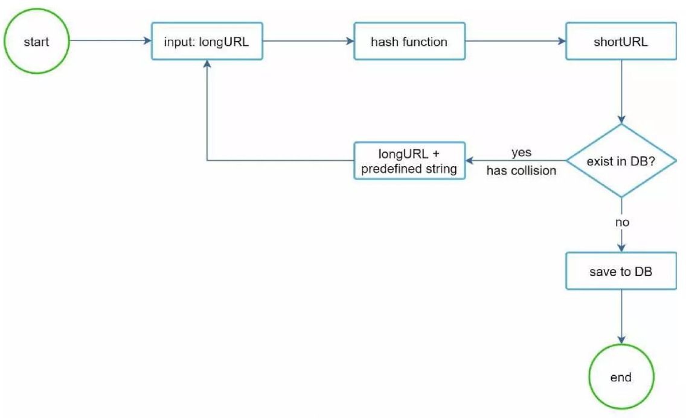
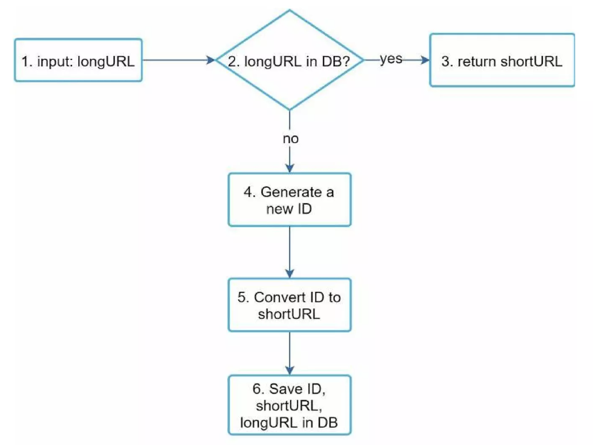
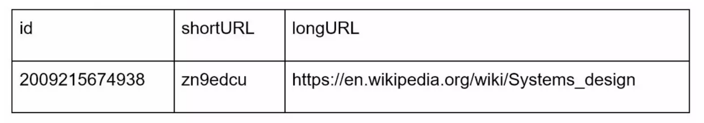
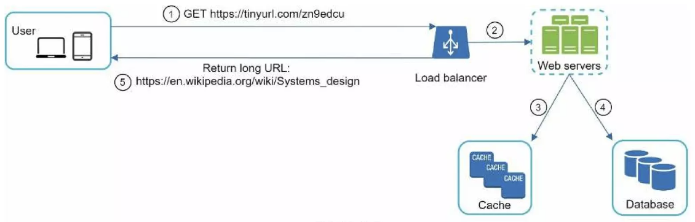

# Chapter 08: URL 단축기 설계

# 1단계: 문제 이해 및 설계 범위 확정

답이 정해지지 않은 시스템을 성공적으로 설계해 내려면 질문을 통해 모호함을 줄이고 요구사항을 알아내야 한다.

```
지원자: URL 단축기가 어떻게 동작해야 하는지 예제를 보여주실 수 있을까요?
면접관: 긴 url이 입력으로 주어졌다고 해 봅시다. 이 서비스는 이러한 긴 url을 짧은 url로 단축해서 제공해야 합니다. 이 url에 접속하면 원래 url로 갈 수도 있어야 해요.

지원자: 트래픽 규모는 어느 정도일까요?
면접관: 매일 1억개의 단축 URL을 만들어 낼 수 있어야 합니다.

지원자: 단축 URL의 길이는 어느 정도여야 하나요?
면접관: 짧으면 짧을수록 좋습니다.

지원자: 단축 URL에 포함될 문자에 제한이 있습니까?
면접관: 단축 URL에는 숫자(0 ~ 9)와 영문자(a ~ z, A ~ Z)만 사용할 수 있습니다.

지원자: 단축된 URL을 시스템에서 지우거나 갱신할 수 있습니까?
면접관: 시스템을 단순화하기 위해 삭제나 갱신은 할 수 없다고 가정합시다.
```

이 시스템의 기본 기능은 아래와 같다.

1. **URL 단축**
   - 주어진 긴 URL을 훨씬 짧게 줄인다.
2. **URL 리다이렉션**
   - 축약된 URL로 HTTP 요청이 오면 원래 URL로 안내
3. 높은 가용성과 규모 확장성, 그리고 장애 감내가 요구됨

## 개략적 추정

- **쓰기 연산**
  - 매일 1억 개의 단축 URL 생성
- **초당 쓰기 연산**
  - 1억 / 24 / 3600 = `1,160회`
- **읽기 연산**
  - 읽기 연산과 쓰기 연산 비율은 10:1 이라고 가정한다.
  - 이 경우, 읽기 연산은 초당 `11,600회` 발생한다. _(= 1160 X 10)_
- URL 단축 서비스를 10년간 운영한다고 가정
  - 1억 X 365 X 10 = `3650억 개`의 **레코드**를 보관해야 한다.
- 축약 전 URL의 평군 길이는 100이라고 가정
  - 10년 동안 필요한 저장 용량은 3650 X 100바이트 = `36.5TB`

---

# 2단계: 개략적 설계안 제시 및 동의 구하기

## API 엔드포인트

URL 단축기는 두 개의 엔드 포인트를 필요로 한다.

1. URL 단축용 엔드포인트

   - 새로운 단축 URL을 생성하고자 하는 클라이언트는 이 엔드포인트에 단축할 URL을 인자로 실어서 POST 요청을 보낸다.
   - ex. `POST /api/v1/data/shorten`
     - 반환: 단축 URL

2. URL 리다이렉션용 엔드포인트
   - 단축 URL에 대해서 HTTP 요청이 오면, 원래 URL로 보내주기 위한 용도의 엔드포인트
   - ex. `GET /api/v1/shortUrl`
     - 반환: HTTP 리다이렉션 목적지가 될 원래 URL

## URL 리다이렉션

아래 그림은 브라우저에 단축 URL을 입력할 때의 상황을 보여준다.



> 단축 URL을 받은 서버는 그 URL을 원래 URL로 바꾸어서 `301 응답의 Location 헤더`에 넣어 반환한다.

아래 그림은 클라이언트와 서버 사이의 통신 절차를 좀 더 자세히 보여준다.



- `301 Permanently Moved`
  - 해당 URL에 대한 HTTP 요청의 처리 책임이 **영구적으로** `Location 헤더에 반환된 URL`로 이전되었다는 응답
  - 영구적으로 이전되었음을 알게 된 브라우저는 이 응답을 **캐시**한다.
    - 추후 같은 단축 URL에 요청을 보낼 필요가 있을 때, 브라우저는 `캐시된 원본 URL`로 요청을 보내게 된다.
- `302 Found`
  - 주어진 URL로의 요청이 **일시적으로** `Location 헤더가 지정하는 URL`에 의해 처리되어야 한다는 응답
  - 클라이언트의 요청은 **언제나** 단축 URL 서버에 먼저 보내진 후, 원래 URL로 리다이렉션 되어야 함

> 👉🏻 **서버 부하를 줄이는 것**이 중요하다면 `301 Permanent Moved`를, **트래픽 분석**이 중요할 때는 `302 Found`를 사용하는 것이 좋다.
>
> - `301 Permanent Moved`은 **첫 번째 요청만** URL 서버로 전송되기 때문
> - 그에 반해 `302 Found`는 **매번 URL 서버로** 요청이 전달되므로, 클릭 발생률이나 발생 위치를 추적하는 데 더 용이함

URL 리다이렉션을 구현하는 가장 직관적인 방법은 `해시 테이블`을 사용하는 것이다.

- 해시 테이블에 `<단축 URL, 원본 URL>` 쌍으로 저장
  1. 원래 URL = hashTable.get(단축 URL)
  2. 301 또는 302 응답 Location 헤더에 원래 URL을 넣은 후 전송

## URL 단축

결국 중요한 것은 긴 URL을 해시 값으로 대응시킬 **해시 함수 fx**를 찾는 것이다.



이 해시 함수는 아래 요구사항을 만족해야 한다.

- 입력으로 주어지는 긴 URL이 다른 값이면 해시 값도 달라야 한다.
- 계산된 해시 값은 원래 입력으로 주어졌던 긴 URL로 복원될 수 있어야 한다.

---

# 3단계: 상세 설계

## 데이터 모델

메모리는 유한하고 비싸기 때문에, `<단축 URL, 원본 URL>`의 순서쌍을 **관계형 데이터베이스에 저장하는 것**이 좋다.

아래 그림은 이 테이블의 간단한 설계이다.



> `id`, `shortURL`, `longURL` 세 가지 칼럼을 가짐

## 해시 함수

해시 함수는 원래 URL을 단축 URL로 변환하는 데 쓰인다.  
단축 URL 값을 **hashValue**라고 지칭한다.

### 해시 값 길이

**hashValue**는 [0-9, a-z, A-Z]의 문자들로 구성된다. 따라서 사용 가능한 문자의 개수는 `62(= 10 + 26 + 26)개`이다.

**hashValue**의 길이를 정하기 위해서는 `62^n >= 3650억`인 n의 최솟값을 찾아야 한다. _(계략적인 추정치에 따르면, 이 시스템은 `3650억 개`의 URL을 만들어낼 수 있어야 함)_

- `n = 7`이면 3.5조개의 URL을 만들 수 있다.

따라서 **hashValue**의 길이는 `7`로 정한다.

해시 함수 구현에 쓰일 기술로 `해시 후 충돌 해소` 방법과 `base-62 변환` 법을 살펴보도록 한다.

### 해시 후 충돌 해소

CRC32, MD5, SHA-1과 같은 해시 함수를 사용하여 문자열을 줄일 수 있다.

아래는 하나의 긴 URL을 축약한 결과들이다.



> 하지만 가장 짧은 해시값이 7보다 길다

이 문제를 해결할 첫 번째 방법은 계산된 해시 값에서 처음 7개의 글자만 이용하는 것이다.

- 하지만 이 방법은 **해시 결과가 서로 충돌할 확률**이 높다.
- 충돌이 발생하면, 충돌이 해소될 때까지 사전에 정한 문자열을 해시값에 덧붙인다.



> 이 방법은 충돌을 해소할 수 있지만, 단축 URL을 생성할 때 한 번 이상 **데이터베이스 질의**를 해야 하므로 **오버헤드가 크다.**
>
> - 이 경우, 데이터베이스 대신 블룸 필터를 사용하면 성능을 높일 수 있다.  
>   _(블룸 필터는 어떤 집합에 특정 원소가 있는지 검사할 수 있도록 하는, 확률론에 기초한 공간 효율이 좋은 기술)_

### base-62 변환

`진법 변환`은 수의 표현 방식이 다른 두 시스템이 같은 수를 공유해야 하는 경유 유용하다.

예시로 10진수 `11157`을 62진수로 변환하면 다음과 같다.


> `2TX`(62)로 변환되었음

따라서 단축 URL은 `https://tinyurl.com/2TX`가 된다.

### 해시 후 충돌 해소 vs base-62 변환

| 해시 후 충돌 해소 전략                                                                     | base-62 변환                                                                                                                 |
| ------------------------------------------------------------------------------------------ | ---------------------------------------------------------------------------------------------------------------------------- |
| 단축 URL 길이가 고정됨                                                                     | 단축 URL 길이가 가변적. ID 값이 커지면 값이 길어짐                                                                           |
| 유일성이 보장되는 ID 생성기가 필요치 않음                                                  | 유일성 보장 ID 생성기가 필요                                                                                                 |
| 충돌이 가능해서 해소 전략이 필요                                                           | ID의 유일성이 보장된 후에야 적용 가능한 전략이라 충돌은 아예 불가능                                                          |
| ID로부터 단축 URL을 계산하는 방식이 아니라서, 다음에 쓸 수 있는 URL을 알아내는 것이 불가능 | ID가 1씩 증가하는 값이라고 가정하면 다음에 쓸 수 있는 단축 URL이 무엇인지 쉽게 알아낼 수 있어서 보안상 문제가 될 소지가 있음 |

## URL 단축기 상세 설계



1. 입력으로 긴 URL을 받는다.
2. 데이터베이스에 해당 URL이 있는지 검사한다.
3. 데이터베이스에 있다면 해당 URL에 대한 단축 URL을 만든 적이 있는 것이다.  
   따라서 데이터베이스에서 해당 단축 URL을 가져와서 클라이언트에게 반환한다.
4. 데이터베이스에 없는 경우에는 해당 URL은 새로 접수된 것이므로, `유일한 ID`를 생성한다. 이 ID는 데이터베이스의 기본 키로 사용된다.
5. 62진법 변환을 적용, ID를 `단축 URL`로 만든다.
6. `ID`, `단축 URL`, `원본 URL`을 새 데이터베이스 레코드에 추가한 후, 단축 URL을 클라이언트에게

이해가 어렵다면 아래 예제를 참고한다.

- 입력된 URL이 `~/Systems_design` 이라고 하자
  - 해당 URL이 데이터베이스에 존재하면, 해당하는 단축 URL을 클라이언트에게 리턴 후 종료
- 이 URL에 대해 ID 생성기가 반환한 ID는 `2009215674938`이다.
- 이 ID를 62진수로 변환하면 `zn9edcu`를 얻는다.
- 아래 표와 같은 새로운 데이터베이스 레코드를 생성한다.



```
[ ID 생성기 관련 ]

여기서 이 생성기의 주된 용도는 `단축 URL을 만들 때 사용할 ID`를 만드는 것이다.
여기서 이 ID는 전역적 유일성이 보장되어야 한다.
- 7장에서 이와 관련한 내용을 다뤘음
```

## URL 리다이렉션 상세 설계

아래 그림은 URL 리다이렉션 매커니즘의 상세한 설계를 그리고 있다.

쓰기보다 읽기를 더 자주하는 시스템이기 때문에, `<단축 URL, 원본 URL>` 쌍을 캐시에 저장하여 성능을 높였다.



로드 밸런서 동작 흐름은 다음과 같이 요약할 수 있다.

1. 사용자가 단축 URL을 클릭한다.
2. 로드밸런서가 해당 클릭으로 발생한 요청을 웹 서버에 전달한다.
   1. **단축 URL이 이미 `캐시`에 있는 경우**, 원래 URL을 바로 꺼내서 클라이언트에게 전달
   2. **단축 URL이 `캐시`에 존재하지 않는 경우**, 데이터베이스에서 꺼낸다.  
      _(이때, 데이터베이스에 없다면 사용자가 잘못된 단축 URL을 입력한 경우일 것이다.)_
      - 데이터베이스에서 꺼낸 URL을 캐시에 넣은 후 사용자에게 반환한다.

---

# 4단계: 마무리

설계를 마친 후에 아래 내용들도 이야기할 수 있을 것이다.

- **처리율 제한 장치** _(4장 참고)_
  - 지금까지 살펴본 시스템은 엄청난 양의 URL 단축 요청이 밀려들 경우, 무력화 될 수 있다는 잠재적 보안 결함을 갖고 있다.
  - 처리율 제한 장치를 두면, IP 주소를 비롯한 필터링 규칙들을 이용하여 요청을 걸러낼 수 있다.
- **웹 서버의 규모 확장**
  - 본 설계에 포함된 웹 계층은 무상태(stateless) 계층이므로, 웹 서버를 자유롭게 증설하거나 삭제할 수 있다.
- **데이터베이스의 규모 확장**
  - 데이터베이스를 다중화하거나 샤딩하여 규모 확장성을 달성할 수 있다.
- **데이터 분석 솔루션**
  - 데이터 분석 솔루션을 통합해 두면 어떤 링크를 얼마나 많은 사용자가 클릭했는지, 언제 주로 클릭했는지 등 중요한 정보를 알아낼 수 있을 것이다.
    - 이 경우, `302 Found` 응답으로 처리해야 유리할 것
- **가용성, 데이터 일관성, 안정성** _(1장 참고)_
  - 대규모 시스템이 성공적으로 운영되려면 반드시 갖춰야 할 속성들이다.
