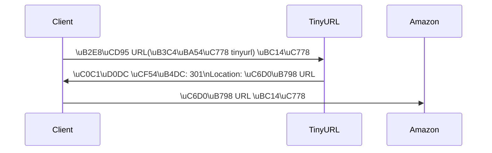

#8장. URL 단축 서비스 설계

이번 글에서는 TinyURL과 유사한 URL 단축 시스템을 설계하는 방법을 알아보겠다.
설계는 크게 4단계로 나누어 진행해보겠다.

---

## 1단계) 요구사항 정의 및 설계 범위 확정

시스템 설계 면접 문제는 명확한 해답이 정해져 있지 않도록 의도적으로 구성. 면접 환경에서 요구사항과 모호함을 정리하려면 **필요한 질문을 통해 불명확한 부분을 구체화**해야 함.

> **설계 범위를 결정하기 위한 예시 Q&A**

1. **URL 단축기의 핵심 동작 원리**
    - “URL 단축기에는 어떤 입력과 출력이 필요한가?”  
      → 예: `https://www.systeminterview.com/q=chatsystem` 이 들어오면  
      `https://tinyurl.com/y7ke-ocwjdh` 와 같은 짧은 URL을 반환해주고, 이 단축 URL로 접속했을 때 원래 URL로 리다이렉트가 가능해야 합니다.

2. **트래픽 규모**
    - “일일 단축 URL 생성 요청이 얼마 정도로 예상되는가?”  
      → 일일 최대 **1억 개**의 단축 URL 생성 가능해야 한다고 가정합니다.

3. **단축 링크 길이**
    - “단축 URL을 몇 글자로 제한할 것인가?”  
      → 최대한 짧게 만드는 것을 목표로 합니다.

4. **문자 사용 범위**
    - “단축 URL에 사용할 수 있는 문자는 어떤 것들인가?”  
      → 숫자(0-9), 영문 대소문자(a-z, A-Z)만 사용하기로 합니다.

5. **단축 URL 수정 및 삭제 여부**
    - “생성된 단축 URL을 삭제하거나 갱신할 수 있는가?”  
      → 구현 복잡도를 줄이기 위해 **삭제나 갱신은 하지 않는** 것으로 결정합니다.

---

---

### 주요 요구사항

1. **URL 단축**
    - 긴 URL을 짧게 변환
2. **URL 리다이렉션**
    - 단축 URL로 들어온 요청을 원본 URL로 안내
3. **높은 가용성**, **규모 확장성**, **장애 대응력**

---

### 대략적인 수치 추정

- **일일 생성되는 단축 URL**: 약 1억 개
- **초당 쓰기(생성) 연산**: 1억 / (24 × 3600) ≈ **1,160회/초**
- **읽기 연산 비율**: 쓰기와 읽기의 비율을 1:10으로 가정 → **읽기 연산은 초당 약 11,600회**
- **10년간 운영 시 총 레코드 수**: 1억 × 365일 × 10년 = **3,650억 개**
- **평균 원본 URL 길이**: 100자 가정
- **필요 저장 용량**: 3,650억 × 100바이트 = **약 36.5TB**

---

## 2단계) 전체 구조 제시 및 합의 얻기

이제 API 엔드포인트, 리다이렉션 방식, 그리고 단축 처리 과정을 개략적으로 살펴보겠다.

### 1) API 엔드포인트 설계

일반적으로 **REST API**를 활용해 서버-클라이언트 통신을 설계한다.

1. **URL 단축용 엔드포인트**
    - **POST /api/v1/data/shorten**
        - 요청 바디 예시:
          ```json
          {
            "longUrl": "http://example.com/some-really-long-url"
          }
          ```  
        - 반환: 생성된 **단축 URL** 문자열

2. **URL 리다이렉션 엔드포인트**
    - **GET /api/v1/{shortUrl}**
        - 파라미터(또는 경로 변수)로 단축 URL을 받아서
        - 원본 URL로 **HTTP 리다이렉션**(301 혹은 302) 응답

### 2) URL 리다이렉션 방식



HTTP 리다이렉션에는 주로 **301 Moved Permanently** 혹은 **302 Found** 상태 코드를 사용.

- **301 Moved Permanently**
    - 영구적으로 다른 URL로 이동했다는 의미
    - 브라우저가 이 응답을 **캐시**하여 서버 부하 감소에 유리

- **302 Found**
    - 일시적으로 다른 URL을 사용해야 한다는 의미
    - 매번 단축 URL 서버로 요청이 들어와야 하므로, **트래픽 분석**에 유리

일반적인 구현은 **해시 테이블** 형태(예: `<shortUrl, originalUrl>` 매핑)를 이용하며,  
단축 URL을 키로 해서 원본 URL을 빠르게 조회할 수 있게 함.

**리다이렉션 흐름은 다음과 같습니다.**
1. 단축 URL이 들어오면, 해시 테이블(혹은 데이터베이스)에서 매핑된 원본 URL을 가져옴.
2. HTTP 301 또는 302 응답으로, `Location` 헤더에 원본 URL을 담아 전송.

### 3) URL 단축 로직

결국 **원본 URL → 해시 값**으로 변환하여 짧은 문자열을 만들어야 함.

[긴 URL]  
↓   (해시 함수)  
[해시 값 → 짧은 URL로 사용]  

**해당 해시 함수가 충족해야 할 조건은 두 가지입니다.**
1. 서로 다른 URL은 서로 다른 해시 값으로 매핑되어야 함.
2. 해시 값으로부터 원본 URL을 추적할 수 있어야 함(데이터베이스의 도움으로 역참조).

---

## 3단계) 상세 설계

### 1) 데이터 모델

간단한 예시 수준에서는 `<shortUrl, originalUrl>` 쌍을 **메모리 기반 해시 테이블**에 저장할 수 있음.  
하지만 실제 서비스 규모에서는 **메모리 한계**와 **비용 문제**가 발생하므로,  
**관계형 DB**나 **NoSQL** 등 영속적인 저장소를 고려해야 함.


| shortUrl | originalUrl                                   |
|----------|-----------------------------------------------|
| abc123   | https://www.systeminterview.com/q=chatsystem  |
  


### 2) 해시 함수 구현 아이디어

URL 단축 과정의 핵심은 **해시 함수**로, 결과로 나온 해시 문자열을 단축 URL에 사용해야함.  
단축 URL에는 숫자, 영문 대소문자 총 62개 문자가 쓰이므로 이를 **base-62**로 표현할 수 있음.

우리가 10년간 3,650억 개의 URL을 생성한다 가정할 때, **62^n ≥ 3,650억**을 만족하는 **n의 최솟값**을 찾아야 함. 
계산해보면 **n=7** 정도면 충분함.

#### (1) 해시 후 충돌 해결 방식

- CRC32, MD5, SHA-1 등 이미 널리 알려진 해시 함수를 통해 원본 URL에 대한 해시 값을 구한 뒤,  
  그 **앞 7자**만 사용해 단축 URL로 씀.
- 충돌 발생 시, 특정 문자열을 덧붙이는 등 사전에 정한 규칙으로 **중복**을 해결해야 하므로,  
  추가 DB 조회나 블룸 필터 등 별도 장치가 필요.

#### (2) base-62 변환 방식

- URL을 DB에 저장할 때 **고유 ID**를 기본 키(PK)로 갖는다고 해보자.
- 이 고유 ID를 **62진수**로 변환하면, 그 결과를 단축 URL로 사용.  
  (예: 11157 → 62진수로 변환하면 `2TX`)
- 유일한 ID를 1씩 증가시키는 방식이므로 **충돌**이 발생하지 않음.  
  다만 다음에 생성될 단축 URL이 예측 가능(보안 이슈 발생 가능)하다는 단점이 존재.

| 구분                   | 해시 후 충돌 해결 방식                                                      | base-62 변환 방식                                                                                           |
| ---------------------- | ----------------------------------------------------------------------- | ------------------------------------------------------------------------------------------------------------ |
| 단축 URL 길이         | 고정                                                                      | 증가하는 ID에 따라 변동 가능                                                                                 |
| 유일성                | 별도 충돌 처리 로직 필요                                                  | 고유 ID가 보장된 뒤에 변환하므로 충돌 없음                                                                    |
| 사전 계산 가능성      | 다음에 쓸 해시 값을 예측하기 어려움                                        | 기본 키가 1씩 증가하면 다음 단축 URL 예측 가능 (보안 이슈)                                                    |
| 구현 난이도           | 충돌 해결에 따른 부가 오버헤드 존재                                       | ID 생성기의 분산 및 동기화가 필요                                                                             |
| 예시                  | MD5 결과 중 앞 7자 + (충돌 시 보정)                                        | 단순히 ID → 62진수 변환, 예: 2009215674938 → "zn9edcu"                                                         |

### 3) URL 단축 프로세스 예시

1. 사용자가 원본 URL(예: `https://en.wikipedia.org/wiki/Systems_design`)을 전달.
2. 시스템 내부에서 **ID 생성기**가 새로운 ID(예: `2009215674938`)를 발급.
3. 이 ID를 **62진수 변환**하면 `zn9edcu`를 얻음.
4. DB에 아래처럼 저장.

| id             | shortURL | longURL                                        |
| -------------- | -------- | ---------------------------------------------- |
| 2009215674938 | zn9edcu  | https://en.wikipedia.org/wiki/Systems_design   |

### 4) URL 리다이렉션 프로세스

**읽기(조회)가 더 많은 서비스**이므로, DB 조회 횟수를 줄이기 위해 **캐시를 적극 활용**.

1. 사용자가 단축 URL(`zn9edcu`)을 클릭
2. **로드 밸런서**가 해당 요청을 웹 서버 중 하나로 전달
3. 캐시에 `zn9edcu`가 있는지 확인
    - 있으면, 바로 원본 URL 반환
    - 없으면 DB에서 조회 후, 캐시에 저장 후 반환

---

## 4단계) 마무리 및 추가 고려 사항

설계안을 모두 설명한 뒤 시간이 남는다면, 아래 사항을 함께 제안하거나 고려할 수 있음.

1. **처리율 제한(rate limiter)**
    - 대규모 혹은 악의적인 요청(스팸, DoS 공격) 방어를 위해 IP 등 기준을 설정해 요청을 제한

2. **웹 서버의 무중단 확장**
    - 웹 계층은 상태를 들고 있지 않으므로(무상태), 서버 증설이 비교적 용이

3. **데이터베이스 확장**
    - 단일 DB로는 한계가 있으므로, **샤딩** 또는 **리플리카(다중화)** 등을 적용해 대규모 트래픽 대응

4. **데이터 분석 솔루션 통합**
    - 클릭 수, 시점별 사용량 분석 등 비즈니스 관점에서 중요한 통계를 제공

5. **가용성, 데이터 일관성, 장애 대응**
    - 대규모 시스템은 **고가용성(HA)**, **궁극적 일관성** 보장, **재해 복구** 등을 고려해야 실제 서비스 품질을 높일 수 있음

---

위의 설계를 토대로, 일일 수억 건의 요청을 처리할 수 있는 URL 단축 서비스를 구축할 수 있다. 
실제 환경에서는 트래픽 특성, 예산, 운영 편의성 등을 종합적으로 고려해 **구체적 기술 스택**(예: 데이터베이스 종류, 캐시 솔루션, 로드 밸런서 설정)을 결정해야한다. 
시 스템 설계 면접에서는 이러한 구조와 트레이드오프를 **명확히 논리적으로 풀어나가는 과정**이 핵심 포인트!