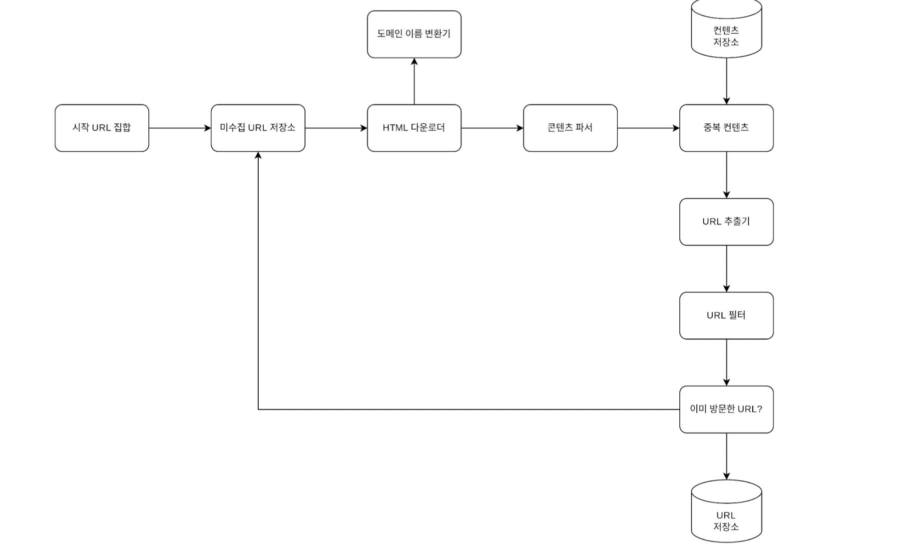

# 웹 크롤러 설계 이야기

**웹 크롤러**(Web Crawler)는 검색엔진을 비롯해 다양한 분야에서 활용되는 핵심 기술. 
크롤러의 주목적은 웹에 올라온 새로운 콘텐츠(페이지, 이미지, 동영상 등)를 찾아내고, 이를 저장하거나 가공하는 것. 
크롤링 규모가 커질수록 처리 데이터가 급격히 많아지기 때문에, 사전에 요구사항을 잘 파악하고 적절히 설계하는 것이 매우 중요.

---

## 1. 웹 크롤러의 활용 사례

1. **검색 엔진 인덱싱**
    - 검색 결과 품질을 높이기 위해, 전 세계 웹 페이지를 수집 후 **로컬 인덱스**를 구축.
    - (구글, 네이버 등의 검색엔진이 사용하는 웹 크롤러가 대표적 사례.)

2. **웹 아카이빙**
    - 웹에 있는 정보를 장기 보존 목적으로 모으는 활동.
    - 나중에 참고할 수 있도록 과거의 웹 페이지를 저장·보관.

3. **웹 마이닝**
    - 인터넷 상의 방대한 데이터를 수집·분석해서, 유용한 패턴이나 지식을 뽑아내는 데이터 마이닝 기법.

4. **웹 모니터링**
    - 특정 사이트들에서 **저작권·상표권 침해**와 같은 위반 사항을 감지하기 위해, 주기적으로 웹을 크롤링해 점검.

---

## 2. 웹 크롤러의 기본 알고리즘

1. **시작 URL** 목록을 입력받아, 해당 페이지들을 다운로드.
2. 다운로드 완료된 페이지 내부에서 **새로운 URL 링크**들을 추출.
3. 추출된 URL들을 다시 다운로드해야 할 목록에 추가하고, 이 과정을 반복.

---

## 3. 좋은 크롤러가 갖춰야 할 특성

1. **규모 확장성**
    - 전 세계 웹에는 방대한 정보가 존재하므로, **병렬 처리(Parallelism)** 등을 활용해 크롤링 성능을 높여야 함.

2. **안정성(Robustness)**
    - 잘못된 HTML, 고장난 서버, 오류 응답, 악성 코드 링크 등 예외 상황이 많이 존재.
    - 이런 문제에도 **중단 없이** 동작할 수 있도록 견고해야 함.

3. **예절(Politeness)**
    - 짧은 시간에 과도한 요청을 특정 사이트에 보내서는 안됨.

4. **확장성(Extensibility)**
    - 새로운 형식(예: 동영상, PDF 등)의 콘텐츠들이  등장해도 쉽게 지원할 수 있도록 모듈식 설계를 고려해야함.

---

## 4. 웹 크롤러 구조 설계

아래는 크롤러의 전체 동작 과정을 간략히 나타낸 예시 흐름도이다.

### 4.1 시작 URL 집합

- **크롤링을 시작할 출발점**이 되는 URL 목록.
- 전 세계 웹을 최대한 커버하기 위해, 국가·언어·주제 등에 따라 여러 대표 사이트를 선정하기도 함.

### 4.2 미수집 URL 저장소

- **아직 다운로드되지 않은** URL들을 모아두는 공간.
- 보통 FIFO(Queue) 구조로 구현하며, 방문하지 않은 URL을 차례대로 꺼냄.
- 스레드별 호스트 관리를 적용해, 같은 호스트에 대해서는 너무 많은 요청을 몰아주지 않도록 제어할 수 있음.

### 4.3 HTML 다운로더

- **미수집 URL 저장소**에서 가져온 URL을 대상으로 웹 페이지를 실제로 다운로드하는 모듈.
- **도메인 이름 변환기(DNS Resolver)** 를 사용해 호스트 이름을 IP 주소로 바꾸고, 해당 IP로 접속하여 데이터를 가져올 것임.

#### 4.3.1 성능 최적화 팁

1. **분산 크롤링**
    - 여러 서버와 스레드를 병렬로 운영해, 다운로드 속도를 끌어올림.

2. **DNS 캐싱**
    - DNS 변환 과정이 병목이 될 수 있으므로, 변환 결과를 캐시에 보관하고 주기적으로 갱신.

3. **지역성(Locality) 활용**
    - 지리적으로 가까운 웹 서버로부터 크롤링하면 **다운로드 시간이 단축**.

4. **짧은 타임아웃**
    - 응답이 느리거나 장애가 있는 서버를 기다리느라 시간을 소비하지 않도록, 일정 시간을 넘으면 연결을 끊음.

### 4.4 콘텐츠 파서

- 다운로드한 HTML이 **정상적인 페이지**인지 검사하고, 필요한 정보를 추출하는 역할.
- 로직이 복잡해질 수 있어, **크롤러와 독립**된 컴포넌트로 구현하는 경우도 많음.

### 4.5 중복 콘텐츠 확인

- 연구에 따르면, 웹 페이지 중 **약 29%가 동일하거나 유사한 콘텐츠**.
- 이미 **저장소**에 있는 콘텐츠와 동일한 페이지라면 저장하지 않고 버림.
- **해시값**이나 **체크섬**을 비교해 중복 여부를 효율적으로 판별.
  (단순히 해시값을 문자열 기반으로 만들어 비교하는 건 아니고
  문자열 비교 알고리즘을 통해서 처리한다. 표절 검사에도 사용된다고 함. )

### 4.6 콘텐츠 저장소

- 다운로드가 끝난 **HTML 문서**를 보관하는 시스템.
- 저장해야 하는 데이터 유형, 크기, 보존 기간, 접근 빈도 등에 따라 구조를 결정.

### 4.7 URL 추출기

- 파싱된 HTML로부터 **링크들**(Anchor 태그 등)을 찾아내는 과정.
- 상대경로를 절대경로로 변환하거나, 특정 규칙(예: 특정 확장자 제외 등)을 적용해 URL을 정리.

### 4.8 URL 필터

- 크롤링 대상에서 제외할 URL 조건을 모아두어, 걸러내는 역할을 수행.
    - 예: 접근 불가 페이지, 지정된 MIME 타입(이미지·동영상 등), 접근 제외 목록에 포함된 링크 등

### 4.9 이미 방문한 URL 확인

- **중복 방문**을 막기 위해, 방문 이력을 저장해두고 확인.
- 블룸 필터(Bloom Filter), 해시 테이블 등을 사용해 빠르게 체크할 수 있음.

### 4.10 URL 저장소

- **이미 방문한 URL**을 모아두어, 새로운 URL 발견 시 중복 여부를 판별.
- 만약 새 URL이면 저장소에 추가하고, 미수집 URL 목록에 전달.

---

## 5. 구현 알고리즘 관점 (DFS vs BFS)

- 크롤러는 대체로 **너비 우선 탐색(BFS)** 방식을 활용.
- 웹 페이지의 깊이가 예측 불가하고, 전역적으로 폭넓게 탐색하는 것이 유리하므로 BFS가 자주 쓰임.
- 다만 순수 BFS 대신 **우선순위 큐**를 사용하여 페이지 인기·트래픽·업데이트 빈도에 따라 가중을 두기도 함.

---

## 마무리

웹 크롤러는 간단해 보이지만, **대규모 데이터 처리**와 **다양한 예외 상황**에 대응해야 하는 복합적인 시스템.  
**분산 처리**, **중복 체크**, **예의 있는 요청 빈도 제어**, **확장성** 등을 종합적으로 고려해야 gka.

검색엔진, 아카이빙, 모니터링, 마이닝 등 다양한 분야에서 웹 크롤러의 활용 범위는 계속 확장되고 있음.  
앞으로도 변화무쌍한 웹 환경에 맞춰 **탄탄하고 유연한 크롤러**를 설계하고 운영하는 일이 점점 더 중요해질 것.

ref)
https://jonghoonpark.com/2023/06/22/web-crawler
https://en.wikipedia.org/wiki/Rabin_fingerprint
https://en.wikipedia.org/wiki/Rabin%E2%80%93Karp_algorithm
https://junstar92.tistory.com/125