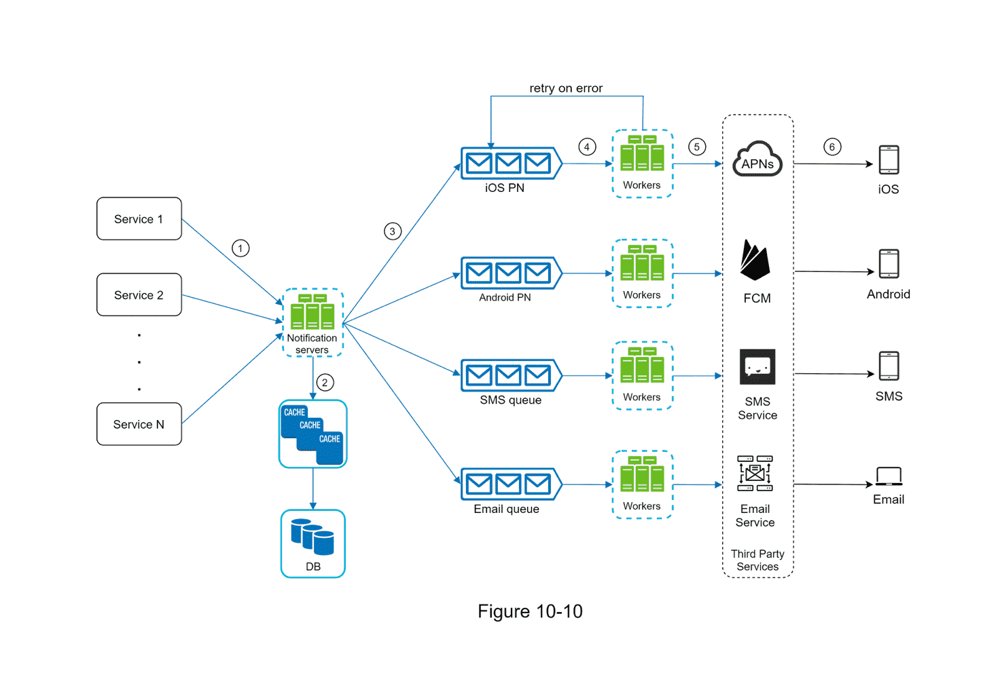

# 알림 시스템 설계하기

알림 시스템(Notification System)은 여러 서비스에서 발생하는 이벤트를 모아,
사용자에게 필요한 정보를 **비동기적으로** 전달하는 핵심 컴포넌트이다. 
모바일 푸시, SMS, 이메일 등 다양한 채널로 빠르고 안정적으로 전송해야 하며, 이를 위해 **메시지 큐**, **작업 서버**, **제3자 서비스 연동** 등의 요소가 중요하게 작용한다.

---
## 1. 알림 시스템 개요

현대 애플리케이션은 사용자 편의와 참여도를 높이기 위해, 특정 이벤트 발생 시 **실시간 알림**을 보낸다.  
예) 주문 상태 변경, 친구 요청, 이벤트 안내 등

알림은 크게 다음과 같은 채널로 구분할 수 있다.

1. **모바일 푸시 알림**
    - iOS: APNS(Apple Push Notification Service)
    - Android: FCM(Firebase Cloud Messaging)
2. **SMS 메시지**
    - Twilio, Nexmo 등의 **외부 SMS 게이트웨이** 연동
3. **이메일**
    - 자체 메일 서버 혹은 Sendgrid, Mailchimp 같은 상용 서비스 이용

---

## 2. 알림 유형별 구조

### 2.1 iOS 푸시 알림

- **알림 제공자(Provider)**: 서버 측에서 알림 요청을 생성해 APNS로 전달
- **APNS(Apple Push Notification Service)**: 애플이 제공하는 푸시 인프라
- **iOS 단말**: 실제 알림을 수신해 사용자에게 표시

iOS 알림에는 **디바이스 토큰(Device Token)**과 **페이로드(Payload)**가 필요하며, 토큰은 앱이 설치될 때 발급받아 서버에 저장된다.

### 2.2 Android 푸시 알림

- **알림 제공자**: 서버에서 메시지를 생성해 FCM으로 보내는 주체
- **FCM(Firebase Cloud Messaging)**: 구글이 제공하는 안드로이드 푸시 서비스
- **안드로이드 단말**: 알림을 수신 및 표시

FCM도 iOS와 비슷하게 **디바이스 토큰** 개념을 사용한다.

### 2.3 SMS 메시지

- **알림 제공자**: 서버 또는 작업 서버(Worker)가 SMS 전송 요청 생성
- **SMS 서비스**: Twilio, Nexmo 등과 같은 제3자 SMS 게이트웨이
- **SMS 수신 단말**: 일반 휴대폰, 문자메시지 앱 등

SMS는 비용이 발생하는 경우가 많으므로, **타 서비스와의 요금 정책**과 **API 연동**이 중요.

### 2.4 이메일

- **알림 제공자**: 서버에서 이메일 전송 요청 생성
- **이메일 서비스**: 자체 구축 메일 서버 또는 상용 메일 서비스(Sendgrid, Mailchimp 등)
- **이메일 수신 단말**: 사용자가 쓰는 이메일 클라이언트(PC, 스마트폰, 웹메일 등)

규모가 작은 조직은 종종 **외부 이메일 서비스**를 활용해 운영 편의성과 안정성을 높인다.

---

## 3. 연락처 정보 수집

각 알림을 보내기 위해서는 **디바이스 토큰**, **전화번호**, **이메일 주소** 같은 정보를 미리 받아야 한다.
- 사용자가 앱을 최초 설치하거나 회원가입할 때, 서버는 이 정보를 받아 **DB나 캐시에 저장**한다.
- 이후 알림 발송 시, 해당 정보를 참조해 적절한 채널로 전송하게 된다.

---

## 4. 알림 전송 및 수신

아래는 알림 전송의 전형적인 흐름이다.

1. **다양한 서비스**가 알림 서버의 API를 호출하여 알림 요청을 전달
2. **알림 서버**는 사용자/단말 토큰 정보를 확인하고, 알림 내용을 적절히 구성
3. 알림 서버가 **메시지 큐**에 이벤트(알림 요청)를 넣음
4. **작업 서버(Worker)** 는 메시지 큐에서 이벤트를 꺼내, 대응되는 **제3자 서비스**(APNS, FCM, SMS, Email 등)로 전송
5. **제3자 서비스**는 수신 단말(iOS, Android, 휴대폰, 이메일)로 알림을 발송

알림 서버는 내부적으로 **캐시**를 사용해 자주 조회되는 데이터(예: 사용자 프로필, 알림 템플릿)를 빠르게 가져오며, 모든 기록은 **DB**에 보관해 추적과 분석에 활용할 수 있다.

---

## 5. 안정성 고려 사항

분산 환경에서 알림 시스템이 안정적으로 동작하려면 다음에 유의해야 한다.

1. **데이터 손실 방지**
    - 알림 큐에 저장된 메시지가 누락되지 않도록, **Durable 메시지 큐**를 사용하거나 디스크에 기록
    - 작업 서버가 제3자 서비스 전송에 실패하면 **재시도**할 수 있어야 함

2. **중복 알림 방지**
    - 동일 이벤트가 여러 번 반복되지 않도록, **이벤트 ID**나 **해시** 등을 이용해 처리 이력을 체크
    - 알림 서버나 작업 서버에서 한 번 보낸 이력이 있는 이벤트는 다시 전송하지 않도록 조치

---

## 6. 컴포넌트 상세

### 6.1 알림 템플릿

- 알림 메시지 구조가 대부분 유사하므로, **템플릿** 형태로 관리
- 템플릿 내부에 `[item_name]`, `[user_name]` 등 파라미터만 다르게 채워주어 일관된 메시지 생성
- 오류나 중복 개발을 줄이고, 메시지 디자인도 통일할 수 있음

### 6.2 알림 설정(Preferences)

- 사용자별로 **어떤 알림을 받을지**, **푸시/이메일/SMS 중 어떤 채널을 이용할지** 등을 선택 가능
- 이러한 설정은 **알림 설정 테이블**에 저장하여, 전송 시점에 참조

### 6.3 전송률 제한(Rate Limiting)

- 특정 사용자에게 너무 자주 알림이 가면 스팸이 될 수 있으므로, **빈도 제한**을 적용
- 예: 시간당 N회, 하루에 M회 이상은 보내지 않도록 세팅

### 6.4 재시도(Retry) 전략

- 제3자 서비스가 응답하지 않거나 오류가 발생하면, 해당 알림 요청을 **재시도 큐**로 이동
- 일정 횟수 이상 실패 시 관리자에게 경고하거나 로그를 남김

### 6.5 푸시 알림 보안

- iOS/Android 푸시의 인증은 `appKey`나 `appSecret` 같은 정보를 사용
- 알림 서버의 API도 사내 서비스나 인증된 클라이언트만 호출 가능하도록 제한

### 6.6 큐 모니터링

- 메시지 큐에 **쌓여 있는 이벤트의 양**, 처리 속도 등을 지속적으로 관찰
- 서버 인스턴스나 워커 수를 동적으로 조정해 장애나 지연을 방지

### 6.7 이벤트 추적

- 알림이 생성부터 최종 수신까지 과정을 추적할 수 있게, 로그나 이벤트 분석 시스템과 연동
- 예: 알림 생성 시점, 전송 성공/실패, 사용자 열람 시간 등

---

## 7. 최종 설계 

아래는 위 개념들을 토대로 한 알림 시스템 구조를 Mermaid로 표현한 예시이다.

## 설명

1. **서비스(1..N)**가 알림 서버에 요청을 전송한다.  
2. 알림 서버는 캐시/DB에서 사용자·템플릿·설정 등을 조회한다.  
3. 알림 이벤트를 메시지 큐로 넣고, 채널별(iOS, Android, SMS, Email)로 분류한다.  
4. 워커(Worker) 서버는 큐에서 메시지를 꺼내 제3자 서비스(APNS, FCM 등)로 전송한다.  
5. 제3자 서비스가 사용자 단말에 알림을 도착시키면, 최종적으로 사용자가 알림을 확인한다.  
6. 오류가 발생하면, 재시도 큐(Retry)와 전용 워커를 통해 재전송할 수 있도록 설계한다.

---

## 결론

이 설계는 **비동기적**이고 **확장 가능한** 알림 전달을 목표로 하며,

- **메시지 큐**를 통해 각 채널(푸시, SMS, 이메일)에 대한 **유연성** 확보  
- **캐시**와 **DB**를 이용해 사용자·템플릿 정보를 빠르게 접근  
- **오류나 중복 방지** 등 안정성을 높이기 위한 다양한 메커니즘 적용  
- **제3자 서비스**와의 결합도를 낮추기 위해 **Worker**와 **Queue** 중심 구조를 채택  

이처럼 여러 서비스에서 발생하는 알림 이벤트를 **일관되게** 처리하고,  
필요 시 **Retry**와 **Rate Limiting** 등을 통해 사용자 경험과 시스템 **안정성**을 모두 달성할 수 있다.